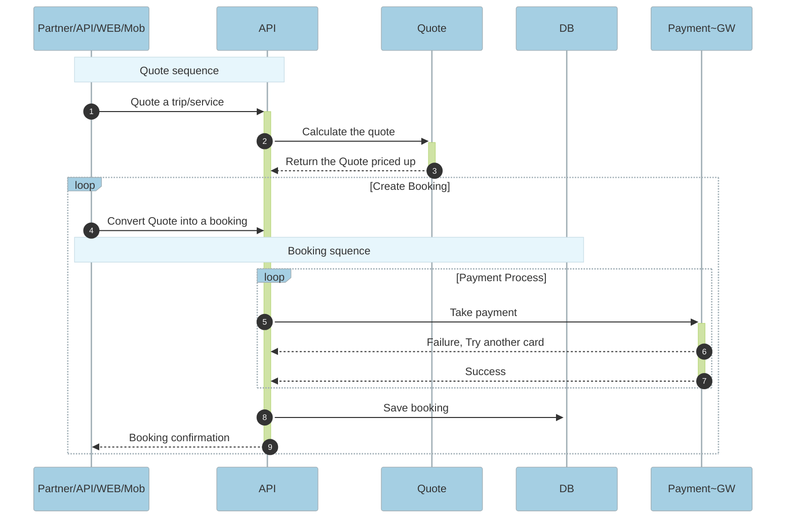

> Mermaid configuration variables and file, expand panel below

<details>
  <summary>Click to expand configuration!</summary>

```json
{
  "theme": "base",
  "themeVariables": {
    "background": "#f4f4f4",
    "primaryColor": "#fff4dd",
    "secondaryColor": "hsl(-79.4117647059, 100%, 93.3333333333%)",
    "tertiaryColor": "hsl(220.5882352941, 100%, 98.3333333333%)",
    "primaryBorderColor": "hsl(40.5882352941, 60%, 83.3333333333%)",
    "secondaryBorderColor": "hsl(-79.4117647059, 60%, 83.3333333333%)",
    "tertiaryBorderColor": "hsl(220.5882352941, 60%, 88.3333333333%)",
    "primaryTextColor": "#333",
    "secondaryTextColor": "rgb(17.0000000001, 17.0000000001, 17.0000000001)",
    "tertiaryTextColor": "rgb(4.2500000001, 4.2500000001, 4.2500000001)",
    "lineColor": "#0b0b0b",
    "textColor": "#333",
    "mainBkg": "#fff4dd",
    "secondBkg": "#ffffde",
    "border1": "#9370DB",
    "border2": "#aaaa33",
    "arrowheadColor": "#333333",
    "fontFamily": "\"roboto\", arial",
    "fontSize": "16px",
    "labelBackground": "#e8e8e8",
    "nodeBkg": "#fff4dd",
    "nodeBorder": "hsl(40.5882352941, 60%, 83.3333333333%)",
    "clusterBkg": "hsl(220.5882352941, 100%, 98.3333333333%)",
    "clusterBorder": "hsl(220.5882352941, 60%, 88.3333333333%)",
    "defaultLinkColor": "#0b0b0b",
    "titleColor": "rgb(4.2500000001, 4.2500000001, 4.2500000001)",
    "edgeLabelBackground": "hsl(-79.4117647059, 100%, 93.3333333333%)",
    "actorBorder": "hsl(40.5882352941, 60%, 83.3333333333%)",
    "actorBkg": "#fff4dd",
    "actorTextColor": "#333",
    "actorLineColor": "grey",
    "signalColor": "#333",
    "signalTextColor": "#333",
    "labelBoxBkgColor": "#fff4dd",
    "labelBoxBorderColor": "hsl(40.5882352941, 60%, 83.3333333333%)",
    "labelTextColor": "#333",
    "loopTextColor": "#333",
    "noteBorderColor": "hsl(52.6829268293, 60%, 73.9215686275%)",
    "noteBkgColor": "#fff5ad",
    "noteTextColor": "#333",
    "activationBorderColor": "hsl(-79.4117647059, 100%, 83.3333333333%)",
    "activationBkgColor": "hsl(-79.4117647059, 100%, 93.3333333333%)",
    "sequenceNumberColor": "#f4f4f4",
    "sectionBkgColor": "hsl(220.5882352941, 100%, 98.3333333333%)",
    "altSectionBkgColor": "white",
    "sectionBkgColor2": "#fff4dd",
    "taskBorderColor": "hsl(40.5882352941, 60%, 83.3333333333%)",
    "taskBkgColor": "#fff4dd",
    "taskTextLightColor": "#333",
    "taskTextColor": "#333",
    "taskTextDarkColor": "#333",
    "taskTextOutsideColor": "#333",
    "taskTextClickableColor": "#003163",
    "activeTaskBorderColor": "#fff4dd",
    "activeTaskBkgColor": "hsl(40.5882352941, 100%, 100%)",
    "gridColor": "lightgrey",
    "doneTaskBkgColor": "lightgrey",
    "doneTaskBorderColor": "grey",
    "critBorderColor": "#ff8888",
    "critBkgColor": "red",
    "todayLineColor": "red",
    "labelColor": "#333",
    "errorBkgColor": "hsl(220.5882352941, 100%, 98.3333333333%)",
    "errorTextColor": "rgb(4.2500000001, 4.2500000001, 4.2500000001)",
    "classText": "#333",
    "fillType0": "#fff4dd",
    "fillType1": "hsl(-79.4117647059, 100%, 93.3333333333%)",
    "fillType2": "hsl(104.5882352941, 100%, 93.3333333333%)",
    "fillType3": "hsl(-15.4117647059, 100%, 93.3333333333%)",
    "fillType4": "hsl(-23.4117647059, 100%, 93.3333333333%)",
    "fillType5": "hsl(-143.4117647059, 100%, 93.3333333333%)",
    "fillType6": "hsl(168.5882352941, 100%, 93.3333333333%)",
    "fillType7": "hsl(48.5882352941, 100%, 93.3333333333%)",
    "darkMode": true,
    "nodeTextColor": "#333",
    "altBackground": "hsl(220.5882352941, 100%, 98.3333333333%)"
  }
}
```

</details>
<br>

# SqD - High level booking flow


