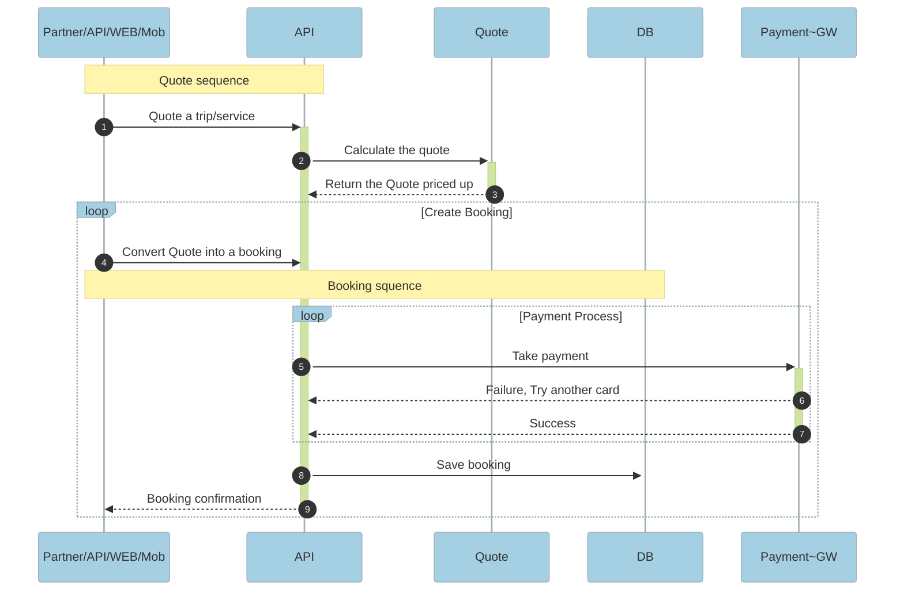
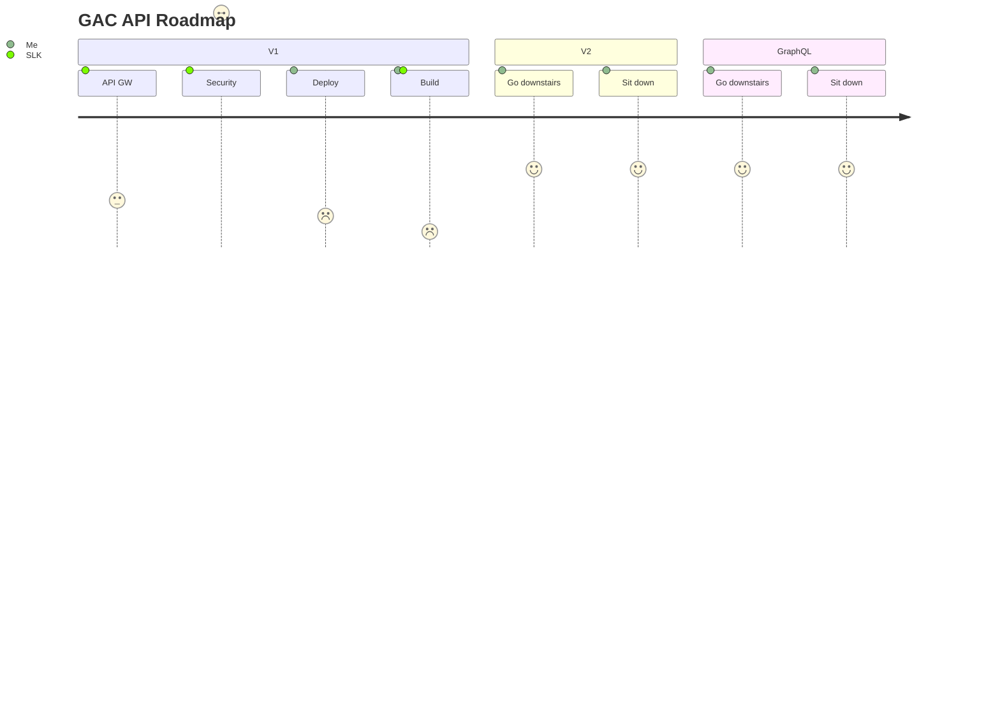

<!-- Generator: Widdershins v4.0.1 -->

<h1 id="gac-api-v1-1-0">GAC API V1.1.0</h1>

# Run in Insomnia

-  button

-- The **Run In Insomnia** button, , allows developers to take our API's for spin in a matter of minutes.

### [](https://insomnia.rest/run/?label=GAC%20Public%20APIs&uri=https%3A%2F%2Fraw.githubusercontent.com%2Fglobalairportconcierge%2Finsomnia%2Fmain%2FGAC-public.v1.yaml)

## GitHub OAS 3.0 file/repo

https://raw.githubusercontent.com/globalairportconcierge/insomnia/main/GAC-public.v1.yaml

## HTML

```
<a href="https://insomnia.rest/run/?label=GAC%20Public%20APIs&uri=https%3A%2F%2Fraw.githubusercontent.com%2Fglobalairportconcierge%2Finsomnia%2Fmain%2FGAC-public.v1.yaml" target="_blank"></a>
```

## MD

[](https://insomnia.rest/run/?label=GAC%20Public%20APIs&uri=https%3A%2F%2Fraw.githubusercontent.com%2Fglobalairportconcierge%2Finsomnia%2Fmain%2FGAC-public.v1.yaml)

Insomnia like Postman, allows developers to interact with API's beyound the capabilites of cURL in CLI. It's a great tool for testing and getting familiar instantily with all the API's endpoints and a great compliment to any documentation.

> Scroll down for code samples, example requests and responses. Select a language for code samples from the tabs above or the mobile navigation menu.

Your passenger services APIs of choice

Base URLs:

- <a href="https://prism.supun.xyz">https://prism.supun.xyz</a>

<a href="https://gac.com/terms-of-service.html">Terms of service</a>

License: <a href="https://gac.com/api-license.html">GAC</a>

# Collapsible sections

<details>
<summary>Expand here...</summary>
<p>

```c#
public class Order
{
    public int OrderId { get; set; }
    public int CustomerId { get; set; }

    public List<int> Products { get; set; }
}
```

</p>
</details> 
<br>

# Sequence diagram

> > Mermaid sequence diagram



[![](https://mermaid.ink/img/eyJjb2RlIjoic2VxdWVuY2VEaWFncmFtXG5hdXRvbnVtYmVyXG4gICAgTm90ZSBvdmVyIFBhcnRuZXIvQVBJL1dFQi9Nb2IsQVBJOiBRdW90ZSBzZXF1ZW5jZVxuICAgIFBhcnRuZXIvQVBJL1dFQi9Nb2ItPj4rQVBJOiBRdW90ZSBhIHRyaXAvc2VydmljZVxuICAgIEFQSS0-PitRdW90ZTogQ2FsY3VsYXRlIHRoZSBxdW90ZVxuICAgIFF1b3RlLS0-Pi1BUEk6IFJldHVybiB0aGUgUXVvdGUgcHJpY2VkIHVwXG4gICAgbG9vcCBDcmVhdGUgQm9va2luZ1xuICAgIFBhcnRuZXIvQVBJL1dFQi9Nb2ItPj5BUEk6IENvbnZlcnQgUXVvdGUgaW50byBhIGJvb2tpbmdcbiAgICBOb3RlIG92ZXIgUGFydG5lci9BUEkvV0VCL01vYixEQjogQm9va2luZyBzcXVlbmNlXG4gICAgbG9vcCBQYXltZW50IFByb2Nlc3NcbiAgICBBUEktPj4rUGF5bWVudH5HVzogVGFrZSBwYXltZW50XG4gICAgUGF5bWVudH5HVy0tPj5BUEk6IEZhaWx1cmUsIFRyeSBhbm90aGVyIGNhcmRcbiAgICBQYXltZW50fkdXLS0-Pi1BUEk6IFN1Y2Nlc3NcbiAgICBlbmRcbiAgICBBUEktPj4rREI6IFNhdmUgYm9va2luZ1xuICAgIEFQSS0tPj4tUGFydG5lci9BUEkvV0VCL01vYjogQm9va2luZyBjb25maXJtYXRpb25cbmVuZFxuIiwibWVybWFpZCI6eyJ0aGVtZSI6ImRlZmF1bHQiLCJ0aGVtZVZhcmlhYmxlcyI6eyJiYWNrZ3JvdW5kIjoid2hpdGUiLCJwcmltYXJ5Q29sb3IiOiIjRTdGNkZDIiwic2Vjb25kYXJ5Q29sb3IiOiIjZmZmZmRlIiwidGVydGlhcnlDb2xvciI6ImhzbCg4MCwgMTAwJSwgOTYuMjc0NTA5ODAzOSUpIiwicHJpbWFyeUJvcmRlckNvbG9yIjoiaHNsKDI0MCwgNjAlLCA4Ni4yNzQ1MDk4MDM5JSkiLCJzZWNvbmRhcnlCb3JkZXJDb2xvciI6ImhzbCg2MCwgNjAlLCA4My41Mjk0MTE3NjQ3JSkiLCJ0ZXJ0aWFyeUJvcmRlckNvbG9yIjoiaHNsKDgwLCA2MCUsIDg2LjI3NDUwOTgwMzklKSIsInByaW1hcnlUZXh0Q29sb3IiOiIjMTMxMzAwIiwic2Vjb25kYXJ5VGV4dENvbG9yIjoiIzAwMDAyMSIsInRlcnRpYXJ5VGV4dENvbG9yIjoicmdiKDkuNTAwMDAwMDAwMSwgOS41MDAwMDAwMDAxLCA5LjUwMDAwMDAwMDEpIiwibGluZUNvbG9yIjoiIzMzMzMzMyIsInRleHRDb2xvciI6IiMzMzMiLCJtYWluQmtnIjoiI0VDRUNGRiIsInNlY29uZEJrZyI6IiNmZmZmZGUiLCJib3JkZXIxIjoiIzkzNzBEQiIsImJvcmRlcjIiOiIjYWFhYTMzIiwiYXJyb3doZWFkQ29sb3IiOiIjMzMzMzMzIiwiZm9udEZhbWlseSI6IlwidHJlYnVjaGV0IG1zXCIsIHZlcmRhbmEsIGFyaWFsIiwiZm9udFNpemUiOiIxNnB4IiwibGFiZWxCYWNrZ3JvdW5kIjoiI2U4ZThlOCIsIm5vZGVCa2ciOiIjRUNFQ0ZGIiwibm9kZUJvcmRlciI6IiM5MzcwREIiLCJjbHVzdGVyQmtnIjoiI2ZmZmZkZSIsImNsdXN0ZXJCb3JkZXIiOiIjYWFhYTMzIiwiZGVmYXVsdExpbmtDb2xvciI6IiMzMzMzMzMiLCJ0aXRsZUNvbG9yIjoiIzMzMyIsImVkZ2VMYWJlbEJhY2tncm91bmQiOiIjZThlOGU4IiwiYWN0b3JCb3JkZXIiOiJoc2woMjU5LjYyNjE2ODIyNDMsIDU5Ljc3NjUzNjMxMjglLCA4Ny45MDE5NjA3ODQzJSkiLCJhY3RvckJrZyI6IiNFQ0VDRkYiLCJhY3RvclRleHRDb2xvciI6ImJsYWNrIiwiYWN0b3JMaW5lQ29sb3IiOiJncmV5Iiwic2lnbmFsQ29sb3IiOiIjMzMzIiwic2lnbmFsVGV4dENvbG9yIjoiIzMzMyIsImxhYmVsQm94QmtnQ29sb3IiOiIjRUNFQ0ZGIiwibGFiZWxCb3hCb3JkZXJDb2xvciI6ImhzbCgyNTkuNjI2MTY4MjI0MywgNTkuNzc2NTM2MzEyOCUsIDg3LjkwMTk2MDc4NDMlKSIsImxhYmVsVGV4dENvbG9yIjoiYmxhY2siLCJsb29wVGV4dENvbG9yIjoiYmxhY2siLCJub3RlQm9yZGVyQ29sb3IiOiIjYWFhYTMzIiwibm90ZUJrZ0NvbG9yIjoiI0U3RjZGQyIsIm5vdGVUZXh0Q29sb3IiOiJibGFjayIsImFjdGl2YXRpb25Cb3JkZXJDb2xvciI6IiM2NjYiLCJhY3RpdmF0aW9uQmtnQ29sb3IiOiIjZjRmNGY0Iiwic2VxdWVuY2VOdW1iZXJDb2xvciI6IndoaXRlIiwic2VjdGlvbkJrZ0NvbG9yIjoicmdiYSgxMDIsIDEwMiwgMjU1LCAwLjQ5KSIsImFsdFNlY3Rpb25Ca2dDb2xvciI6IndoaXRlIiwic2VjdGlvbkJrZ0NvbG9yMiI6IiNmZmY0MDAiLCJ0YXNrQm9yZGVyQ29sb3IiOiIjNTM0ZmJjIiwidGFza0JrZ0NvbG9yIjoiIzhhOTBkZCIsInRhc2tUZXh0TGlnaHRDb2xvciI6IndoaXRlIiwidGFza1RleHRDb2xvciI6IndoaXRlIiwidGFza1RleHREYXJrQ29sb3IiOiJibGFjayIsInRhc2tUZXh0T3V0c2lkZUNvbG9yIjoiYmxhY2siLCJ0YXNrVGV4dENsaWNrYWJsZUNvbG9yIjoiIzAwMzE2MyIsImFjdGl2ZVRhc2tCb3JkZXJDb2xvciI6IiM1MzRmYmMiLCJhY3RpdmVUYXNrQmtnQ29sb3IiOiIjYmZjN2ZmIiwiZ3JpZENvbG9yIjoibGlnaHRncmV5IiwiZG9uZVRhc2tCa2dDb2xvciI6ImxpZ2h0Z3JleSIsImRvbmVUYXNrQm9yZGVyQ29sb3IiOiJncmV5IiwiY3JpdEJvcmRlckNvbG9yIjoiI2ZmODg4OCIsImNyaXRCa2dDb2xvciI6InJlZCIsInRvZGF5TGluZUNvbG9yIjoicmVkIiwibGFiZWxDb2xvciI6ImJsYWNrIiwiZXJyb3JCa2dDb2xvciI6IiM1NTIyMjIiLCJlcnJvclRleHRDb2xvciI6IiM1NTIyMjIiLCJjbGFzc1RleHQiOiIjMTMxMzAwIiwiZmlsbFR5cGUwIjoiI0U3RjZGQyIsImZpbGxUeXBlMSI6IiNmZmZmZGUiLCJmaWxsVHlwZTIiOiJoc2woMjYxLjE0Mjg1NzE0MjksIDc3Ljc3Nzc3Nzc3NzglLCA5NC43MDU4ODIzNTI5JSkiLCJmaWxsVHlwZTMiOiJoc2woMTI0LCAxMDAlLCA5My41Mjk0MTE3NjQ3JSkiLCJmaWxsVHlwZTQiOiJoc2woMTMzLjE0Mjg1NzE0MjksIDc3Ljc3Nzc3Nzc3NzglLCA5NC43MDU4ODIzNTI5JSkiLCJmaWxsVHlwZTUiOiJoc2woLTQsIDEwMCUsIDkzLjUyOTQxMTc2NDclKSIsImZpbGxUeXBlNiI6ImhzbCgzMjUuMTQyODU3MTQyOSwgNzcuNzc3Nzc3Nzc3OCUsIDk0LjcwNTg4MjM1MjklKSIsImZpbGxUeXBlNyI6ImhzbCgxODgsIDEwMCUsIDkzLjUyOTQxMTc2NDclKSJ9fX0)](https://mermaid-js.github.io/mermaid-live-editor/#/edit/eyJjb2RlIjoic2VxdWVuY2VEaWFncmFtXG5hdXRvbnVtYmVyXG4gICAgTm90ZSBvdmVyIFBhcnRuZXIvQVBJL1dFQi9Nb2IsQVBJOiBRdW90ZSBzZXF1ZW5jZVxuICAgIFBhcnRuZXIvQVBJL1dFQi9Nb2ItPj4rQVBJOiBRdW90ZSBhIHRyaXAvc2VydmljZVxuICAgIEFQSS0-PitRdW90ZTogQ2FsY3VsYXRlIHRoZSBxdW90ZVxuICAgIFF1b3RlLS0-Pi1BUEk6IFJldHVybiB0aGUgUXVvdGUgcHJpY2VkIHVwXG4gICAgbG9vcCBDcmVhdGUgQm9va2luZ1xuICAgIFBhcnRuZXIvQVBJL1dFQi9Nb2ItPj5BUEk6IENvbnZlcnQgUXVvdGUgaW50byBhIGJvb2tpbmdcbiAgICBOb3RlIG92ZXIgUGFydG5lci9BUEkvV0VCL01vYixEQjogQm9va2luZyBzcXVlbmNlXG4gICAgbG9vcCBQYXltZW50IFByb2Nlc3NcbiAgICBBUEktPj4rUGF5bWVudH5HVzogVGFrZSBwYXltZW50XG4gICAgUGF5bWVudH5HVy0tPj5BUEk6IEZhaWx1cmUsIFRyeSBhbm90aGVyIGNhcmRcbiAgICBQYXltZW50fkdXLS0-Pi1BUEk6IFN1Y2Nlc3NcbiAgICBlbmRcbiAgICBBUEktPj4rREI6IFNhdmUgYm9va2luZ1xuICAgIEFQSS0tPj4tUGFydG5lci9BUEkvV0VCL01vYjogQm9va2luZyBjb25maXJtYXRpb25cbmVuZFxuIiwibWVybWFpZCI6eyJ0aGVtZSI6ImRlZmF1bHQiLCJ0aGVtZVZhcmlhYmxlcyI6eyJiYWNrZ3JvdW5kIjoid2hpdGUiLCJwcmltYXJ5Q29sb3IiOiIjRTdGNkZDIiwic2Vjb25kYXJ5Q29sb3IiOiIjZmZmZmRlIiwidGVydGlhcnlDb2xvciI6ImhzbCg4MCwgMTAwJSwgOTYuMjc0NTA5ODAzOSUpIiwicHJpbWFyeUJvcmRlckNvbG9yIjoiaHNsKDI0MCwgNjAlLCA4Ni4yNzQ1MDk4MDM5JSkiLCJzZWNvbmRhcnlCb3JkZXJDb2xvciI6ImhzbCg2MCwgNjAlLCA4My41Mjk0MTE3NjQ3JSkiLCJ0ZXJ0aWFyeUJvcmRlckNvbG9yIjoiaHNsKDgwLCA2MCUsIDg2LjI3NDUwOTgwMzklKSIsInByaW1hcnlUZXh0Q29sb3IiOiIjMTMxMzAwIiwic2Vjb25kYXJ5VGV4dENvbG9yIjoiIzAwMDAyMSIsInRlcnRpYXJ5VGV4dENvbG9yIjoicmdiKDkuNTAwMDAwMDAwMSwgOS41MDAwMDAwMDAxLCA5LjUwMDAwMDAwMDEpIiwibGluZUNvbG9yIjoiIzMzMzMzMyIsInRleHRDb2xvciI6IiMzMzMiLCJtYWluQmtnIjoiI0VDRUNGRiIsInNlY29uZEJrZyI6IiNmZmZmZGUiLCJib3JkZXIxIjoiIzkzNzBEQiIsImJvcmRlcjIiOiIjYWFhYTMzIiwiYXJyb3doZWFkQ29sb3IiOiIjMzMzMzMzIiwiZm9udEZhbWlseSI6IlwidHJlYnVjaGV0IG1zXCIsIHZlcmRhbmEsIGFyaWFsIiwiZm9udFNpemUiOiIxNnB4IiwibGFiZWxCYWNrZ3JvdW5kIjoiI2U4ZThlOCIsIm5vZGVCa2ciOiIjRUNFQ0ZGIiwibm9kZUJvcmRlciI6IiM5MzcwREIiLCJjbHVzdGVyQmtnIjoiI2ZmZmZkZSIsImNsdXN0ZXJCb3JkZXIiOiIjYWFhYTMzIiwiZGVmYXVsdExpbmtDb2xvciI6IiMzMzMzMzMiLCJ0aXRsZUNvbG9yIjoiIzMzMyIsImVkZ2VMYWJlbEJhY2tncm91bmQiOiIjZThlOGU4IiwiYWN0b3JCb3JkZXIiOiJoc2woMjU5LjYyNjE2ODIyNDMsIDU5Ljc3NjUzNjMxMjglLCA4Ny45MDE5NjA3ODQzJSkiLCJhY3RvckJrZyI6IiNFQ0VDRkYiLCJhY3RvclRleHRDb2xvciI6ImJsYWNrIiwiYWN0b3JMaW5lQ29sb3IiOiJncmV5Iiwic2lnbmFsQ29sb3IiOiIjMzMzIiwic2lnbmFsVGV4dENvbG9yIjoiIzMzMyIsImxhYmVsQm94QmtnQ29sb3IiOiIjRUNFQ0ZGIiwibGFiZWxCb3hCb3JkZXJDb2xvciI6ImhzbCgyNTkuNjI2MTY4MjI0MywgNTkuNzc2NTM2MzEyOCUsIDg3LjkwMTk2MDc4NDMlKSIsImxhYmVsVGV4dENvbG9yIjoiYmxhY2siLCJsb29wVGV4dENvbG9yIjoiYmxhY2siLCJub3RlQm9yZGVyQ29sb3IiOiIjYWFhYTMzIiwibm90ZUJrZ0NvbG9yIjoiI0U3RjZGQyIsIm5vdGVUZXh0Q29sb3IiOiJibGFjayIsImFjdGl2YXRpb25Cb3JkZXJDb2xvciI6IiM2NjYiLCJhY3RpdmF0aW9uQmtnQ29sb3IiOiIjZjRmNGY0Iiwic2VxdWVuY2VOdW1iZXJDb2xvciI6IndoaXRlIiwic2VjdGlvbkJrZ0NvbG9yIjoicmdiYSgxMDIsIDEwMiwgMjU1LCAwLjQ5KSIsImFsdFNlY3Rpb25Ca2dDb2xvciI6IndoaXRlIiwic2VjdGlvbkJrZ0NvbG9yMiI6IiNmZmY0MDAiLCJ0YXNrQm9yZGVyQ29sb3IiOiIjNTM0ZmJjIiwidGFza0JrZ0NvbG9yIjoiIzhhOTBkZCIsInRhc2tUZXh0TGlnaHRDb2xvciI6IndoaXRlIiwidGFza1RleHRDb2xvciI6IndoaXRlIiwidGFza1RleHREYXJrQ29sb3IiOiJibGFjayIsInRhc2tUZXh0T3V0c2lkZUNvbG9yIjoiYmxhY2siLCJ0YXNrVGV4dENsaWNrYWJsZUNvbG9yIjoiIzAwMzE2MyIsImFjdGl2ZVRhc2tCb3JkZXJDb2xvciI6IiM1MzRmYmMiLCJhY3RpdmVUYXNrQmtnQ29sb3IiOiIjYmZjN2ZmIiwiZ3JpZENvbG9yIjoibGlnaHRncmV5IiwiZG9uZVRhc2tCa2dDb2xvciI6ImxpZ2h0Z3JleSIsImRvbmVUYXNrQm9yZGVyQ29sb3IiOiJncmV5IiwiY3JpdEJvcmRlckNvbG9yIjoiI2ZmODg4OCIsImNyaXRCa2dDb2xvciI6InJlZCIsInRvZGF5TGluZUNvbG9yIjoicmVkIiwibGFiZWxDb2xvciI6ImJsYWNrIiwiZXJyb3JCa2dDb2xvciI6IiM1NTIyMjIiLCJlcnJvclRleHRDb2xvciI6IiM1NTIyMjIiLCJjbGFzc1RleHQiOiIjMTMxMzAwIiwiZmlsbFR5cGUwIjoiI0U3RjZGQyIsImZpbGxUeXBlMSI6IiNmZmZmZGUiLCJmaWxsVHlwZTIiOiJoc2woMjYxLjE0Mjg1NzE0MjksIDc3Ljc3Nzc3Nzc3NzglLCA5NC43MDU4ODIzNTI5JSkiLCJmaWxsVHlwZTMiOiJoc2woMTI0LCAxMDAlLCA5My41Mjk0MTE3NjQ3JSkiLCJmaWxsVHlwZTQiOiJoc2woMTMzLjE0Mjg1NzE0MjksIDc3Ljc3Nzc3Nzc3NzglLCA5NC43MDU4ODIzNTI5JSkiLCJmaWxsVHlwZTUiOiJoc2woLTQsIDEwMCUsIDkzLjUyOTQxMTc2NDclKSIsImZpbGxUeXBlNiI6ImhzbCgzMjUuMTQyODU3MTQyOSwgNzcuNzc3Nzc3Nzc3OCUsIDk0LjcwNTg4MjM1MjklKSIsImZpbGxUeXBlNyI6ImhzbCgxODgsIDEwMCUsIDkzLjUyOTQxMTc2NDclKSJ9fX0)

# Roadmap



<!-- Generator: Widdershins v4.0.1 -->

# Authentication

- API Key (Authorization)
  - Parameter Name: **apiKey**, in: header. Bearer Token

<h1 id="gac-api-v1-1-0-terminals">Terminals</h1>

## GET _terminals_{id}\_services

<a id="opIdGET /terminals/{id}/services"></a>

> Code samples

```shell
# You can also use wget
curl -X GET https://prism.supun.xyz/terminals/{id}/services \
  -H 'Accept: application/json' \
  -H 'X-Trace-Id: 1061b7fe-e742-47e2-a41c-1f8cb3c58d9f' \
  -H 'Content-Type: application/json' \
  -H 'Accept-Encoding: gzip' \
  -H 'apiKey: API_KEY'

```

```http
GET https://prism.supun.xyz/terminals/{id}/services HTTP/1.1
Host: prism.supun.xyz
Accept: application/json
X-Trace-Id: 1061b7fe-e742-47e2-a41c-1f8cb3c58d9f
Content-Type: application/json
Accept-Encoding: gzip

```

```javascript
const headers = {
  Accept: "application/json",
  "X-Trace-Id": "1061b7fe-e742-47e2-a41c-1f8cb3c58d9f",
  "Content-Type": "application/json",
  "Accept-Encoding": "gzip",
  apiKey: "API_KEY",
};

fetch("https://prism.supun.xyz/terminals/{id}/services", {
  method: "GET",

  headers: headers,
})
  .then(function (res) {
    return res.json();
  })
  .then(function (body) {
    console.log(body);
  });
```

```ruby
require 'rest-client'
require 'json'

headers = {
  'Accept' => 'application/json',
  'X-Trace-Id' => '1061b7fe-e742-47e2-a41c-1f8cb3c58d9f',
  'Content-Type' => 'application/json',
  'Accept-Encoding' => 'gzip',
  'apiKey' => 'API_KEY'
}

result = RestClient.get 'https://prism.supun.xyz/terminals/{id}/services',
  params: {
  }, headers: headers

p JSON.parse(result)

```

```python
import requests
headers = {
  'Accept': 'application/json',
  'X-Trace-Id': '1061b7fe-e742-47e2-a41c-1f8cb3c58d9f',
  'Content-Type': 'application/json',
  'Accept-Encoding': 'gzip',
  'apiKey': 'API_KEY'
}

r = requests.get('https://prism.supun.xyz/terminals/{id}/services', headers = headers)

print(r.json())

```

```php
<?php

require 'vendor/autoload.php';

$headers = array(
    'Accept' => 'application/json',
    'X-Trace-Id' => '1061b7fe-e742-47e2-a41c-1f8cb3c58d9f',
    'Content-Type' => 'application/json',
    'Accept-Encoding' => 'gzip',
    'apiKey' => 'API_KEY',
);

$client = new \GuzzleHttp\Client();

// Define array of request body.
$request_body = array();

try {
    $response = $client->request('GET','https://prism.supun.xyz/terminals/{id}/services', array(
        'headers' => $headers,
        'json' => $request_body,
       )
    );
    print_r($response->getBody()->getContents());
 }
 catch (\GuzzleHttp\Exception\BadResponseException $e) {
    // handle exception or api errors.
    print_r($e->getMessage());
 }

 // ...

```

```java
URL obj = new URL("https://prism.supun.xyz/terminals/{id}/services");
HttpURLConnection con = (HttpURLConnection) obj.openConnection();
con.setRequestMethod("GET");
int responseCode = con.getResponseCode();
BufferedReader in = new BufferedReader(
    new InputStreamReader(con.getInputStream()));
String inputLine;
StringBuffer response = new StringBuffer();
while ((inputLine = in.readLine()) != null) {
    response.append(inputLine);
}
in.close();
System.out.println(response.toString());

```

```go
package main

import (
       "bytes"
       "net/http"
)

func main() {

    headers := map[string][]string{
        "Accept": []string{"application/json"},
        "X-Trace-Id": []string{"1061b7fe-e742-47e2-a41c-1f8cb3c58d9f"},
        "Content-Type": []string{"application/json"},
        "Accept-Encoding": []string{"gzip"},
        "apiKey": []string{"API_KEY"},
    }

    data := bytes.NewBuffer([]byte{jsonReq})
    req, err := http.NewRequest("GET", "https://prism.supun.xyz/terminals/{id}/services", data)
    req.Header = headers

    client := &http.Client{}
    resp, err := client.Do(req)
    // ...
}

```

`GET /terminals/{id}/services`

_/terminals/{id}/services_

GET a list of services in a terminal

<h3 id="get-_terminals_{id}_services-parameters">Parameters</h3>

| Name            | In     | Type           | Required | Description                                                  |
| --------------- | ------ | -------------- | -------- | ------------------------------------------------------------ |
| X-Trace-Id      | header | string         | false    | Please provide your UUID for tracing                         |
| Content-Type    | header | string         | true     | application/json                                             |
| Accept-Encoding | header | string         | true     | add a req. header for payload to be compressed by the server |
| name            | query  | string         | false    | a service name                                               |
| limit           | query  | integer(int32) | false    | specify the number of results returned from the request      |
| starting_from   | query  | integer(int32) | false    | specify the number of results returned from the request      |
| sort            | query  | string         | false    | will sort objects returned from the request                  |
| id              | path   | string         | true     | a terminal id                                                |

#### Enumerated Values

| Parameter | Value |
| --------- | ----- |
| sort      | asc   |
| sort      | desc  |

> Example responses

> OK

```json
{
  "Status": {
    "success": true,
    "status": 200,
    "message": "Data retreived successfully"
  },
  "Trace": {
    "X-GAC-Trace-Id": "a949eea7-56d5-4864-a5e6-0f15b6897960",
    "X-Trace-Id": "56d9e9d0-08d6-481e-94e7-e2667423cf37",
    "Idempotency-Key": "687d997b-391e-4906-94c5-a24c2fc12ba0"
  },
  "Pagination": {
    "total_count": 100,
    "total_pages": 20,
    "current_page": 3,
    "limit": 10
  },
  "Data": [
    {
      "id": "497f6eca-6276-4993-bfeb-53cbbbba6f08",
      "service_name": "Meet & Assist Service",
      "rates": [
        {
          "currency": "USD",
          "packages": [
            {
              "pax": 0,
              "value": 0
            }
          ]
        }
      ],
      "created_by": {
        "id": "497f6eca-6276-4993-bfeb-53cbbbba6f08",
        "username": "Resil"
      },
      "updated_by": {
        "id": "497f6eca-6276-4993-bfeb-53cbbbba6f08",
        "username": "Anna"
      },
      "created_at": "2019-08-24T14:15:22Z",
      "updated_at": "2019-08-24T14:15:22Z",
      "deleted_at": "2019-08-24T14:15:22Z"
    }
  ]
}
```

<h3 id="get-_terminals_{id}_services-responses">Responses</h3>

| Status | Meaning                                                 | Description | Schema |
| ------ | ------------------------------------------------------- | ----------- | ------ |
| 200    | [OK](https://tools.ietf.org/html/rfc7231#section-6.3.1) | OK          | Inline |

<h3 id="get-_terminals_{id}_services-responseschema">Response Schema</h3>

#### Enumerated Values

| Property | Value |
| -------- | ----- |
| status   | 200   |
| status   | 201   |
| status   | 204   |

<aside class="warning">
To perform this operation, you must be authenticated by means of one of the following methods:
Authorization
</aside>

<h1 id="gac-api-v1-1-0-airports">Airports</h1>

## GET \_airports

<a id="opIdGET /airports"></a>

> Code samples

```shell
# You can also use wget
curl -X GET https://prism.supun.xyz/airports \
  -H 'Accept: application/json' \
  -H 'X-Trace-Id: 1061b7fe-e742-47e2-a41c-1f8cb3c58d9f' \
  -H 'Content-Type: application/json' \
  -H 'Accept-Encoding: gzip' \
  -H 'apiKey: API_KEY'

```

```http
GET https://prism.supun.xyz/airports HTTP/1.1
Host: prism.supun.xyz
Accept: application/json
X-Trace-Id: 1061b7fe-e742-47e2-a41c-1f8cb3c58d9f
Content-Type: application/json
Accept-Encoding: gzip

```

```javascript
const headers = {
  Accept: "application/json",
  "X-Trace-Id": "1061b7fe-e742-47e2-a41c-1f8cb3c58d9f",
  "Content-Type": "application/json",
  "Accept-Encoding": "gzip",
  apiKey: "API_KEY",
};

fetch("https://prism.supun.xyz/airports", {
  method: "GET",

  headers: headers,
})
  .then(function (res) {
    return res.json();
  })
  .then(function (body) {
    console.log(body);
  });
```

```ruby
require 'rest-client'
require 'json'

headers = {
  'Accept' => 'application/json',
  'X-Trace-Id' => '1061b7fe-e742-47e2-a41c-1f8cb3c58d9f',
  'Content-Type' => 'application/json',
  'Accept-Encoding' => 'gzip',
  'apiKey' => 'API_KEY'
}

result = RestClient.get 'https://prism.supun.xyz/airports',
  params: {
  }, headers: headers

p JSON.parse(result)

```

```python
import requests
headers = {
  'Accept': 'application/json',
  'X-Trace-Id': '1061b7fe-e742-47e2-a41c-1f8cb3c58d9f',
  'Content-Type': 'application/json',
  'Accept-Encoding': 'gzip',
  'apiKey': 'API_KEY'
}

r = requests.get('https://prism.supun.xyz/airports', headers = headers)

print(r.json())

```

```php
<?php

require 'vendor/autoload.php';

$headers = array(
    'Accept' => 'application/json',
    'X-Trace-Id' => '1061b7fe-e742-47e2-a41c-1f8cb3c58d9f',
    'Content-Type' => 'application/json',
    'Accept-Encoding' => 'gzip',
    'apiKey' => 'API_KEY',
);

$client = new \GuzzleHttp\Client();

// Define array of request body.
$request_body = array();

try {
    $response = $client->request('GET','https://prism.supun.xyz/airports', array(
        'headers' => $headers,
        'json' => $request_body,
       )
    );
    print_r($response->getBody()->getContents());
 }
 catch (\GuzzleHttp\Exception\BadResponseException $e) {
    // handle exception or api errors.
    print_r($e->getMessage());
 }

 // ...

```

```java
URL obj = new URL("https://prism.supun.xyz/airports");
HttpURLConnection con = (HttpURLConnection) obj.openConnection();
con.setRequestMethod("GET");
int responseCode = con.getResponseCode();
BufferedReader in = new BufferedReader(
    new InputStreamReader(con.getInputStream()));
String inputLine;
StringBuffer response = new StringBuffer();
while ((inputLine = in.readLine()) != null) {
    response.append(inputLine);
}
in.close();
System.out.println(response.toString());

```

```go
package main

import (
       "bytes"
       "net/http"
)

func main() {

    headers := map[string][]string{
        "Accept": []string{"application/json"},
        "X-Trace-Id": []string{"1061b7fe-e742-47e2-a41c-1f8cb3c58d9f"},
        "Content-Type": []string{"application/json"},
        "Accept-Encoding": []string{"gzip"},
        "apiKey": []string{"API_KEY"},
    }

    data := bytes.NewBuffer([]byte{jsonReq})
    req, err := http.NewRequest("GET", "https://prism.supun.xyz/airports", data)
    req.Header = headers

    client := &http.Client{}
    resp, err := client.Do(req)
    // ...
}

```

`GET /airports`

_/airports_

Get list of operating Airports.

<h3 id="get-_airports-parameters">Parameters</h3>

| Name            | In     | Type           | Required | Description                                                  |
| --------------- | ------ | -------------- | -------- | ------------------------------------------------------------ |
| X-Trace-Id      | header | string         | false    | Please provide your UUID for tracing                         |
| Content-Type    | header | string         | true     | application/json                                             |
| name            | query  | string         | false    | airport name                                                 |
| city            | query  | string         | false    | airport city                                                 |
| country         | query  | string         | false    | airport country                                              |
| code            | query  | string         | false    | airport code                                                 |
| limit           | query  | integer(int32) | false    | specify the number of results returned from the request      |
| starting_from   | query  | integer(int32) | false    | specify the number of results returned from the request      |
| Accept-Encoding | header | string         | true     | add a req. header for payload to be compressed by the server |
| sort            | query  | string         | false    | will sort objects returned from the request                  |

#### Enumerated Values

| Parameter | Value |
| --------- | ----- |
| sort      | asc   |
| sort      | desc  |

> Example responses

> OK

```json
{
  "Status": {
    "success": true,
    "status": 200,
    "message": "Data retreived successfully"
  },
  "Trace": {
    "X-GAC-Trace-Id": "a949eea7-56d5-4864-a5e6-0f15b6897960",
    "X-Trace-Id": "56d9e9d0-08d6-481e-94e7-e2667423cf37",
    "Idempotency-Key": "687d997b-391e-4906-94c5-a24c2fc12ba0"
  },
  "Pagination": {
    "total_count": 100,
    "total_pages": 20,
    "current_page": 3,
    "limit": 10
  },
  "Data": [
    {
      "id": "497f6eca-6276-4993-bfeb-53cbbbba6f08",
      "code": "LHR",
      "name": "LHR London Heahrow Airport",
      "country": "United Kingdom",
      "city": "London",
      "time_zone": "Europe/London",
      "booking_window": 48,
      "currency": "GBP",
      "comments": "Use Hethrow VIP for ABI",
      "image": "airport_image.png",
      "location": {
        "latitude": 40.690252,
        "longitude": -74.172314
      },
      "contacts": {
        "address": {
          "streets": ["No 221/1, Baker's Street"],
          "city": "Hethrow",
          "state": "London",
          "postal_code": "LN223 2323",
          "country": "United Kingdom"
        },
        "emails": [
          {
            "type": "Main",
            "email": "email@email.com"
          }
        ],
        "phones": [
          {
            "type": "Office",
            "name": "Head Office",
            "phone": "+44 7799 473 140"
          }
        ]
      },
      "operational": true,
      "terminals": [
        {
          "airport_id": "497f6eca-6276-4993-bfeb-53cbbbba6f08",
          "id": "497f6eca-6276-4993-bfeb-53cbbbba6f08",
          "terminal_name": "LHR Terminal 2",
          "services": [
            {
              "id": "497f6eca-6276-4993-bfeb-53cbbbba6f08",
              "service_name": "Meet & Assist Service",
              "rates": [
                {
                  "currency": "USD",
                  "packages": [
                    {
                      "pax": 0,
                      "value": 0
                    }
                  ]
                }
              ],
              "created_by": {
                "id": "497f6eca-6276-4993-bfeb-53cbbbba6f08",
                "username": "Resil"
              },
              "updated_by": {
                "id": "497f6eca-6276-4993-bfeb-53cbbbba6f08",
                "username": "Anna"
              },
              "created_at": "2019-08-24T14:15:22Z",
              "updated_at": "2019-08-24T14:15:22Z",
              "deleted_at": "2019-08-24T14:15:22Z"
            }
          ],
          "service_providers": {
            "id": "497f6eca-6276-4993-bfeb-53cbbbba6f08",
            "company_name": "string",
            "image": "company_image.png",
            "default": true,
            "contacts": {
              "address": {
                "streets": ["No 221/1, Baker's Street"],
                "city": "Hethrow",
                "state": "London",
                "postal_code": "LN223 2323",
                "country": "United Kingdom"
              },
              "emails": [
                {
                  "type": "Main",
                  "email": "email@email.com"
                }
              ],
              "phones": [
                {
                  "type": "Office",
                  "name": "Head Office",
                  "phone": "+44 7799 473 140"
                }
              ]
            },
            "agents": [
              {
                "id": "497f6eca-6276-4993-bfeb-53cbbbba6f08",
                "name": "This Company LHR OPS Team",
                "emails": [
                  {
                    "type": "Main",
                    "email": "email@email.com"
                  }
                ],
                "phones": [
                  {
                    "type": "Main",
                    "name": "Head Office",
                    "phone": "+44 772 2323 2323"
                  }
                ]
              }
            ],
            "greeters": [
              {
                "id": "497f6eca-6276-4993-bfeb-53cbbbba6f08",
                "name": "Jone Doe",
                "emails": [
                  {
                    "type": "Main",
                    "email": "email@email.com"
                  }
                ],
                "phones": [
                  {
                    "type": "Office",
                    "name": "Head Office",
                    "phone": "+44 779 3232 2323"
                  }
                ]
              }
            ],
            "services": [
              {
                "id": "497f6eca-6276-4993-bfeb-53cbbbba6f08",
                "service_name": "Meet & Assist Service",
                "rates": [
                  {
                    "currency": "USD",
                    "packages": [
                      {
                        "pax": 0,
                        "value": 0
                      }
                    ]
                  }
                ],
                "created_by": {
                  "id": "497f6eca-6276-4993-bfeb-53cbbbba6f08",
                  "username": "Resil"
                },
                "updated_by": {
                  "id": "497f6eca-6276-4993-bfeb-53cbbbba6f08",
                  "username": "Anna"
                },
                "created_at": "2019-08-24T14:15:22Z",
                "updated_at": "2019-08-24T14:15:22Z",
                "deleted_at": "2019-08-24T14:15:22Z"
              }
            ],
            "created_by": {
              "id": "497f6eca-6276-4993-bfeb-53cbbbba6f08",
              "username": "Resil"
            },
            "updated_by": {
              "id": "497f6eca-6276-4993-bfeb-53cbbbba6f08",
              "username": "Anna"
            },
            "created_at": "2019-08-24T14:15:22Z",
            "updated_at": "2019-08-24T14:15:22Z",
            "deleted_at": "2019-08-24T14:15:22Z"
          },
          "created_by": {
            "id": "497f6eca-6276-4993-bfeb-53cbbbba6f08",
            "username": "Resil"
          },
          "updated_by": {
            "id": "497f6eca-6276-4993-bfeb-53cbbbba6f08",
            "username": "Anna"
          },
          "created_at": "2019-08-24T14:15:22Z",
          "updated_at": "2019-08-24T14:15:22Z",
          "deleted_at": "2019-08-24T14:15:22Z"
        }
      ],
      "charges": {
        "surcharge": [
          {
            "below": 48,
            "percentage": 50
          }
        ],
        "additional_hour_charge": [
          {
            "currancy": "GBP",
            "rate": 50
          }
        ]
      },
      "air_side_meetup": {
        "international": {
          "arrival": true,
          "depature": true,
          "transit": true
        },
        "domestic": {
          "arrival": true,
          "depature": true,
          "transit": true
        }
      },
      "created_by": {
        "id": "497f6eca-6276-4993-bfeb-53cbbbba6f08",
        "username": "Resil"
      },
      "updated_by": {
        "id": "497f6eca-6276-4993-bfeb-53cbbbba6f08",
        "username": "Anna"
      },
      "created_at": "2019-08-24T14:15:22Z",
      "updated_at": "2019-08-24T14:15:22Z",
      "deleted_at": "2019-08-24T14:15:22Z"
    }
  ]
}
```

<h3 id="get-_airports-responses">Responses</h3>

| Status | Meaning                                                 | Description | Schema |
| ------ | ------------------------------------------------------- | ----------- | ------ |
| 200    | [OK](https://tools.ietf.org/html/rfc7231#section-6.3.1) | OK          | Inline |

<h3 id="get-_airports-responseschema">Response Schema</h3>

#### Enumerated Values

| Property       | Value |
| -------------- | ----- |
| status         | 200   |
| status         | 201   |
| status         | 204   |
| booking_window | 6     |
| booking_window | 12    |
| booking_window | 24    |
| booking_window | 48    |
| below          | 6     |
| below          | 12    |
| below          | 24    |
| below          | 48    |

<aside class="warning">
To perform this operation, you must be authenticated by means of one of the following methods:
Authorization ( Scopes: 1234 )
</aside>

## GET _airports_{id}

<a id="opIdGET /airports/{id}"></a>

> Code samples

```shell
# You can also use wget
curl -X GET https://prism.supun.xyz/airports/{id} \
  -H 'Accept: application/json' \
  -H 'X-Trace-Id: 1061b7fe-e742-47e2-a41c-1f8cb3c58d9f' \
  -H 'Content-Type: application/json' \
  -H 'Accept-Encoding: gzip' \
  -H 'apiKey: API_KEY'

```

```http
GET https://prism.supun.xyz/airports/{id} HTTP/1.1
Host: prism.supun.xyz
Accept: application/json
X-Trace-Id: 1061b7fe-e742-47e2-a41c-1f8cb3c58d9f
Content-Type: application/json
Accept-Encoding: gzip

```

```javascript
const headers = {
  Accept: "application/json",
  "X-Trace-Id": "1061b7fe-e742-47e2-a41c-1f8cb3c58d9f",
  "Content-Type": "application/json",
  "Accept-Encoding": "gzip",
  apiKey: "API_KEY",
};

fetch("https://prism.supun.xyz/airports/{id}", {
  method: "GET",

  headers: headers,
})
  .then(function (res) {
    return res.json();
  })
  .then(function (body) {
    console.log(body);
  });
```

```ruby
require 'rest-client'
require 'json'

headers = {
  'Accept' => 'application/json',
  'X-Trace-Id' => '1061b7fe-e742-47e2-a41c-1f8cb3c58d9f',
  'Content-Type' => 'application/json',
  'Accept-Encoding' => 'gzip',
  'apiKey' => 'API_KEY'
}

result = RestClient.get 'https://prism.supun.xyz/airports/{id}',
  params: {
  }, headers: headers

p JSON.parse(result)

```

```python
import requests
headers = {
  'Accept': 'application/json',
  'X-Trace-Id': '1061b7fe-e742-47e2-a41c-1f8cb3c58d9f',
  'Content-Type': 'application/json',
  'Accept-Encoding': 'gzip',
  'apiKey': 'API_KEY'
}

r = requests.get('https://prism.supun.xyz/airports/{id}', headers = headers)

print(r.json())

```

```php
<?php

require 'vendor/autoload.php';

$headers = array(
    'Accept' => 'application/json',
    'X-Trace-Id' => '1061b7fe-e742-47e2-a41c-1f8cb3c58d9f',
    'Content-Type' => 'application/json',
    'Accept-Encoding' => 'gzip',
    'apiKey' => 'API_KEY',
);

$client = new \GuzzleHttp\Client();

// Define array of request body.
$request_body = array();

try {
    $response = $client->request('GET','https://prism.supun.xyz/airports/{id}', array(
        'headers' => $headers,
        'json' => $request_body,
       )
    );
    print_r($response->getBody()->getContents());
 }
 catch (\GuzzleHttp\Exception\BadResponseException $e) {
    // handle exception or api errors.
    print_r($e->getMessage());
 }

 // ...

```

```java
URL obj = new URL("https://prism.supun.xyz/airports/{id}");
HttpURLConnection con = (HttpURLConnection) obj.openConnection();
con.setRequestMethod("GET");
int responseCode = con.getResponseCode();
BufferedReader in = new BufferedReader(
    new InputStreamReader(con.getInputStream()));
String inputLine;
StringBuffer response = new StringBuffer();
while ((inputLine = in.readLine()) != null) {
    response.append(inputLine);
}
in.close();
System.out.println(response.toString());

```

```go
package main

import (
       "bytes"
       "net/http"
)

func main() {

    headers := map[string][]string{
        "Accept": []string{"application/json"},
        "X-Trace-Id": []string{"1061b7fe-e742-47e2-a41c-1f8cb3c58d9f"},
        "Content-Type": []string{"application/json"},
        "Accept-Encoding": []string{"gzip"},
        "apiKey": []string{"API_KEY"},
    }

    data := bytes.NewBuffer([]byte{jsonReq})
    req, err := http.NewRequest("GET", "https://prism.supun.xyz/airports/{id}", data)
    req.Header = headers

    client := &http.Client{}
    resp, err := client.Do(req)
    // ...
}

```

`GET /airports/{id}`

_/airports/{id}_

GET Airport details.

<h3 id="get-_airports_{id}-parameters">Parameters</h3>

| Name            | In     | Type   | Required | Description                                                  |
| --------------- | ------ | ------ | -------- | ------------------------------------------------------------ |
| X-Trace-Id      | header | string | false    | Please provide your UUID for tracing                         |
| Content-Type    | header | string | true     | application/json                                             |
| Accept-Encoding | header | string | true     | add a req. header for payload to be compressed by the server |
| id              | path   | string | true     | an airport id                                                |

> Example responses

> OK

```json
{
  "Status": {
    "success": true,
    "status": 200,
    "message": "Data retreived successfully"
  },
  "Trace": {
    "X-GAC-Trace-Id": "a949eea7-56d5-4864-a5e6-0f15b6897960",
    "X-Trace-Id": "56d9e9d0-08d6-481e-94e7-e2667423cf37",
    "Idempotency-Key": "687d997b-391e-4906-94c5-a24c2fc12ba0"
  },
  "Data": [
    {
      "id": "497f6eca-6276-4993-bfeb-53cbbbba6f08",
      "code": "LHR",
      "name": "LHR London Heahrow Airport",
      "country": "United Kingdom",
      "city": "London",
      "time_zone": "Europe/London",
      "booking_window": 48,
      "currency": "GBP",
      "comments": "Use Hethrow VIP for ABI",
      "image": "airport_image.png",
      "location": {
        "latitude": 40.690252,
        "longitude": -74.172314
      },
      "contacts": {
        "address": {
          "streets": ["No 221/1, Baker's Street"],
          "city": "Hethrow",
          "state": "London",
          "postal_code": "LN223 2323",
          "country": "United Kingdom"
        },
        "emails": [
          {
            "type": "Main",
            "email": "email@email.com"
          }
        ],
        "phones": [
          {
            "type": "Office",
            "name": "Head Office",
            "phone": "+44 7799 473 140"
          }
        ]
      },
      "operational": true,
      "terminals": [
        {
          "airport_id": "497f6eca-6276-4993-bfeb-53cbbbba6f08",
          "id": "497f6eca-6276-4993-bfeb-53cbbbba6f08",
          "terminal_name": "LHR Terminal 2",
          "services": [
            {
              "id": "497f6eca-6276-4993-bfeb-53cbbbba6f08",
              "service_name": "Meet & Assist Service",
              "rates": [
                {
                  "currency": "USD",
                  "packages": [
                    {
                      "pax": 0,
                      "value": 0
                    }
                  ]
                }
              ],
              "created_by": {
                "id": "497f6eca-6276-4993-bfeb-53cbbbba6f08",
                "username": "Resil"
              },
              "updated_by": {
                "id": "497f6eca-6276-4993-bfeb-53cbbbba6f08",
                "username": "Anna"
              },
              "created_at": "2019-08-24T14:15:22Z",
              "updated_at": "2019-08-24T14:15:22Z",
              "deleted_at": "2019-08-24T14:15:22Z"
            }
          ],
          "service_providers": {
            "id": "497f6eca-6276-4993-bfeb-53cbbbba6f08",
            "company_name": "string",
            "image": "company_image.png",
            "default": true,
            "contacts": {
              "address": {
                "streets": ["No 221/1, Baker's Street"],
                "city": "Hethrow",
                "state": "London",
                "postal_code": "LN223 2323",
                "country": "United Kingdom"
              },
              "emails": [
                {
                  "type": "Main",
                  "email": "email@email.com"
                }
              ],
              "phones": [
                {
                  "type": "Office",
                  "name": "Head Office",
                  "phone": "+44 7799 473 140"
                }
              ]
            },
            "agents": [
              {
                "id": "497f6eca-6276-4993-bfeb-53cbbbba6f08",
                "name": "This Company LHR OPS Team",
                "emails": [
                  {
                    "type": "Main",
                    "email": "email@email.com"
                  }
                ],
                "phones": [
                  {
                    "type": "Main",
                    "name": "Head Office",
                    "phone": "+44 772 2323 2323"
                  }
                ]
              }
            ],
            "greeters": [
              {
                "id": "497f6eca-6276-4993-bfeb-53cbbbba6f08",
                "name": "Jone Doe",
                "emails": [
                  {
                    "type": "Main",
                    "email": "email@email.com"
                  }
                ],
                "phones": [
                  {
                    "type": "Office",
                    "name": "Head Office",
                    "phone": "+44 779 3232 2323"
                  }
                ]
              }
            ],
            "services": [
              {
                "id": "497f6eca-6276-4993-bfeb-53cbbbba6f08",
                "service_name": "Meet & Assist Service",
                "rates": [
                  {
                    "currency": "USD",
                    "packages": [
                      {
                        "pax": 0,
                        "value": 0
                      }
                    ]
                  }
                ],
                "created_by": {
                  "id": "497f6eca-6276-4993-bfeb-53cbbbba6f08",
                  "username": "Resil"
                },
                "updated_by": {
                  "id": "497f6eca-6276-4993-bfeb-53cbbbba6f08",
                  "username": "Anna"
                },
                "created_at": "2019-08-24T14:15:22Z",
                "updated_at": "2019-08-24T14:15:22Z",
                "deleted_at": "2019-08-24T14:15:22Z"
              }
            ],
            "created_by": {
              "id": "497f6eca-6276-4993-bfeb-53cbbbba6f08",
              "username": "Resil"
            },
            "updated_by": {
              "id": "497f6eca-6276-4993-bfeb-53cbbbba6f08",
              "username": "Anna"
            },
            "created_at": "2019-08-24T14:15:22Z",
            "updated_at": "2019-08-24T14:15:22Z",
            "deleted_at": "2019-08-24T14:15:22Z"
          },
          "created_by": {
            "id": "497f6eca-6276-4993-bfeb-53cbbbba6f08",
            "username": "Resil"
          },
          "updated_by": {
            "id": "497f6eca-6276-4993-bfeb-53cbbbba6f08",
            "username": "Anna"
          },
          "created_at": "2019-08-24T14:15:22Z",
          "updated_at": "2019-08-24T14:15:22Z",
          "deleted_at": "2019-08-24T14:15:22Z"
        }
      ],
      "charges": {
        "surcharge": [
          {
            "below": 48,
            "percentage": 50
          }
        ],
        "additional_hour_charge": [
          {
            "currancy": "GBP",
            "rate": 50
          }
        ]
      },
      "air_side_meetup": {
        "international": {
          "arrival": true,
          "depature": true,
          "transit": true
        },
        "domestic": {
          "arrival": true,
          "depature": true,
          "transit": true
        }
      },
      "created_by": {
        "id": "497f6eca-6276-4993-bfeb-53cbbbba6f08",
        "username": "Resil"
      },
      "updated_by": {
        "id": "497f6eca-6276-4993-bfeb-53cbbbba6f08",
        "username": "Anna"
      },
      "created_at": "2019-08-24T14:15:22Z",
      "updated_at": "2019-08-24T14:15:22Z",
      "deleted_at": "2019-08-24T14:15:22Z"
    }
  ]
}
```

<h3 id="get-_airports_{id}-responses">Responses</h3>

| Status | Meaning                                                 | Description | Schema |
| ------ | ------------------------------------------------------- | ----------- | ------ |
| 200    | [OK](https://tools.ietf.org/html/rfc7231#section-6.3.1) | OK          | Inline |

<h3 id="get-_airports_{id}-responseschema">Response Schema</h3>

#### Enumerated Values

| Property       | Value |
| -------------- | ----- |
| status         | 200   |
| status         | 201   |
| status         | 204   |
| booking_window | 6     |
| booking_window | 12    |
| booking_window | 24    |
| booking_window | 48    |
| below          | 6     |
| below          | 12    |
| below          | 24    |
| below          | 48    |

<aside class="warning">
To perform this operation, you must be authenticated by means of one of the following methods:
Authorization
</aside>

## GET _airports_{id}\_terminals

<a id="opIdGET /airports/{id}/terminals"></a>

> Code samples

```shell
# You can also use wget
curl -X GET https://prism.supun.xyz/airports/{id}/terminals \
  -H 'Accept: application/json' \
  -H 'X-Trace-Id: 1061b7fe-e742-47e2-a41c-1f8cb3c58d9f' \
  -H 'Content-Type: application/json' \
  -H 'Accept-Encoding: gzip' \
  -H 'apiKey: API_KEY'

```

```http
GET https://prism.supun.xyz/airports/{id}/terminals HTTP/1.1
Host: prism.supun.xyz
Accept: application/json
X-Trace-Id: 1061b7fe-e742-47e2-a41c-1f8cb3c58d9f
Content-Type: application/json
Accept-Encoding: gzip

```

```javascript
const headers = {
  Accept: "application/json",
  "X-Trace-Id": "1061b7fe-e742-47e2-a41c-1f8cb3c58d9f",
  "Content-Type": "application/json",
  "Accept-Encoding": "gzip",
  apiKey: "API_KEY",
};

fetch("https://prism.supun.xyz/airports/{id}/terminals", {
  method: "GET",

  headers: headers,
})
  .then(function (res) {
    return res.json();
  })
  .then(function (body) {
    console.log(body);
  });
```

```ruby
require 'rest-client'
require 'json'

headers = {
  'Accept' => 'application/json',
  'X-Trace-Id' => '1061b7fe-e742-47e2-a41c-1f8cb3c58d9f',
  'Content-Type' => 'application/json',
  'Accept-Encoding' => 'gzip',
  'apiKey' => 'API_KEY'
}

result = RestClient.get 'https://prism.supun.xyz/airports/{id}/terminals',
  params: {
  }, headers: headers

p JSON.parse(result)

```

```python
import requests
headers = {
  'Accept': 'application/json',
  'X-Trace-Id': '1061b7fe-e742-47e2-a41c-1f8cb3c58d9f',
  'Content-Type': 'application/json',
  'Accept-Encoding': 'gzip',
  'apiKey': 'API_KEY'
}

r = requests.get('https://prism.supun.xyz/airports/{id}/terminals', headers = headers)

print(r.json())

```

```php
<?php

require 'vendor/autoload.php';

$headers = array(
    'Accept' => 'application/json',
    'X-Trace-Id' => '1061b7fe-e742-47e2-a41c-1f8cb3c58d9f',
    'Content-Type' => 'application/json',
    'Accept-Encoding' => 'gzip',
    'apiKey' => 'API_KEY',
);

$client = new \GuzzleHttp\Client();

// Define array of request body.
$request_body = array();

try {
    $response = $client->request('GET','https://prism.supun.xyz/airports/{id}/terminals', array(
        'headers' => $headers,
        'json' => $request_body,
       )
    );
    print_r($response->getBody()->getContents());
 }
 catch (\GuzzleHttp\Exception\BadResponseException $e) {
    // handle exception or api errors.
    print_r($e->getMessage());
 }

 // ...

```

```java
URL obj = new URL("https://prism.supun.xyz/airports/{id}/terminals");
HttpURLConnection con = (HttpURLConnection) obj.openConnection();
con.setRequestMethod("GET");
int responseCode = con.getResponseCode();
BufferedReader in = new BufferedReader(
    new InputStreamReader(con.getInputStream()));
String inputLine;
StringBuffer response = new StringBuffer();
while ((inputLine = in.readLine()) != null) {
    response.append(inputLine);
}
in.close();
System.out.println(response.toString());

```

```go
package main

import (
       "bytes"
       "net/http"
)

func main() {

    headers := map[string][]string{
        "Accept": []string{"application/json"},
        "X-Trace-Id": []string{"1061b7fe-e742-47e2-a41c-1f8cb3c58d9f"},
        "Content-Type": []string{"application/json"},
        "Accept-Encoding": []string{"gzip"},
        "apiKey": []string{"API_KEY"},
    }

    data := bytes.NewBuffer([]byte{jsonReq})
    req, err := http.NewRequest("GET", "https://prism.supun.xyz/airports/{id}/terminals", data)
    req.Header = headers

    client := &http.Client{}
    resp, err := client.Do(req)
    // ...
}

```

`GET /airports/{id}/terminals`

_/airports/{id}/terminals_

Get a list of terminals at an airport

<h3 id="get-_airports_{id}_terminals-parameters">Parameters</h3>

| Name            | In     | Type           | Required | Description                                                  |
| --------------- | ------ | -------------- | -------- | ------------------------------------------------------------ |
| X-Trace-Id      | header | string         | false    | Please provide your UUID for tracing                         |
| Content-Type    | header | string         | true     | application/json                                             |
| Accept-Encoding | header | string         | true     | add a req. header for payload to be compressed by the server |
| name            | query  | string         | false    | a terminal name                                              |
| limit           | query  | integer(int32) | false    | specify the number of results returned from the request      |
| starting_from   | query  | integer(int32) | false    | specify the number of results returned from the request      |
| sort            | query  | string         | false    | will sort objects returned from the request                  |
| id              | path   | string         | true     | an airport id                                                |

#### Enumerated Values

| Parameter | Value |
| --------- | ----- |
| sort      | asc   |
| sort      | desc  |

> Example responses

> OK

```json
{
  "Status": {
    "success": true,
    "status": 200,
    "message": "Data retreived successfully"
  },
  "Trace": {
    "X-GAC-Trace-Id": "a949eea7-56d5-4864-a5e6-0f15b6897960",
    "X-Trace-Id": "56d9e9d0-08d6-481e-94e7-e2667423cf37",
    "Idempotency-Key": "687d997b-391e-4906-94c5-a24c2fc12ba0"
  },
  "Pagination": {
    "total_count": 100,
    "total_pages": 20,
    "current_page": 3,
    "limit": 10
  },
  "Data": [
    {
      "airport_id": "497f6eca-6276-4993-bfeb-53cbbbba6f08",
      "id": "497f6eca-6276-4993-bfeb-53cbbbba6f08",
      "terminal_name": "LHR Terminal 2",
      "services": [
        {
          "id": "497f6eca-6276-4993-bfeb-53cbbbba6f08",
          "service_name": "Meet & Assist Service",
          "rates": [
            {
              "currency": "USD",
              "packages": [
                {
                  "pax": 0,
                  "value": 0
                }
              ]
            }
          ],
          "created_by": {
            "id": "497f6eca-6276-4993-bfeb-53cbbbba6f08",
            "username": "Resil"
          },
          "updated_by": {
            "id": "497f6eca-6276-4993-bfeb-53cbbbba6f08",
            "username": "Anna"
          },
          "created_at": "2019-08-24T14:15:22Z",
          "updated_at": "2019-08-24T14:15:22Z",
          "deleted_at": "2019-08-24T14:15:22Z"
        }
      ],
      "service_providers": {
        "id": "497f6eca-6276-4993-bfeb-53cbbbba6f08",
        "company_name": "string",
        "image": "company_image.png",
        "default": true,
        "contacts": {
          "address": {
            "streets": ["No 221/1, Baker's Street"],
            "city": "Hethrow",
            "state": "London",
            "postal_code": "LN223 2323",
            "country": "United Kingdom"
          },
          "emails": [
            {
              "type": "Main",
              "email": "email@email.com"
            }
          ],
          "phones": [
            {
              "type": "Office",
              "name": "Head Office",
              "phone": "+44 7799 473 140"
            }
          ]
        },
        "agents": [
          {
            "id": "497f6eca-6276-4993-bfeb-53cbbbba6f08",
            "name": "This Company LHR OPS Team",
            "emails": [
              {
                "type": "Main",
                "email": "email@email.com"
              }
            ],
            "phones": [
              {
                "type": "Main",
                "name": "Head Office",
                "phone": "+44 772 2323 2323"
              }
            ]
          }
        ],
        "greeters": [
          {
            "id": "497f6eca-6276-4993-bfeb-53cbbbba6f08",
            "name": "Jone Doe",
            "emails": [
              {
                "type": "Main",
                "email": "email@email.com"
              }
            ],
            "phones": [
              {
                "type": "Office",
                "name": "Head Office",
                "phone": "+44 779 3232 2323"
              }
            ]
          }
        ],
        "services": [
          {
            "id": "497f6eca-6276-4993-bfeb-53cbbbba6f08",
            "service_name": "Meet & Assist Service",
            "rates": [
              {
                "currency": "USD",
                "packages": [
                  {
                    "pax": 0,
                    "value": 0
                  }
                ]
              }
            ],
            "created_by": {
              "id": "497f6eca-6276-4993-bfeb-53cbbbba6f08",
              "username": "Resil"
            },
            "updated_by": {
              "id": "497f6eca-6276-4993-bfeb-53cbbbba6f08",
              "username": "Anna"
            },
            "created_at": "2019-08-24T14:15:22Z",
            "updated_at": "2019-08-24T14:15:22Z",
            "deleted_at": "2019-08-24T14:15:22Z"
          }
        ],
        "created_by": {
          "id": "497f6eca-6276-4993-bfeb-53cbbbba6f08",
          "username": "Resil"
        },
        "updated_by": {
          "id": "497f6eca-6276-4993-bfeb-53cbbbba6f08",
          "username": "Anna"
        },
        "created_at": "2019-08-24T14:15:22Z",
        "updated_at": "2019-08-24T14:15:22Z",
        "deleted_at": "2019-08-24T14:15:22Z"
      },
      "created_by": {
        "id": "497f6eca-6276-4993-bfeb-53cbbbba6f08",
        "username": "Resil"
      },
      "updated_by": {
        "id": "497f6eca-6276-4993-bfeb-53cbbbba6f08",
        "username": "Anna"
      },
      "created_at": "2019-08-24T14:15:22Z",
      "updated_at": "2019-08-24T14:15:22Z",
      "deleted_at": "2019-08-24T14:15:22Z"
    }
  ]
}
```

<h3 id="get-_airports_{id}_terminals-responses">Responses</h3>

| Status | Meaning                                                 | Description | Schema |
| ------ | ------------------------------------------------------- | ----------- | ------ |
| 200    | [OK](https://tools.ietf.org/html/rfc7231#section-6.3.1) | OK          | Inline |

<h3 id="get-_airports_{id}_terminals-responseschema">Response Schema</h3>

#### Enumerated Values

| Property | Value |
| -------- | ----- |
| status   | 200   |
| status   | 201   |
| status   | 204   |

<aside class="warning">
To perform this operation, you must be authenticated by means of one of the following methods:
Authorization
</aside>

<h1 id="gac-api-v1-1-0-bookings">Bookings</h1>

## GET \_bookings

<a id="opIdGET /bookings"></a>

> Code samples

```shell
# You can also use wget
curl -X GET https://prism.supun.xyz/bookings \
  -H 'Accept: application/json' \
  -H 'X-Trace-Id: 1061b7fe-e742-47e2-a41c-1f8cb3c58d9f' \
  -H 'Content-Type: application/json' \
  -H 'Accept-Encoding: gzip' \
  -H 'apiKey: API_KEY'

```

```http
GET https://prism.supun.xyz/bookings HTTP/1.1
Host: prism.supun.xyz
Accept: application/json
X-Trace-Id: 1061b7fe-e742-47e2-a41c-1f8cb3c58d9f
Content-Type: application/json
Accept-Encoding: gzip

```

```javascript
const headers = {
  Accept: "application/json",
  "X-Trace-Id": "1061b7fe-e742-47e2-a41c-1f8cb3c58d9f",
  "Content-Type": "application/json",
  "Accept-Encoding": "gzip",
  apiKey: "API_KEY",
};

fetch("https://prism.supun.xyz/bookings", {
  method: "GET",

  headers: headers,
})
  .then(function (res) {
    return res.json();
  })
  .then(function (body) {
    console.log(body);
  });
```

```ruby
require 'rest-client'
require 'json'

headers = {
  'Accept' => 'application/json',
  'X-Trace-Id' => '1061b7fe-e742-47e2-a41c-1f8cb3c58d9f',
  'Content-Type' => 'application/json',
  'Accept-Encoding' => 'gzip',
  'apiKey' => 'API_KEY'
}

result = RestClient.get 'https://prism.supun.xyz/bookings',
  params: {
  }, headers: headers

p JSON.parse(result)

```

```python
import requests
headers = {
  'Accept': 'application/json',
  'X-Trace-Id': '1061b7fe-e742-47e2-a41c-1f8cb3c58d9f',
  'Content-Type': 'application/json',
  'Accept-Encoding': 'gzip',
  'apiKey': 'API_KEY'
}

r = requests.get('https://prism.supun.xyz/bookings', headers = headers)

print(r.json())

```

```php
<?php

require 'vendor/autoload.php';

$headers = array(
    'Accept' => 'application/json',
    'X-Trace-Id' => '1061b7fe-e742-47e2-a41c-1f8cb3c58d9f',
    'Content-Type' => 'application/json',
    'Accept-Encoding' => 'gzip',
    'apiKey' => 'API_KEY',
);

$client = new \GuzzleHttp\Client();

// Define array of request body.
$request_body = array();

try {
    $response = $client->request('GET','https://prism.supun.xyz/bookings', array(
        'headers' => $headers,
        'json' => $request_body,
       )
    );
    print_r($response->getBody()->getContents());
 }
 catch (\GuzzleHttp\Exception\BadResponseException $e) {
    // handle exception or api errors.
    print_r($e->getMessage());
 }

 // ...

```

```java
URL obj = new URL("https://prism.supun.xyz/bookings");
HttpURLConnection con = (HttpURLConnection) obj.openConnection();
con.setRequestMethod("GET");
int responseCode = con.getResponseCode();
BufferedReader in = new BufferedReader(
    new InputStreamReader(con.getInputStream()));
String inputLine;
StringBuffer response = new StringBuffer();
while ((inputLine = in.readLine()) != null) {
    response.append(inputLine);
}
in.close();
System.out.println(response.toString());

```

```go
package main

import (
       "bytes"
       "net/http"
)

func main() {

    headers := map[string][]string{
        "Accept": []string{"application/json"},
        "X-Trace-Id": []string{"1061b7fe-e742-47e2-a41c-1f8cb3c58d9f"},
        "Content-Type": []string{"application/json"},
        "Accept-Encoding": []string{"gzip"},
        "apiKey": []string{"API_KEY"},
    }

    data := bytes.NewBuffer([]byte{jsonReq})
    req, err := http.NewRequest("GET", "https://prism.supun.xyz/bookings", data)
    req.Header = headers

    client := &http.Client{}
    resp, err := client.Do(req)
    // ...
}

```

`GET /bookings`

_/bookings_

GET a list of bookings

<h3 id="get-_bookings-parameters">Parameters</h3>

| Name            | In     | Type           | Required | Description                                                  |
| --------------- | ------ | -------------- | -------- | ------------------------------------------------------------ |
| X-Trace-Id      | header | string         | false    | Please provide your UUID for tracing                         |
| Content-Type    | header | string         | true     | application/json                                             |
| reference_id    | query  | string         | false    | booking referece id                                          |
| type            | query  | string         | false    | booking type                                                 |
| booker_id       | query  | string         | false    | booker id                                                    |
| airport_id      | query  | string         | false    | an airport id                                                |
| country         | query  | string         | false    | country                                                      |
| stop_status     | query  | string         | false    | stop status                                                  |
| payment_status  | query  | string         | false    | payment status                                               |
| lead_passenger  | query  | string         | false    | lead passenger                                               |
| Accept-Encoding | header | string         | true     | add a req. header for payload to be compressed by the server |
| limit           | query  | integer(int32) | false    | specify the number of results returned from the request      |
| starting_from   | query  | integer(int32) | false    | specify the number of results returned from the request      |
| sort            | query  | string         | false    | will sort objects returned from the request                  |

#### Enumerated Values

| Parameter      | Value       |
| -------------- | ----------- |
| type           | GAC         |
| type           | USS         |
| type           | MCS         |
| stop_status    | all         |
| stop_status    | waiting     |
| stop_status    | cancelled   |
| stop_status    | no show     |
| stop_status    | job faliure |
| payment_status | all         |
| payment_status | pending     |
| payment_status | paid        |
| payment_status | refunded    |
| sort           | asc         |
| sort           | desc        |

> Example responses

> OK

```json
{
  "Status": {
    "success": true,
    "status": 200,
    "message": "Data retreived successfully"
  },
  "Trace": {
    "X-GAC-Trace-Id": "a949eea7-56d5-4864-a5e6-0f15b6897960",
    "X-Trace-Id": "56d9e9d0-08d6-481e-94e7-e2667423cf37",
    "Idempotency-Key": "687d997b-391e-4906-94c5-a24c2fc12ba0"
  },
  "Pagination": {
    "total_count": 100,
    "total_pages": 20,
    "current_page": 3,
    "limit": 10
  },
  "Data": [
    {
      "id": "497f6eca-6276-4993-bfeb-53cbbbba6f08",
      "reference_id": 1001,
      "type": "GAC",
      "booker": {
        "id": "497f6eca-6276-4993-bfeb-53cbbbba6f08",
        "email": "email@email.com",
        "email_contacts": [
          {
            "type": "Main",
            "email": "email@email.com"
          }
        ],
        "name": {
          "title": "Mr.",
          "forename": "John",
          "surname": "Doe"
        },
        "company": {
          "id": "497f6eca-6276-4993-bfeb-53cbbbba6f08",
          "name": "This is a Company PVT Ltd"
        }
      },
      "journeys": [
        {
          "journey_id": "497f6eca-6276-4993-bfeb-53cbbbba6f08",
          "reference_id": 1,
          "passengers": {
            "meta": {
              "adult": 2,
              "child": 2,
              "infant": 0,
              "bags": 5
            },
            "pax": [
              {
                "type": "Lead",
                "pnr": "JHS3ES",
                "class": "First",
                "details": {
                  "id": "497f6eca-6276-4993-bfeb-53cbbbba6f08",
                  "name": {
                    "title": "Mr.",
                    "forename": "John",
                    "surname": "Doe"
                  },
                  "contacts": {
                    "address": {
                      "streets": ["No 221/1, Baker's Street"],
                      "city": "Hethrow",
                      "state": "London",
                      "postal_code": "LN223 2323",
                      "country": "United Kingdom"
                    },
                    "emails": [
                      {
                        "type": "Main",
                        "email": "email@email.com"
                      }
                    ],
                    "phones": [
                      {
                        "type": "Office",
                        "name": "Head Office",
                        "phone": "+44 7799 473 140"
                      }
                    ]
                  },
                  "date_of_birth": "1989-02-14",
                  "passport_no": "N32343423",
                  "comments": "First time traveller.",
                  "signage": "John Doe",
                  "sig_image": "signage_image.png",
                  "image": "passenger_image.png",
                  "pas_stat": true,
                  "created_by": {
                    "id": "497f6eca-6276-4993-bfeb-53cbbbba6f08",
                    "username": "Resil"
                  },
                  "updated_by": {
                    "id": "497f6eca-6276-4993-bfeb-53cbbbba6f08",
                    "username": "Anna"
                  },
                  "created_at": "2019-08-24T14:15:22Z",
                  "updated_at": "2019-08-24T14:15:22Z",
                  "deleted_at": "2019-08-24T14:15:22Z"
                }
              }
            ]
          },
          "stops": [
            {
              "type": "Connection",
              "meeting_date": "2020-10-31",
              "meeting_time": "18:20:00",
              "location": "United Kingdom",
              "airport": {
                "id": "497f6eca-6276-4993-bfeb-53cbbbba6f08",
                "name": "LHR London Hethrow Airport"
              },
              "flights": {
                "arrival": {
                  "flight_no": "BA281",
                  "terminal": "LHR Terminal 2",
                  "date": "2020-11-05",
                  "time": "20:15:00",
                  "origin": {
                    "id": "497f6eca-6276-4993-bfeb-53cbbbba6f08",
                    "name": "LAX Los Angeles Airport"
                  }
                },
                "departure": {
                  "flight_no": "BA282",
                  "terminal": "LHR Terminal 4",
                  "date": "2020-11-05",
                  "time": "22:15:00",
                  "destination": {
                    "id": "497f6eca-6276-4993-bfeb-53cbbbba6f08",
                    "name": "DXB Dubai International Airport"
                  }
                }
              },
              "service_providers": [
                {
                  "id": "497f6eca-6276-4993-bfeb-53cbbbba6f08",
                  "name": "This is a Company PVT Ltd",
                  "services": ["47cc67093475061e3d95369d"],
                  "status": 0,
                  "email_status": {
                    "sup_email_sent": true,
                    "sup_sent_date": "2019-08-24T14:15:22Z",
                    "sup_action_date": "2019-08-24T14:15:22Z",
                    "grt_info_sent": true,
                    "grt_sent_date": "2019-08-24T14:15:22Z"
                  },
                  "agent": [
                    {
                      "id": "497f6eca-6276-4993-bfeb-53cbbbba6f08",
                      "name": "Company LHR OPS Team",
                      "email_contacts": [
                        {
                          "type": "Main",
                          "email": "email@email.com"
                        }
                      ]
                    }
                  ],
                  "greeter": [
                    {
                      "id": "497f6eca-6276-4993-bfeb-53cbbbba6f08",
                      "name": "Jane Doe",
                      "email_contacts": [
                        {
                          "type": "Main",
                          "email": "email@email.com"
                        }
                      ]
                    }
                  ],
                  "created_by": {
                    "id": "497f6eca-6276-4993-bfeb-53cbbbba6f08",
                    "username": "Resil"
                  },
                  "updated_by": {
                    "id": "497f6eca-6276-4993-bfeb-53cbbbba6f08",
                    "username": "Anna"
                  },
                  "created_at": "2019-08-24T14:15:22Z",
                  "updated_at": "2019-08-24T14:15:22Z",
                  "deleted_at": "2019-08-24T14:15:22Z"
                }
              ],
              "services": [
                {
                  "id": "497f6eca-6276-4993-bfeb-53cbbbba6f08",
                  "service_name": "Meet & Assist Service",
                  "passengers": {
                    "meta": {
                      "adult": 2,
                      "child": 2,
                      "infant": 0,
                      "bags": 5
                    },
                    "pax": [
                      {
                        "type": "Lead",
                        "details": {
                          "id": "497f6eca-6276-4993-bfeb-53cbbbba6f08",
                          "name": {
                            "title": "Mr.",
                            "forename": "John",
                            "surname": "Doe"
                          },
                          "contacts": {
                            "address": {
                              "streets": ["No 221/1, Baker's Street"],
                              "city": "Hethrow",
                              "state": "London",
                              "postal_code": "LN223 2323",
                              "country": "United Kingdom"
                            },
                            "emails": [
                              {
                                "type": "Main",
                                "email": "email@email.com"
                              }
                            ],
                            "phones": [
                              {
                                "type": "Office",
                                "name": "Head Office",
                                "phone": "+44 7799 473 140"
                              }
                            ]
                          },
                          "date_of_birth": "1989-02-14",
                          "passport_no": "N32343423",
                          "comments": "First time traveller.",
                          "signage": "John Doe",
                          "sig_image": "signage_image.png",
                          "image": "passenger_image.png",
                          "pas_stat": true,
                          "created_by": {
                            "id": "497f6eca-6276-4993-bfeb-53cbbbba6f08",
                            "username": "Resil"
                          },
                          "updated_by": {
                            "id": "497f6eca-6276-4993-bfeb-53cbbbba6f08",
                            "username": "Anna"
                          },
                          "created_at": "2019-08-24T14:15:22Z",
                          "updated_at": "2019-08-24T14:15:22Z",
                          "deleted_at": "2019-08-24T14:15:22Z"
                        }
                      }
                    ]
                  }
                }
              ]
            }
          ],
          "special_notes": "string",
          "created_by": {
            "id": "497f6eca-6276-4993-bfeb-53cbbbba6f08",
            "username": "Resil"
          },
          "updated_by": {
            "id": "497f6eca-6276-4993-bfeb-53cbbbba6f08",
            "username": "Anna"
          },
          "created_at": "2019-08-24T14:15:22Z",
          "updated_at": "2019-08-24T14:15:22Z",
          "deleted_at": "2019-08-24T14:15:22Z"
        }
      ],
      "billing": {
        "type": "Online",
        "status": 1,
        "ref_id": "txn_1Hgdg0KqcoAJEUrOcr6pMaw4",
        "card": "Visa 4242",
        "total_service_cost": 336.38,
        "add_hrs_charge": 0,
        "surcharge": 0,
        "total_booking_cost": 336.38,
        "promo_code": "PROMO10",
        "total_discount": 33.63,
        "grand_total": 302.75,
        "total_paid": 302.75
      },
      "commets": "First Time Traveller",
      "status": true,
      "created_by": {
        "id": "497f6eca-6276-4993-bfeb-53cbbbba6f08",
        "username": "Resil"
      },
      "updated_by": {
        "id": "497f6eca-6276-4993-bfeb-53cbbbba6f08",
        "username": "Anna"
      },
      "created_at": "2019-08-24T14:15:22Z",
      "updated_at": "2019-08-24T14:15:22Z",
      "deleted_at": "2019-08-24T14:15:22Z"
    }
  ]
}
```

<h3 id="get-_bookings-responses">Responses</h3>

| Status | Meaning                                                 | Description | Schema |
| ------ | ------------------------------------------------------- | ----------- | ------ |
| 200    | [OK](https://tools.ietf.org/html/rfc7231#section-6.3.1) | OK          | Inline |

<h3 id="get-_bookings-responseschema">Response Schema</h3>

#### Enumerated Values

| Property | Value      |
| -------- | ---------- |
| status   | 200        |
| status   | 201        |
| status   | 204        |
| type     | GAC        |
| type     | USS        |
| type     | MCS        |
| title    | Mr.        |
| title    | Mrs.       |
| title    | Ms.        |
| title    | Dr.        |
| title    | Mstr.      |
| title    | Miss       |
| title    | Mx.        |
| title    | Prof.      |
| title    | Rev.       |
| title    | Sir        |
| title    | Sister     |
| title    | Team       |
| type     | Lead       |
| title    | Mr.        |
| title    | Mrs.       |
| title    | Ms.        |
| title    | Dr.        |
| title    | Mstr.      |
| title    | Miss       |
| title    | Mx.        |
| title    | Prof.      |
| title    | Rev.       |
| title    | Sir        |
| title    | Sister     |
| title    | Team       |
| type     | Arrival    |
| type     | Departure  |
| type     | Connection |
| status   | 0          |
| status   | 1          |
| status   | 2          |
| type     | Lead       |
| type     | Additional |
| title    | Mr.        |
| title    | Mrs.       |
| title    | Ms.        |
| title    | Dr.        |
| title    | Mstr.      |
| title    | Miss       |
| title    | Mx.        |
| title    | Prof.      |
| title    | Rev.       |
| title    | Sir        |
| title    | Sister     |
| title    | Team       |
| type     | Online     |
| type     | RES Online |
| type     | Invoice    |
| type     | Quotation  |
| status   | 0          |
| status   | 1          |
| status   | 2          |
| status   | 3          |

<aside class="warning">
To perform this operation, you must be authenticated by means of one of the following methods:
Authorization
</aside>

## POST \_bookings

<a id="opIdPOST /bookings"></a>

> Code samples

```shell
# You can also use wget
curl -X POST https://prism.supun.xyz/bookings \
  -H 'Content-Type: application/json' \
  -H 'Accept: application/json' \
  -H 'X-Trace-Id: 1061b7fe-e742-47e2-a41c-1f8cb3c58d9f' \
  -H 'Content-Type: application/json' \
  -H 'Accept-Encoding: gzip' \
  -H 'apiKey: API_KEY'

```

```http
POST https://prism.supun.xyz/bookings HTTP/1.1
Host: prism.supun.xyz
Content-Type: application/json
Accept: application/json
X-Trace-Id: 1061b7fe-e742-47e2-a41c-1f8cb3c58d9f
Content-Type: application/json
Accept-Encoding: gzip

```

```javascript
const inputBody = '{
  "type": "GAC",
  "booker": {
    "id": "497f6eca-6276-4993-bfeb-53cbbbba6f08",
    "company": {
      "id": "497f6eca-6276-4993-bfeb-53cbbbba6f08"
    }
  },
  "billing": {
    "type": "Online",
    "status": 1,
    "ref_id": "txn_1Hgdg0KqcoAJEUrOcr6pMaw4",
    "card": "Visa 4242",
    "total_service_cost": 336,
    "add_hrs_charge": 0,
    "surcharge": 0,
    "total_booking_cost": 336,
    "promo_code": "PROMO10",
    "total_discount": 33,
    "grand_total": 302,
    "total_paid": 302
  },
  "commets": "First Time Traveller"
}';
const headers = {
  'Content-Type':'application/json',
  'Accept':'application/json',
  'X-Trace-Id':'1061b7fe-e742-47e2-a41c-1f8cb3c58d9f',
  'Content-Type':'application/json',
  'Accept-Encoding':'gzip',
  'apiKey':'API_KEY'
};

fetch('https://prism.supun.xyz/bookings',
{
  method: 'POST',
  body: inputBody,
  headers: headers
})
.then(function(res) {
    return res.json();
}).then(function(body) {
    console.log(body);
});

```

```ruby
require 'rest-client'
require 'json'

headers = {
  'Content-Type' => 'application/json',
  'Accept' => 'application/json',
  'X-Trace-Id' => '1061b7fe-e742-47e2-a41c-1f8cb3c58d9f',
  'Content-Type' => 'application/json',
  'Accept-Encoding' => 'gzip',
  'apiKey' => 'API_KEY'
}

result = RestClient.post 'https://prism.supun.xyz/bookings',
  params: {
  }, headers: headers

p JSON.parse(result)

```

```python
import requests
headers = {
  'Content-Type': 'application/json',
  'Accept': 'application/json',
  'X-Trace-Id': '1061b7fe-e742-47e2-a41c-1f8cb3c58d9f',
  'Content-Type': 'application/json',
  'Accept-Encoding': 'gzip',
  'apiKey': 'API_KEY'
}

r = requests.post('https://prism.supun.xyz/bookings', headers = headers)

print(r.json())

```

```php
<?php

require 'vendor/autoload.php';

$headers = array(
    'Content-Type' => 'application/json',
    'Accept' => 'application/json',
    'X-Trace-Id' => '1061b7fe-e742-47e2-a41c-1f8cb3c58d9f',
    'Content-Type' => 'application/json',
    'Accept-Encoding' => 'gzip',
    'apiKey' => 'API_KEY',
);

$client = new \GuzzleHttp\Client();

// Define array of request body.
$request_body = array();

try {
    $response = $client->request('POST','https://prism.supun.xyz/bookings', array(
        'headers' => $headers,
        'json' => $request_body,
       )
    );
    print_r($response->getBody()->getContents());
 }
 catch (\GuzzleHttp\Exception\BadResponseException $e) {
    // handle exception or api errors.
    print_r($e->getMessage());
 }

 // ...

```

```java
URL obj = new URL("https://prism.supun.xyz/bookings");
HttpURLConnection con = (HttpURLConnection) obj.openConnection();
con.setRequestMethod("POST");
int responseCode = con.getResponseCode();
BufferedReader in = new BufferedReader(
    new InputStreamReader(con.getInputStream()));
String inputLine;
StringBuffer response = new StringBuffer();
while ((inputLine = in.readLine()) != null) {
    response.append(inputLine);
}
in.close();
System.out.println(response.toString());

```

```go
package main

import (
       "bytes"
       "net/http"
)

func main() {

    headers := map[string][]string{
        "Content-Type": []string{"application/json"},
        "Accept": []string{"application/json"},
        "X-Trace-Id": []string{"1061b7fe-e742-47e2-a41c-1f8cb3c58d9f"},
        "Content-Type": []string{"application/json"},
        "Accept-Encoding": []string{"gzip"},
        "apiKey": []string{"API_KEY"},
    }

    data := bytes.NewBuffer([]byte{jsonReq})
    req, err := http.NewRequest("POST", "https://prism.supun.xyz/bookings", data)
    req.Header = headers

    client := &http.Client{}
    resp, err := client.Do(req)
    // ...
}

```

`POST /bookings`

_/bookings_

Create a booking

> Body parameter

```json
{
  "type": "GAC",
  "booker": {
    "id": "497f6eca-6276-4993-bfeb-53cbbbba6f08",
    "company": {
      "id": "497f6eca-6276-4993-bfeb-53cbbbba6f08"
    }
  },
  "billing": {
    "type": "Online",
    "status": 1,
    "ref_id": "txn_1Hgdg0KqcoAJEUrOcr6pMaw4",
    "card": "Visa 4242",
    "total_service_cost": 336,
    "add_hrs_charge": 0,
    "surcharge": 0,
    "total_booking_cost": 336,
    "promo_code": "PROMO10",
    "total_discount": 33,
    "grand_total": 302,
    "total_paid": 302
  },
  "commets": "First Time Traveller"
}
```

<h3 id="post-_bookings-parameters">Parameters</h3>

| Name                  | In     | Type           | Required | Description                                                  |
| --------------------- | ------ | -------------- | -------- | ------------------------------------------------------------ |
| X-Trace-Id            | header | string         | false    | Please provide your UUID for tracing                         |
| Content-Type          | header | string         | true     | application/json                                             |
| Accept-Encoding       | header | string         | true     | add a req. header for payload to be compressed by the server |
| body                  | body   | object         | false    | booking request body                                         |
| » type                | body   | string         | true     | Booking type                                                 |
| » booker              | body   | object         | true     | Booker details                                               |
| »» id                 | body   | string(uuid)   | true     | none                                                         |
| »» company            | body   | object         | true     | none                                                         |
| »»» id                | body   | string(uuid)   | true     | none                                                         |
| » billing             | body   | object         | true     | Billing details                                              |
| »» type               | body   | string         | true     | none                                                         |
| »» status             | body   | number         | true     | none                                                         |
| »» ref_id             | body   | string         | false    | none                                                         |
| »» card               | body   | string         | false    | none                                                         |
| »» total_service_cost | body   | number(double) | true     | none                                                         |
| »» add_hrs_charge     | body   | number         | true     | none                                                         |
| »» surcharge          | body   | number(double) | true     | none                                                         |
| »» total_booking_cost | body   | number(double) | true     | none                                                         |
| »» promo_code         | body   | string         | true     | none                                                         |
| »» total_discount     | body   | number         | true     | none                                                         |
| »» grand_total        | body   | number         | true     | none                                                         |
| »» total_paid         | body   | number         | true     | none                                                         |
| » commets             | body   | string         | false    | Special comments of the booking                              |

#### Enumerated Values

| Parameter | Value      |
| --------- | ---------- |
| » type    | GAC        |
| » type    | USS        |
| » type    | MCS        |
| »» type   | Online     |
| »» type   | RES Online |
| »» type   | Invoice    |
| »» type   | Quotation  |
| »» status | 0          |
| »» status | 1          |
| »» status | 2          |
| »» status | 3          |

> Example responses

> Created

```json
{
  "Status": {
    "success": true,
    "status": 200,
    "message": "Data retreived successfully"
  },
  "Trace": {
    "X-GAC-Trace-Id": "a949eea7-56d5-4864-a5e6-0f15b6897960",
    "X-Trace-Id": "56d9e9d0-08d6-481e-94e7-e2667423cf37",
    "Idempotency-Key": "687d997b-391e-4906-94c5-a24c2fc12ba0"
  },
  "Data": [
    {
      "id": "497f6eca-6276-4993-bfeb-53cbbbba6f08",
      "reference_id": 1001,
      "type": "GAC",
      "booker": {
        "id": "497f6eca-6276-4993-bfeb-53cbbbba6f08",
        "email": "email@email.com",
        "email_contacts": [
          {
            "type": "Main",
            "email": "email@email.com"
          }
        ],
        "name": {
          "title": "Mr.",
          "forename": "John",
          "surname": "Doe"
        },
        "company": {
          "id": "497f6eca-6276-4993-bfeb-53cbbbba6f08",
          "name": "This is a Company PVT Ltd"
        }
      },
      "journeys": [
        {
          "journey_id": "497f6eca-6276-4993-bfeb-53cbbbba6f08",
          "reference_id": 1,
          "passengers": {
            "meta": {
              "adult": 2,
              "child": 2,
              "infant": 0,
              "bags": 5
            },
            "pax": [
              {
                "type": "Lead",
                "pnr": "JHS3ES",
                "class": "First",
                "details": {
                  "id": "497f6eca-6276-4993-bfeb-53cbbbba6f08",
                  "name": {
                    "title": "Mr.",
                    "forename": "John",
                    "surname": "Doe"
                  },
                  "contacts": {
                    "address": {
                      "streets": ["No 221/1, Baker's Street"],
                      "city": "Hethrow",
                      "state": "London",
                      "postal_code": "LN223 2323",
                      "country": "United Kingdom"
                    },
                    "emails": [
                      {
                        "type": "Main",
                        "email": "email@email.com"
                      }
                    ],
                    "phones": [
                      {
                        "type": "Office",
                        "name": "Head Office",
                        "phone": "+44 7799 473 140"
                      }
                    ]
                  },
                  "date_of_birth": "1989-02-14",
                  "passport_no": "N32343423",
                  "comments": "First time traveller.",
                  "signage": "John Doe",
                  "sig_image": "signage_image.png",
                  "image": "passenger_image.png",
                  "pas_stat": true,
                  "created_by": {
                    "id": "497f6eca-6276-4993-bfeb-53cbbbba6f08",
                    "username": "Resil"
                  },
                  "updated_by": {
                    "id": "497f6eca-6276-4993-bfeb-53cbbbba6f08",
                    "username": "Anna"
                  },
                  "created_at": "2019-08-24T14:15:22Z",
                  "updated_at": "2019-08-24T14:15:22Z",
                  "deleted_at": "2019-08-24T14:15:22Z"
                }
              }
            ]
          },
          "stops": [
            {
              "type": "Connection",
              "meeting_date": "2020-10-31",
              "meeting_time": "18:20:00",
              "location": "United Kingdom",
              "airport": {
                "id": "497f6eca-6276-4993-bfeb-53cbbbba6f08",
                "name": "LHR London Hethrow Airport"
              },
              "flights": {
                "arrival": {
                  "flight_no": "BA281",
                  "terminal": "LHR Terminal 2",
                  "date": "2020-11-05",
                  "time": "20:15:00",
                  "origin": {
                    "id": "497f6eca-6276-4993-bfeb-53cbbbba6f08",
                    "name": "LAX Los Angeles Airport"
                  }
                },
                "departure": {
                  "flight_no": "BA282",
                  "terminal": "LHR Terminal 4",
                  "date": "2020-11-05",
                  "time": "22:15:00",
                  "destination": {
                    "id": "497f6eca-6276-4993-bfeb-53cbbbba6f08",
                    "name": "DXB Dubai International Airport"
                  }
                }
              },
              "service_providers": [
                {
                  "id": "497f6eca-6276-4993-bfeb-53cbbbba6f08",
                  "name": "This is a Company PVT Ltd",
                  "services": ["47cc67093475061e3d95369d"],
                  "status": 0,
                  "email_status": {
                    "sup_email_sent": true,
                    "sup_sent_date": "2019-08-24T14:15:22Z",
                    "sup_action_date": "2019-08-24T14:15:22Z",
                    "grt_info_sent": true,
                    "grt_sent_date": "2019-08-24T14:15:22Z"
                  },
                  "agent": [
                    {
                      "id": "497f6eca-6276-4993-bfeb-53cbbbba6f08",
                      "name": "Company LHR OPS Team",
                      "email_contacts": [
                        {
                          "type": "Main",
                          "email": "email@email.com"
                        }
                      ]
                    }
                  ],
                  "greeter": [
                    {
                      "id": "497f6eca-6276-4993-bfeb-53cbbbba6f08",
                      "name": "Jane Doe",
                      "email_contacts": [
                        {
                          "type": "Main",
                          "email": "email@email.com"
                        }
                      ]
                    }
                  ],
                  "created_by": {
                    "id": "497f6eca-6276-4993-bfeb-53cbbbba6f08",
                    "username": "Resil"
                  },
                  "updated_by": {
                    "id": "497f6eca-6276-4993-bfeb-53cbbbba6f08",
                    "username": "Anna"
                  },
                  "created_at": "2019-08-24T14:15:22Z",
                  "updated_at": "2019-08-24T14:15:22Z",
                  "deleted_at": "2019-08-24T14:15:22Z"
                }
              ],
              "services": [
                {
                  "id": "497f6eca-6276-4993-bfeb-53cbbbba6f08",
                  "service_name": "Meet & Assist Service",
                  "passengers": {
                    "meta": {
                      "adult": 2,
                      "child": 2,
                      "infant": 0,
                      "bags": 5
                    },
                    "pax": [
                      {
                        "type": "Lead",
                        "details": {
                          "id": "497f6eca-6276-4993-bfeb-53cbbbba6f08",
                          "name": {
                            "title": "Mr.",
                            "forename": "John",
                            "surname": "Doe"
                          },
                          "contacts": {
                            "address": {
                              "streets": ["No 221/1, Baker's Street"],
                              "city": "Hethrow",
                              "state": "London",
                              "postal_code": "LN223 2323",
                              "country": "United Kingdom"
                            },
                            "emails": [
                              {
                                "type": "Main",
                                "email": "email@email.com"
                              }
                            ],
                            "phones": [
                              {
                                "type": "Office",
                                "name": "Head Office",
                                "phone": "+44 7799 473 140"
                              }
                            ]
                          },
                          "date_of_birth": "1989-02-14",
                          "passport_no": "N32343423",
                          "comments": "First time traveller.",
                          "signage": "John Doe",
                          "sig_image": "signage_image.png",
                          "image": "passenger_image.png",
                          "pas_stat": true,
                          "created_by": {
                            "id": "497f6eca-6276-4993-bfeb-53cbbbba6f08",
                            "username": "Resil"
                          },
                          "updated_by": {
                            "id": "497f6eca-6276-4993-bfeb-53cbbbba6f08",
                            "username": "Anna"
                          },
                          "created_at": "2019-08-24T14:15:22Z",
                          "updated_at": "2019-08-24T14:15:22Z",
                          "deleted_at": "2019-08-24T14:15:22Z"
                        }
                      }
                    ]
                  }
                }
              ]
            }
          ],
          "special_notes": "string",
          "created_by": {
            "id": "497f6eca-6276-4993-bfeb-53cbbbba6f08",
            "username": "Resil"
          },
          "updated_by": {
            "id": "497f6eca-6276-4993-bfeb-53cbbbba6f08",
            "username": "Anna"
          },
          "created_at": "2019-08-24T14:15:22Z",
          "updated_at": "2019-08-24T14:15:22Z",
          "deleted_at": "2019-08-24T14:15:22Z"
        }
      ],
      "billing": {
        "type": "Online",
        "status": 1,
        "ref_id": "txn_1Hgdg0KqcoAJEUrOcr6pMaw4",
        "card": "Visa 4242",
        "total_service_cost": 336.38,
        "add_hrs_charge": 0,
        "surcharge": 0,
        "total_booking_cost": 336.38,
        "promo_code": "PROMO10",
        "total_discount": 33.63,
        "grand_total": 302.75,
        "total_paid": 302.75
      },
      "commets": "First Time Traveller",
      "status": true,
      "created_by": {
        "id": "497f6eca-6276-4993-bfeb-53cbbbba6f08",
        "username": "Resil"
      },
      "updated_by": {
        "id": "497f6eca-6276-4993-bfeb-53cbbbba6f08",
        "username": "Anna"
      },
      "created_at": "2019-08-24T14:15:22Z",
      "updated_at": "2019-08-24T14:15:22Z",
      "deleted_at": "2019-08-24T14:15:22Z"
    }
  ]
}
```

<h3 id="post-_bookings-responses">Responses</h3>

| Status | Meaning                                                      | Description | Schema |
| ------ | ------------------------------------------------------------ | ----------- | ------ |
| 201    | [Created](https://tools.ietf.org/html/rfc7231#section-6.3.2) | Created     | Inline |

<h3 id="post-_bookings-responseschema">Response Schema</h3>

#### Enumerated Values

| Property | Value      |
| -------- | ---------- |
| status   | 200        |
| status   | 201        |
| status   | 204        |
| type     | GAC        |
| type     | USS        |
| type     | MCS        |
| title    | Mr.        |
| title    | Mrs.       |
| title    | Ms.        |
| title    | Dr.        |
| title    | Mstr.      |
| title    | Miss       |
| title    | Mx.        |
| title    | Prof.      |
| title    | Rev.       |
| title    | Sir        |
| title    | Sister     |
| title    | Team       |
| type     | Lead       |
| title    | Mr.        |
| title    | Mrs.       |
| title    | Ms.        |
| title    | Dr.        |
| title    | Mstr.      |
| title    | Miss       |
| title    | Mx.        |
| title    | Prof.      |
| title    | Rev.       |
| title    | Sir        |
| title    | Sister     |
| title    | Team       |
| type     | Arrival    |
| type     | Departure  |
| type     | Connection |
| status   | 0          |
| status   | 1          |
| status   | 2          |
| type     | Lead       |
| type     | Additional |
| title    | Mr.        |
| title    | Mrs.       |
| title    | Ms.        |
| title    | Dr.        |
| title    | Mstr.      |
| title    | Miss       |
| title    | Mx.        |
| title    | Prof.      |
| title    | Rev.       |
| title    | Sir        |
| title    | Sister     |
| title    | Team       |
| type     | Online     |
| type     | RES Online |
| type     | Invoice    |
| type     | Quotation  |
| status   | 0          |
| status   | 1          |
| status   | 2          |
| status   | 3          |

<aside class="warning">
To perform this operation, you must be authenticated by means of one of the following methods:
Authorization
</aside>

## GET _bookings_{id}

<a id="opIdGET /bookings/{id}"></a>

> Code samples

```shell
# You can also use wget
curl -X GET https://prism.supun.xyz/bookings/{id} \
  -H 'Accept: application/json' \
  -H 'X-Trace-Id: 1061b7fe-e742-47e2-a41c-1f8cb3c58d9f' \
  -H 'Content-Type: application/json' \
  -H 'Accept-Encoding: gzip' \
  -H 'apiKey: API_KEY'

```

```http
GET https://prism.supun.xyz/bookings/{id} HTTP/1.1
Host: prism.supun.xyz
Accept: application/json
X-Trace-Id: 1061b7fe-e742-47e2-a41c-1f8cb3c58d9f
Content-Type: application/json
Accept-Encoding: gzip

```

```javascript
const headers = {
  Accept: "application/json",
  "X-Trace-Id": "1061b7fe-e742-47e2-a41c-1f8cb3c58d9f",
  "Content-Type": "application/json",
  "Accept-Encoding": "gzip",
  apiKey: "API_KEY",
};

fetch("https://prism.supun.xyz/bookings/{id}", {
  method: "GET",

  headers: headers,
})
  .then(function (res) {
    return res.json();
  })
  .then(function (body) {
    console.log(body);
  });
```

```ruby
require 'rest-client'
require 'json'

headers = {
  'Accept' => 'application/json',
  'X-Trace-Id' => '1061b7fe-e742-47e2-a41c-1f8cb3c58d9f',
  'Content-Type' => 'application/json',
  'Accept-Encoding' => 'gzip',
  'apiKey' => 'API_KEY'
}

result = RestClient.get 'https://prism.supun.xyz/bookings/{id}',
  params: {
  }, headers: headers

p JSON.parse(result)

```

```python
import requests
headers = {
  'Accept': 'application/json',
  'X-Trace-Id': '1061b7fe-e742-47e2-a41c-1f8cb3c58d9f',
  'Content-Type': 'application/json',
  'Accept-Encoding': 'gzip',
  'apiKey': 'API_KEY'
}

r = requests.get('https://prism.supun.xyz/bookings/{id}', headers = headers)

print(r.json())

```

```php
<?php

require 'vendor/autoload.php';

$headers = array(
    'Accept' => 'application/json',
    'X-Trace-Id' => '1061b7fe-e742-47e2-a41c-1f8cb3c58d9f',
    'Content-Type' => 'application/json',
    'Accept-Encoding' => 'gzip',
    'apiKey' => 'API_KEY',
);

$client = new \GuzzleHttp\Client();

// Define array of request body.
$request_body = array();

try {
    $response = $client->request('GET','https://prism.supun.xyz/bookings/{id}', array(
        'headers' => $headers,
        'json' => $request_body,
       )
    );
    print_r($response->getBody()->getContents());
 }
 catch (\GuzzleHttp\Exception\BadResponseException $e) {
    // handle exception or api errors.
    print_r($e->getMessage());
 }

 // ...

```

```java
URL obj = new URL("https://prism.supun.xyz/bookings/{id}");
HttpURLConnection con = (HttpURLConnection) obj.openConnection();
con.setRequestMethod("GET");
int responseCode = con.getResponseCode();
BufferedReader in = new BufferedReader(
    new InputStreamReader(con.getInputStream()));
String inputLine;
StringBuffer response = new StringBuffer();
while ((inputLine = in.readLine()) != null) {
    response.append(inputLine);
}
in.close();
System.out.println(response.toString());

```

```go
package main

import (
       "bytes"
       "net/http"
)

func main() {

    headers := map[string][]string{
        "Accept": []string{"application/json"},
        "X-Trace-Id": []string{"1061b7fe-e742-47e2-a41c-1f8cb3c58d9f"},
        "Content-Type": []string{"application/json"},
        "Accept-Encoding": []string{"gzip"},
        "apiKey": []string{"API_KEY"},
    }

    data := bytes.NewBuffer([]byte{jsonReq})
    req, err := http.NewRequest("GET", "https://prism.supun.xyz/bookings/{id}", data)
    req.Header = headers

    client := &http.Client{}
    resp, err := client.Do(req)
    // ...
}

```

`GET /bookings/{id}`

_/bookings/{id}_

GET a booking by id

<h3 id="get-_bookings_{id}-parameters">Parameters</h3>

| Name            | In     | Type   | Required | Description                                                  |
| --------------- | ------ | ------ | -------- | ------------------------------------------------------------ |
| X-Trace-Id      | header | string | false    | Please provide your UUID for tracing                         |
| Content-Type    | header | string | true     | application/json                                             |
| Accept-Encoding | header | string | true     | add a req. header for payload to be compressed by the server |
| id              | path   | string | true     | a booking id                                                 |

> Example responses

> OK

```json
{
  "Status": {
    "success": true,
    "status": 200,
    "message": "Data retreived successfully"
  },
  "Trace": {
    "X-GAC-Trace-Id": "a949eea7-56d5-4864-a5e6-0f15b6897960",
    "X-Trace-Id": "56d9e9d0-08d6-481e-94e7-e2667423cf37",
    "Idempotency-Key": "687d997b-391e-4906-94c5-a24c2fc12ba0"
  },
  "Data": [
    {
      "id": "497f6eca-6276-4993-bfeb-53cbbbba6f08",
      "reference_id": 1001,
      "type": "GAC",
      "booker": {
        "id": "497f6eca-6276-4993-bfeb-53cbbbba6f08",
        "email": "email@email.com",
        "email_contacts": [
          {
            "type": "Main",
            "email": "email@email.com"
          }
        ],
        "name": {
          "title": "Mr.",
          "forename": "John",
          "surname": "Doe"
        },
        "company": {
          "id": "497f6eca-6276-4993-bfeb-53cbbbba6f08",
          "name": "This is a Company PVT Ltd"
        }
      },
      "journeys": [
        {
          "journey_id": "497f6eca-6276-4993-bfeb-53cbbbba6f08",
          "reference_id": 1,
          "passengers": {
            "meta": {
              "adult": 2,
              "child": 2,
              "infant": 0,
              "bags": 5
            },
            "pax": [
              {
                "type": "Lead",
                "pnr": "JHS3ES",
                "class": "First",
                "details": {
                  "id": "497f6eca-6276-4993-bfeb-53cbbbba6f08",
                  "name": {
                    "title": "Mr.",
                    "forename": "John",
                    "surname": "Doe"
                  },
                  "contacts": {
                    "address": {
                      "streets": ["No 221/1, Baker's Street"],
                      "city": "Hethrow",
                      "state": "London",
                      "postal_code": "LN223 2323",
                      "country": "United Kingdom"
                    },
                    "emails": [
                      {
                        "type": "Main",
                        "email": "email@email.com"
                      }
                    ],
                    "phones": [
                      {
                        "type": "Office",
                        "name": "Head Office",
                        "phone": "+44 7799 473 140"
                      }
                    ]
                  },
                  "date_of_birth": "1989-02-14",
                  "passport_no": "N32343423",
                  "comments": "First time traveller.",
                  "signage": "John Doe",
                  "sig_image": "signage_image.png",
                  "image": "passenger_image.png",
                  "pas_stat": true,
                  "created_by": {
                    "id": "497f6eca-6276-4993-bfeb-53cbbbba6f08",
                    "username": "Resil"
                  },
                  "updated_by": {
                    "id": "497f6eca-6276-4993-bfeb-53cbbbba6f08",
                    "username": "Anna"
                  },
                  "created_at": "2019-08-24T14:15:22Z",
                  "updated_at": "2019-08-24T14:15:22Z",
                  "deleted_at": "2019-08-24T14:15:22Z"
                }
              }
            ]
          },
          "stops": [
            {
              "type": "Connection",
              "meeting_date": "2020-10-31",
              "meeting_time": "18:20:00",
              "location": "United Kingdom",
              "airport": {
                "id": "497f6eca-6276-4993-bfeb-53cbbbba6f08",
                "name": "LHR London Hethrow Airport"
              },
              "flights": {
                "arrival": {
                  "flight_no": "BA281",
                  "terminal": "LHR Terminal 2",
                  "date": "2020-11-05",
                  "time": "20:15:00",
                  "origin": {
                    "id": "497f6eca-6276-4993-bfeb-53cbbbba6f08",
                    "name": "LAX Los Angeles Airport"
                  }
                },
                "departure": {
                  "flight_no": "BA282",
                  "terminal": "LHR Terminal 4",
                  "date": "2020-11-05",
                  "time": "22:15:00",
                  "destination": {
                    "id": "497f6eca-6276-4993-bfeb-53cbbbba6f08",
                    "name": "DXB Dubai International Airport"
                  }
                }
              },
              "service_providers": [
                {
                  "id": "497f6eca-6276-4993-bfeb-53cbbbba6f08",
                  "name": "This is a Company PVT Ltd",
                  "services": ["47cc67093475061e3d95369d"],
                  "status": 0,
                  "email_status": {
                    "sup_email_sent": true,
                    "sup_sent_date": "2019-08-24T14:15:22Z",
                    "sup_action_date": "2019-08-24T14:15:22Z",
                    "grt_info_sent": true,
                    "grt_sent_date": "2019-08-24T14:15:22Z"
                  },
                  "agent": [
                    {
                      "id": "497f6eca-6276-4993-bfeb-53cbbbba6f08",
                      "name": "Company LHR OPS Team",
                      "email_contacts": [
                        {
                          "type": "Main",
                          "email": "email@email.com"
                        }
                      ]
                    }
                  ],
                  "greeter": [
                    {
                      "id": "497f6eca-6276-4993-bfeb-53cbbbba6f08",
                      "name": "Jane Doe",
                      "email_contacts": [
                        {
                          "type": "Main",
                          "email": "email@email.com"
                        }
                      ]
                    }
                  ],
                  "created_by": {
                    "id": "497f6eca-6276-4993-bfeb-53cbbbba6f08",
                    "username": "Resil"
                  },
                  "updated_by": {
                    "id": "497f6eca-6276-4993-bfeb-53cbbbba6f08",
                    "username": "Anna"
                  },
                  "created_at": "2019-08-24T14:15:22Z",
                  "updated_at": "2019-08-24T14:15:22Z",
                  "deleted_at": "2019-08-24T14:15:22Z"
                }
              ],
              "services": [
                {
                  "id": "497f6eca-6276-4993-bfeb-53cbbbba6f08",
                  "service_name": "Meet & Assist Service",
                  "passengers": {
                    "meta": {
                      "adult": 2,
                      "child": 2,
                      "infant": 0,
                      "bags": 5
                    },
                    "pax": [
                      {
                        "type": "Lead",
                        "details": {
                          "id": "497f6eca-6276-4993-bfeb-53cbbbba6f08",
                          "name": {
                            "title": "Mr.",
                            "forename": "John",
                            "surname": "Doe"
                          },
                          "contacts": {
                            "address": {
                              "streets": ["No 221/1, Baker's Street"],
                              "city": "Hethrow",
                              "state": "London",
                              "postal_code": "LN223 2323",
                              "country": "United Kingdom"
                            },
                            "emails": [
                              {
                                "type": "Main",
                                "email": "email@email.com"
                              }
                            ],
                            "phones": [
                              {
                                "type": "Office",
                                "name": "Head Office",
                                "phone": "+44 7799 473 140"
                              }
                            ]
                          },
                          "date_of_birth": "1989-02-14",
                          "passport_no": "N32343423",
                          "comments": "First time traveller.",
                          "signage": "John Doe",
                          "sig_image": "signage_image.png",
                          "image": "passenger_image.png",
                          "pas_stat": true,
                          "created_by": {
                            "id": "497f6eca-6276-4993-bfeb-53cbbbba6f08",
                            "username": "Resil"
                          },
                          "updated_by": {
                            "id": "497f6eca-6276-4993-bfeb-53cbbbba6f08",
                            "username": "Anna"
                          },
                          "created_at": "2019-08-24T14:15:22Z",
                          "updated_at": "2019-08-24T14:15:22Z",
                          "deleted_at": "2019-08-24T14:15:22Z"
                        }
                      }
                    ]
                  }
                }
              ]
            }
          ],
          "special_notes": "string",
          "created_by": {
            "id": "497f6eca-6276-4993-bfeb-53cbbbba6f08",
            "username": "Resil"
          },
          "updated_by": {
            "id": "497f6eca-6276-4993-bfeb-53cbbbba6f08",
            "username": "Anna"
          },
          "created_at": "2019-08-24T14:15:22Z",
          "updated_at": "2019-08-24T14:15:22Z",
          "deleted_at": "2019-08-24T14:15:22Z"
        }
      ],
      "billing": {
        "type": "Online",
        "status": 1,
        "ref_id": "txn_1Hgdg0KqcoAJEUrOcr6pMaw4",
        "card": "Visa 4242",
        "total_service_cost": 336.38,
        "add_hrs_charge": 0,
        "surcharge": 0,
        "total_booking_cost": 336.38,
        "promo_code": "PROMO10",
        "total_discount": 33.63,
        "grand_total": 302.75,
        "total_paid": 302.75
      },
      "commets": "First Time Traveller",
      "status": true,
      "created_by": {
        "id": "497f6eca-6276-4993-bfeb-53cbbbba6f08",
        "username": "Resil"
      },
      "updated_by": {
        "id": "497f6eca-6276-4993-bfeb-53cbbbba6f08",
        "username": "Anna"
      },
      "created_at": "2019-08-24T14:15:22Z",
      "updated_at": "2019-08-24T14:15:22Z",
      "deleted_at": "2019-08-24T14:15:22Z"
    }
  ]
}
```

<h3 id="get-_bookings_{id}-responses">Responses</h3>

| Status | Meaning                                                 | Description | Schema |
| ------ | ------------------------------------------------------- | ----------- | ------ |
| 200    | [OK](https://tools.ietf.org/html/rfc7231#section-6.3.1) | OK          | Inline |

<h3 id="get-_bookings_{id}-responseschema">Response Schema</h3>

#### Enumerated Values

| Property | Value      |
| -------- | ---------- |
| status   | 200        |
| status   | 201        |
| status   | 204        |
| type     | GAC        |
| type     | USS        |
| type     | MCS        |
| title    | Mr.        |
| title    | Mrs.       |
| title    | Ms.        |
| title    | Dr.        |
| title    | Mstr.      |
| title    | Miss       |
| title    | Mx.        |
| title    | Prof.      |
| title    | Rev.       |
| title    | Sir        |
| title    | Sister     |
| title    | Team       |
| type     | Lead       |
| title    | Mr.        |
| title    | Mrs.       |
| title    | Ms.        |
| title    | Dr.        |
| title    | Mstr.      |
| title    | Miss       |
| title    | Mx.        |
| title    | Prof.      |
| title    | Rev.       |
| title    | Sir        |
| title    | Sister     |
| title    | Team       |
| type     | Arrival    |
| type     | Departure  |
| type     | Connection |
| status   | 0          |
| status   | 1          |
| status   | 2          |
| type     | Lead       |
| type     | Additional |
| title    | Mr.        |
| title    | Mrs.       |
| title    | Ms.        |
| title    | Dr.        |
| title    | Mstr.      |
| title    | Miss       |
| title    | Mx.        |
| title    | Prof.      |
| title    | Rev.       |
| title    | Sir        |
| title    | Sister     |
| title    | Team       |
| type     | Online     |
| type     | RES Online |
| type     | Invoice    |
| type     | Quotation  |
| status   | 0          |
| status   | 1          |
| status   | 2          |
| status   | 3          |

<aside class="warning">
To perform this operation, you must be authenticated by means of one of the following methods:
Authorization
</aside>

## PUT _bookings_{id}

<a id="opIdPUT /bookings/{id}"></a>

> Code samples

```shell
# You can also use wget
curl -X PUT https://prism.supun.xyz/bookings/{id} \
  -H 'Content-Type: application/json' \
  -H 'Accept: application/json' \
  -H 'X-Trace-Id: 1061b7fe-e742-47e2-a41c-1f8cb3c58d9f' \
  -H 'Content-Type: application/json' \
  -H 'Accept-Encoding: gzip' \
  -H 'apiKey: API_KEY'

```

```http
PUT https://prism.supun.xyz/bookings/{id} HTTP/1.1
Host: prism.supun.xyz
Content-Type: application/json
Accept: application/json
X-Trace-Id: 1061b7fe-e742-47e2-a41c-1f8cb3c58d9f
Content-Type: application/json
Accept-Encoding: gzip

```

```javascript
const inputBody = '{
  "type": "GAC",
  "booker": {
    "id": "497f6eca-6276-4993-bfeb-53cbbbba6f08",
    "company": {
      "id": "497f6eca-6276-4993-bfeb-53cbbbba6f08"
    }
  },
  "billing": {
    "type": "Online",
    "status": 1,
    "ref_id": "txn_1Hgdg0KqcoAJEUrOcr6pMaw4",
    "card": "Visa 4242",
    "total_service_cost": 336,
    "add_hrs_charge": 0,
    "surcharge": 0,
    "total_booking_cost": 336,
    "promo_code": "PROMO10",
    "total_discount": 33,
    "grand_total": 302,
    "total_paid": 302
  },
  "commets": "First Time Traveller"
}';
const headers = {
  'Content-Type':'application/json',
  'Accept':'application/json',
  'X-Trace-Id':'1061b7fe-e742-47e2-a41c-1f8cb3c58d9f',
  'Content-Type':'application/json',
  'Accept-Encoding':'gzip',
  'apiKey':'API_KEY'
};

fetch('https://prism.supun.xyz/bookings/{id}',
{
  method: 'PUT',
  body: inputBody,
  headers: headers
})
.then(function(res) {
    return res.json();
}).then(function(body) {
    console.log(body);
});

```

```ruby
require 'rest-client'
require 'json'

headers = {
  'Content-Type' => 'application/json',
  'Accept' => 'application/json',
  'X-Trace-Id' => '1061b7fe-e742-47e2-a41c-1f8cb3c58d9f',
  'Content-Type' => 'application/json',
  'Accept-Encoding' => 'gzip',
  'apiKey' => 'API_KEY'
}

result = RestClient.put 'https://prism.supun.xyz/bookings/{id}',
  params: {
  }, headers: headers

p JSON.parse(result)

```

```python
import requests
headers = {
  'Content-Type': 'application/json',
  'Accept': 'application/json',
  'X-Trace-Id': '1061b7fe-e742-47e2-a41c-1f8cb3c58d9f',
  'Content-Type': 'application/json',
  'Accept-Encoding': 'gzip',
  'apiKey': 'API_KEY'
}

r = requests.put('https://prism.supun.xyz/bookings/{id}', headers = headers)

print(r.json())

```

```php
<?php

require 'vendor/autoload.php';

$headers = array(
    'Content-Type' => 'application/json',
    'Accept' => 'application/json',
    'X-Trace-Id' => '1061b7fe-e742-47e2-a41c-1f8cb3c58d9f',
    'Content-Type' => 'application/json',
    'Accept-Encoding' => 'gzip',
    'apiKey' => 'API_KEY',
);

$client = new \GuzzleHttp\Client();

// Define array of request body.
$request_body = array();

try {
    $response = $client->request('PUT','https://prism.supun.xyz/bookings/{id}', array(
        'headers' => $headers,
        'json' => $request_body,
       )
    );
    print_r($response->getBody()->getContents());
 }
 catch (\GuzzleHttp\Exception\BadResponseException $e) {
    // handle exception or api errors.
    print_r($e->getMessage());
 }

 // ...

```

```java
URL obj = new URL("https://prism.supun.xyz/bookings/{id}");
HttpURLConnection con = (HttpURLConnection) obj.openConnection();
con.setRequestMethod("PUT");
int responseCode = con.getResponseCode();
BufferedReader in = new BufferedReader(
    new InputStreamReader(con.getInputStream()));
String inputLine;
StringBuffer response = new StringBuffer();
while ((inputLine = in.readLine()) != null) {
    response.append(inputLine);
}
in.close();
System.out.println(response.toString());

```

```go
package main

import (
       "bytes"
       "net/http"
)

func main() {

    headers := map[string][]string{
        "Content-Type": []string{"application/json"},
        "Accept": []string{"application/json"},
        "X-Trace-Id": []string{"1061b7fe-e742-47e2-a41c-1f8cb3c58d9f"},
        "Content-Type": []string{"application/json"},
        "Accept-Encoding": []string{"gzip"},
        "apiKey": []string{"API_KEY"},
    }

    data := bytes.NewBuffer([]byte{jsonReq})
    req, err := http.NewRequest("PUT", "https://prism.supun.xyz/bookings/{id}", data)
    req.Header = headers

    client := &http.Client{}
    resp, err := client.Do(req)
    // ...
}

```

`PUT /bookings/{id}`

_/bookings/{id}_

Update a booking

> Body parameter

```json
{
  "type": "GAC",
  "booker": {
    "id": "497f6eca-6276-4993-bfeb-53cbbbba6f08",
    "company": {
      "id": "497f6eca-6276-4993-bfeb-53cbbbba6f08"
    }
  },
  "billing": {
    "type": "Online",
    "status": 1,
    "ref_id": "txn_1Hgdg0KqcoAJEUrOcr6pMaw4",
    "card": "Visa 4242",
    "total_service_cost": 336,
    "add_hrs_charge": 0,
    "surcharge": 0,
    "total_booking_cost": 336,
    "promo_code": "PROMO10",
    "total_discount": 33,
    "grand_total": 302,
    "total_paid": 302
  },
  "commets": "First Time Traveller"
}
```

<h3 id="put-_bookings_{id}-parameters">Parameters</h3>

| Name                  | In     | Type           | Required | Description                                                  |
| --------------------- | ------ | -------------- | -------- | ------------------------------------------------------------ |
| X-Trace-Id            | header | string         | false    | Please provide your UUID for tracing                         |
| Content-Type          | header | string         | true     | application/json                                             |
| Accept-Encoding       | header | string         | true     | add a req. header for payload to be compressed by the server |
| body                  | body   | object         | false    | update booking request body                                  |
| » type                | body   | string         | true     | Booking type                                                 |
| » booker              | body   | object         | true     | Booker details                                               |
| »» id                 | body   | string(uuid)   | true     | none                                                         |
| »» company            | body   | object         | true     | none                                                         |
| »»» id                | body   | string(uuid)   | true     | none                                                         |
| » billing             | body   | object         | true     | Billing details                                              |
| »» type               | body   | string         | true     | none                                                         |
| »» status             | body   | number         | true     | none                                                         |
| »» ref_id             | body   | string         | false    | none                                                         |
| »» card               | body   | string         | false    | none                                                         |
| »» total_service_cost | body   | number(double) | true     | none                                                         |
| »» add_hrs_charge     | body   | number         | true     | none                                                         |
| »» surcharge          | body   | number(double) | true     | none                                                         |
| »» total_booking_cost | body   | number(double) | true     | none                                                         |
| »» promo_code         | body   | string         | true     | none                                                         |
| »» total_discount     | body   | number         | true     | none                                                         |
| »» grand_total        | body   | number         | true     | none                                                         |
| »» total_paid         | body   | number         | true     | none                                                         |
| » commets             | body   | string         | false    | Special comments of the booking                              |
| id                    | path   | string         | true     | a booking id                                                 |

#### Enumerated Values

| Parameter | Value      |
| --------- | ---------- |
| » type    | GAC        |
| » type    | USS        |
| » type    | MCS        |
| »» type   | Online     |
| »» type   | RES Online |
| »» type   | Invoice    |
| »» type   | Quotation  |
| »» status | 0          |
| »» status | 1          |
| »» status | 2          |
| »» status | 3          |

> Example responses

> Created

```json
{
  "Status": {
    "success": true,
    "status": 200,
    "message": "Data retreived successfully"
  },
  "Trace": {
    "X-GAC-Trace-Id": "a949eea7-56d5-4864-a5e6-0f15b6897960",
    "X-Trace-Id": "56d9e9d0-08d6-481e-94e7-e2667423cf37",
    "Idempotency-Key": "687d997b-391e-4906-94c5-a24c2fc12ba0"
  },
  "Data": [
    {
      "id": "497f6eca-6276-4993-bfeb-53cbbbba6f08",
      "reference_id": 1001,
      "type": "GAC",
      "booker": {
        "id": "497f6eca-6276-4993-bfeb-53cbbbba6f08",
        "email": "email@email.com",
        "email_contacts": [
          {
            "type": "Main",
            "email": "email@email.com"
          }
        ],
        "name": {
          "title": "Mr.",
          "forename": "John",
          "surname": "Doe"
        },
        "company": {
          "id": "497f6eca-6276-4993-bfeb-53cbbbba6f08",
          "name": "This is a Company PVT Ltd"
        }
      },
      "journeys": [
        {
          "journey_id": "497f6eca-6276-4993-bfeb-53cbbbba6f08",
          "reference_id": 1,
          "passengers": {
            "meta": {
              "adult": 2,
              "child": 2,
              "infant": 0,
              "bags": 5
            },
            "pax": [
              {
                "type": "Lead",
                "pnr": "JHS3ES",
                "class": "First",
                "details": {
                  "id": "497f6eca-6276-4993-bfeb-53cbbbba6f08",
                  "name": {
                    "title": "Mr.",
                    "forename": "John",
                    "surname": "Doe"
                  },
                  "contacts": {
                    "address": {
                      "streets": ["No 221/1, Baker's Street"],
                      "city": "Hethrow",
                      "state": "London",
                      "postal_code": "LN223 2323",
                      "country": "United Kingdom"
                    },
                    "emails": [
                      {
                        "type": "Main",
                        "email": "email@email.com"
                      }
                    ],
                    "phones": [
                      {
                        "type": "Office",
                        "name": "Head Office",
                        "phone": "+44 7799 473 140"
                      }
                    ]
                  },
                  "date_of_birth": "1989-02-14",
                  "passport_no": "N32343423",
                  "comments": "First time traveller.",
                  "signage": "John Doe",
                  "sig_image": "signage_image.png",
                  "image": "passenger_image.png",
                  "pas_stat": true,
                  "created_by": {
                    "id": "497f6eca-6276-4993-bfeb-53cbbbba6f08",
                    "username": "Resil"
                  },
                  "updated_by": {
                    "id": "497f6eca-6276-4993-bfeb-53cbbbba6f08",
                    "username": "Anna"
                  },
                  "created_at": "2019-08-24T14:15:22Z",
                  "updated_at": "2019-08-24T14:15:22Z",
                  "deleted_at": "2019-08-24T14:15:22Z"
                }
              }
            ]
          },
          "stops": [
            {
              "type": "Connection",
              "meeting_date": "2020-10-31",
              "meeting_time": "18:20:00",
              "location": "United Kingdom",
              "airport": {
                "id": "497f6eca-6276-4993-bfeb-53cbbbba6f08",
                "name": "LHR London Hethrow Airport"
              },
              "flights": {
                "arrival": {
                  "flight_no": "BA281",
                  "terminal": "LHR Terminal 2",
                  "date": "2020-11-05",
                  "time": "20:15:00",
                  "origin": {
                    "id": "497f6eca-6276-4993-bfeb-53cbbbba6f08",
                    "name": "LAX Los Angeles Airport"
                  }
                },
                "departure": {
                  "flight_no": "BA282",
                  "terminal": "LHR Terminal 4",
                  "date": "2020-11-05",
                  "time": "22:15:00",
                  "destination": {
                    "id": "497f6eca-6276-4993-bfeb-53cbbbba6f08",
                    "name": "DXB Dubai International Airport"
                  }
                }
              },
              "service_providers": [
                {
                  "id": "497f6eca-6276-4993-bfeb-53cbbbba6f08",
                  "name": "This is a Company PVT Ltd",
                  "services": ["47cc67093475061e3d95369d"],
                  "status": 0,
                  "email_status": {
                    "sup_email_sent": true,
                    "sup_sent_date": "2019-08-24T14:15:22Z",
                    "sup_action_date": "2019-08-24T14:15:22Z",
                    "grt_info_sent": true,
                    "grt_sent_date": "2019-08-24T14:15:22Z"
                  },
                  "agent": [
                    {
                      "id": "497f6eca-6276-4993-bfeb-53cbbbba6f08",
                      "name": "Company LHR OPS Team",
                      "email_contacts": [
                        {
                          "type": "Main",
                          "email": "email@email.com"
                        }
                      ]
                    }
                  ],
                  "greeter": [
                    {
                      "id": "497f6eca-6276-4993-bfeb-53cbbbba6f08",
                      "name": "Jane Doe",
                      "email_contacts": [
                        {
                          "type": "Main",
                          "email": "email@email.com"
                        }
                      ]
                    }
                  ],
                  "created_by": {
                    "id": "497f6eca-6276-4993-bfeb-53cbbbba6f08",
                    "username": "Resil"
                  },
                  "updated_by": {
                    "id": "497f6eca-6276-4993-bfeb-53cbbbba6f08",
                    "username": "Anna"
                  },
                  "created_at": "2019-08-24T14:15:22Z",
                  "updated_at": "2019-08-24T14:15:22Z",
                  "deleted_at": "2019-08-24T14:15:22Z"
                }
              ],
              "services": [
                {
                  "id": "497f6eca-6276-4993-bfeb-53cbbbba6f08",
                  "service_name": "Meet & Assist Service",
                  "passengers": {
                    "meta": {
                      "adult": 2,
                      "child": 2,
                      "infant": 0,
                      "bags": 5
                    },
                    "pax": [
                      {
                        "type": "Lead",
                        "details": {
                          "id": "497f6eca-6276-4993-bfeb-53cbbbba6f08",
                          "name": {
                            "title": "Mr.",
                            "forename": "John",
                            "surname": "Doe"
                          },
                          "contacts": {
                            "address": {
                              "streets": ["No 221/1, Baker's Street"],
                              "city": "Hethrow",
                              "state": "London",
                              "postal_code": "LN223 2323",
                              "country": "United Kingdom"
                            },
                            "emails": [
                              {
                                "type": "Main",
                                "email": "email@email.com"
                              }
                            ],
                            "phones": [
                              {
                                "type": "Office",
                                "name": "Head Office",
                                "phone": "+44 7799 473 140"
                              }
                            ]
                          },
                          "date_of_birth": "1989-02-14",
                          "passport_no": "N32343423",
                          "comments": "First time traveller.",
                          "signage": "John Doe",
                          "sig_image": "signage_image.png",
                          "image": "passenger_image.png",
                          "pas_stat": true,
                          "created_by": {
                            "id": "497f6eca-6276-4993-bfeb-53cbbbba6f08",
                            "username": "Resil"
                          },
                          "updated_by": {
                            "id": "497f6eca-6276-4993-bfeb-53cbbbba6f08",
                            "username": "Anna"
                          },
                          "created_at": "2019-08-24T14:15:22Z",
                          "updated_at": "2019-08-24T14:15:22Z",
                          "deleted_at": "2019-08-24T14:15:22Z"
                        }
                      }
                    ]
                  }
                }
              ]
            }
          ],
          "special_notes": "string",
          "created_by": {
            "id": "497f6eca-6276-4993-bfeb-53cbbbba6f08",
            "username": "Resil"
          },
          "updated_by": {
            "id": "497f6eca-6276-4993-bfeb-53cbbbba6f08",
            "username": "Anna"
          },
          "created_at": "2019-08-24T14:15:22Z",
          "updated_at": "2019-08-24T14:15:22Z",
          "deleted_at": "2019-08-24T14:15:22Z"
        }
      ],
      "billing": {
        "type": "Online",
        "status": 1,
        "ref_id": "txn_1Hgdg0KqcoAJEUrOcr6pMaw4",
        "card": "Visa 4242",
        "total_service_cost": 336.38,
        "add_hrs_charge": 0,
        "surcharge": 0,
        "total_booking_cost": 336.38,
        "promo_code": "PROMO10",
        "total_discount": 33.63,
        "grand_total": 302.75,
        "total_paid": 302.75
      },
      "commets": "First Time Traveller",
      "status": true,
      "created_by": {
        "id": "497f6eca-6276-4993-bfeb-53cbbbba6f08",
        "username": "Resil"
      },
      "updated_by": {
        "id": "497f6eca-6276-4993-bfeb-53cbbbba6f08",
        "username": "Anna"
      },
      "created_at": "2019-08-24T14:15:22Z",
      "updated_at": "2019-08-24T14:15:22Z",
      "deleted_at": "2019-08-24T14:15:22Z"
    }
  ]
}
```

<h3 id="put-_bookings_{id}-responses">Responses</h3>

| Status | Meaning                                                      | Description | Schema |
| ------ | ------------------------------------------------------------ | ----------- | ------ |
| 201    | [Created](https://tools.ietf.org/html/rfc7231#section-6.3.2) | Created     | Inline |

<h3 id="put-_bookings_{id}-responseschema">Response Schema</h3>

#### Enumerated Values

| Property | Value      |
| -------- | ---------- |
| status   | 200        |
| status   | 201        |
| status   | 204        |
| type     | GAC        |
| type     | USS        |
| type     | MCS        |
| title    | Mr.        |
| title    | Mrs.       |
| title    | Ms.        |
| title    | Dr.        |
| title    | Mstr.      |
| title    | Miss       |
| title    | Mx.        |
| title    | Prof.      |
| title    | Rev.       |
| title    | Sir        |
| title    | Sister     |
| title    | Team       |
| type     | Lead       |
| title    | Mr.        |
| title    | Mrs.       |
| title    | Ms.        |
| title    | Dr.        |
| title    | Mstr.      |
| title    | Miss       |
| title    | Mx.        |
| title    | Prof.      |
| title    | Rev.       |
| title    | Sir        |
| title    | Sister     |
| title    | Team       |
| type     | Arrival    |
| type     | Departure  |
| type     | Connection |
| status   | 0          |
| status   | 1          |
| status   | 2          |
| type     | Lead       |
| type     | Additional |
| title    | Mr.        |
| title    | Mrs.       |
| title    | Ms.        |
| title    | Dr.        |
| title    | Mstr.      |
| title    | Miss       |
| title    | Mx.        |
| title    | Prof.      |
| title    | Rev.       |
| title    | Sir        |
| title    | Sister     |
| title    | Team       |
| type     | Online     |
| type     | RES Online |
| type     | Invoice    |
| type     | Quotation  |
| status   | 0          |
| status   | 1          |
| status   | 2          |
| status   | 3          |

<aside class="warning">
To perform this operation, you must be authenticated by means of one of the following methods:
Authorization
</aside>

## DELETE _bookings_{id}

<a id="opIdDELETE /bookings/{id}"></a>

> Code samples

```shell
# You can also use wget
curl -X DELETE https://prism.supun.xyz/bookings/{id} \
  -H 'Accept: application/json' \
  -H 'X-Trace-Id: 1061b7fe-e742-47e2-a41c-1f8cb3c58d9f' \
  -H 'Content-Type: application/json' \
  -H 'Accept-Encoding: gzip' \
  -H 'apiKey: API_KEY'

```

```http
DELETE https://prism.supun.xyz/bookings/{id} HTTP/1.1
Host: prism.supun.xyz
Accept: application/json
X-Trace-Id: 1061b7fe-e742-47e2-a41c-1f8cb3c58d9f
Content-Type: application/json
Accept-Encoding: gzip

```

```javascript
const headers = {
  Accept: "application/json",
  "X-Trace-Id": "1061b7fe-e742-47e2-a41c-1f8cb3c58d9f",
  "Content-Type": "application/json",
  "Accept-Encoding": "gzip",
  apiKey: "API_KEY",
};

fetch("https://prism.supun.xyz/bookings/{id}", {
  method: "DELETE",

  headers: headers,
})
  .then(function (res) {
    return res.json();
  })
  .then(function (body) {
    console.log(body);
  });
```

```ruby
require 'rest-client'
require 'json'

headers = {
  'Accept' => 'application/json',
  'X-Trace-Id' => '1061b7fe-e742-47e2-a41c-1f8cb3c58d9f',
  'Content-Type' => 'application/json',
  'Accept-Encoding' => 'gzip',
  'apiKey' => 'API_KEY'
}

result = RestClient.delete 'https://prism.supun.xyz/bookings/{id}',
  params: {
  }, headers: headers

p JSON.parse(result)

```

```python
import requests
headers = {
  'Accept': 'application/json',
  'X-Trace-Id': '1061b7fe-e742-47e2-a41c-1f8cb3c58d9f',
  'Content-Type': 'application/json',
  'Accept-Encoding': 'gzip',
  'apiKey': 'API_KEY'
}

r = requests.delete('https://prism.supun.xyz/bookings/{id}', headers = headers)

print(r.json())

```

```php
<?php

require 'vendor/autoload.php';

$headers = array(
    'Accept' => 'application/json',
    'X-Trace-Id' => '1061b7fe-e742-47e2-a41c-1f8cb3c58d9f',
    'Content-Type' => 'application/json',
    'Accept-Encoding' => 'gzip',
    'apiKey' => 'API_KEY',
);

$client = new \GuzzleHttp\Client();

// Define array of request body.
$request_body = array();

try {
    $response = $client->request('DELETE','https://prism.supun.xyz/bookings/{id}', array(
        'headers' => $headers,
        'json' => $request_body,
       )
    );
    print_r($response->getBody()->getContents());
 }
 catch (\GuzzleHttp\Exception\BadResponseException $e) {
    // handle exception or api errors.
    print_r($e->getMessage());
 }

 // ...

```

```java
URL obj = new URL("https://prism.supun.xyz/bookings/{id}");
HttpURLConnection con = (HttpURLConnection) obj.openConnection();
con.setRequestMethod("DELETE");
int responseCode = con.getResponseCode();
BufferedReader in = new BufferedReader(
    new InputStreamReader(con.getInputStream()));
String inputLine;
StringBuffer response = new StringBuffer();
while ((inputLine = in.readLine()) != null) {
    response.append(inputLine);
}
in.close();
System.out.println(response.toString());

```

```go
package main

import (
       "bytes"
       "net/http"
)

func main() {

    headers := map[string][]string{
        "Accept": []string{"application/json"},
        "X-Trace-Id": []string{"1061b7fe-e742-47e2-a41c-1f8cb3c58d9f"},
        "Content-Type": []string{"application/json"},
        "Accept-Encoding": []string{"gzip"},
        "apiKey": []string{"API_KEY"},
    }

    data := bytes.NewBuffer([]byte{jsonReq})
    req, err := http.NewRequest("DELETE", "https://prism.supun.xyz/bookings/{id}", data)
    req.Header = headers

    client := &http.Client{}
    resp, err := client.Do(req)
    // ...
}

```

`DELETE /bookings/{id}`

_/bookings/{id}_

delete a booking

<h3 id="delete-_bookings_{id}-parameters">Parameters</h3>

| Name            | In     | Type   | Required | Description                                                  |
| --------------- | ------ | ------ | -------- | ------------------------------------------------------------ |
| X-Trace-Id      | header | string | false    | Please provide your UUID for tracing                         |
| Content-Type    | header | string | true     | application/json                                             |
| Accept-Encoding | header | string | true     | add a req. header for payload to be compressed by the server |
| id              | path   | string | true     | a booking id                                                 |

> Example responses

> OK

```json
{
  "Status": {
    "success": true,
    "status": 200,
    "message": "Data retreived successfully"
  },
  "Trace": {
    "X-GAC-Trace-Id": "a949eea7-56d5-4864-a5e6-0f15b6897960",
    "X-Trace-Id": "56d9e9d0-08d6-481e-94e7-e2667423cf37",
    "Idempotency-Key": "687d997b-391e-4906-94c5-a24c2fc12ba0"
  }
}
```

<h3 id="delete-_bookings_{id}-responses">Responses</h3>

| Status | Meaning                                                 | Description | Schema |
| ------ | ------------------------------------------------------- | ----------- | ------ |
| 200    | [OK](https://tools.ietf.org/html/rfc7231#section-6.3.1) | OK          | Inline |

<h3 id="delete-_bookings_{id}-responseschema">Response Schema</h3>

#### Enumerated Values

| Property | Value |
| -------- | ----- |
| status   | 200   |
| status   | 201   |
| status   | 204   |

<aside class="warning">
To perform this operation, you must be authenticated by means of one of the following methods:
Authorization
</aside>

## GET _bookings_{id}\_journeys

<a id="opIdGET /bookings/{id}/journeys"></a>

> Code samples

```shell
# You can also use wget
curl -X GET https://prism.supun.xyz/bookings/{id}/journeys \
  -H 'Accept: application/json' \
  -H 'X-Trace-Id: 1061b7fe-e742-47e2-a41c-1f8cb3c58d9f' \
  -H 'Content-Type: application/json' \
  -H 'Accept-Encoding: gzip' \
  -H 'apiKey: API_KEY'

```

```http
GET https://prism.supun.xyz/bookings/{id}/journeys HTTP/1.1
Host: prism.supun.xyz
Accept: application/json
X-Trace-Id: 1061b7fe-e742-47e2-a41c-1f8cb3c58d9f
Content-Type: application/json
Accept-Encoding: gzip

```

```javascript
const headers = {
  Accept: "application/json",
  "X-Trace-Id": "1061b7fe-e742-47e2-a41c-1f8cb3c58d9f",
  "Content-Type": "application/json",
  "Accept-Encoding": "gzip",
  apiKey: "API_KEY",
};

fetch("https://prism.supun.xyz/bookings/{id}/journeys", {
  method: "GET",

  headers: headers,
})
  .then(function (res) {
    return res.json();
  })
  .then(function (body) {
    console.log(body);
  });
```

```ruby
require 'rest-client'
require 'json'

headers = {
  'Accept' => 'application/json',
  'X-Trace-Id' => '1061b7fe-e742-47e2-a41c-1f8cb3c58d9f',
  'Content-Type' => 'application/json',
  'Accept-Encoding' => 'gzip',
  'apiKey' => 'API_KEY'
}

result = RestClient.get 'https://prism.supun.xyz/bookings/{id}/journeys',
  params: {
  }, headers: headers

p JSON.parse(result)

```

```python
import requests
headers = {
  'Accept': 'application/json',
  'X-Trace-Id': '1061b7fe-e742-47e2-a41c-1f8cb3c58d9f',
  'Content-Type': 'application/json',
  'Accept-Encoding': 'gzip',
  'apiKey': 'API_KEY'
}

r = requests.get('https://prism.supun.xyz/bookings/{id}/journeys', headers = headers)

print(r.json())

```

```php
<?php

require 'vendor/autoload.php';

$headers = array(
    'Accept' => 'application/json',
    'X-Trace-Id' => '1061b7fe-e742-47e2-a41c-1f8cb3c58d9f',
    'Content-Type' => 'application/json',
    'Accept-Encoding' => 'gzip',
    'apiKey' => 'API_KEY',
);

$client = new \GuzzleHttp\Client();

// Define array of request body.
$request_body = array();

try {
    $response = $client->request('GET','https://prism.supun.xyz/bookings/{id}/journeys', array(
        'headers' => $headers,
        'json' => $request_body,
       )
    );
    print_r($response->getBody()->getContents());
 }
 catch (\GuzzleHttp\Exception\BadResponseException $e) {
    // handle exception or api errors.
    print_r($e->getMessage());
 }

 // ...

```

```java
URL obj = new URL("https://prism.supun.xyz/bookings/{id}/journeys");
HttpURLConnection con = (HttpURLConnection) obj.openConnection();
con.setRequestMethod("GET");
int responseCode = con.getResponseCode();
BufferedReader in = new BufferedReader(
    new InputStreamReader(con.getInputStream()));
String inputLine;
StringBuffer response = new StringBuffer();
while ((inputLine = in.readLine()) != null) {
    response.append(inputLine);
}
in.close();
System.out.println(response.toString());

```

```go
package main

import (
       "bytes"
       "net/http"
)

func main() {

    headers := map[string][]string{
        "Accept": []string{"application/json"},
        "X-Trace-Id": []string{"1061b7fe-e742-47e2-a41c-1f8cb3c58d9f"},
        "Content-Type": []string{"application/json"},
        "Accept-Encoding": []string{"gzip"},
        "apiKey": []string{"API_KEY"},
    }

    data := bytes.NewBuffer([]byte{jsonReq})
    req, err := http.NewRequest("GET", "https://prism.supun.xyz/bookings/{id}/journeys", data)
    req.Header = headers

    client := &http.Client{}
    resp, err := client.Do(req)
    // ...
}

```

`GET /bookings/{id}/journeys`

_/bookings/{id}/journeys_

GET a list of journeys for a single booking

<h3 id="get-_bookings_{id}_journeys-parameters">Parameters</h3>

| Name            | In     | Type           | Required | Description                                                  |
| --------------- | ------ | -------------- | -------- | ------------------------------------------------------------ |
| X-Trace-Id      | header | string         | false    | Please provide your UUID for tracing                         |
| Content-Type    | header | string         | true     | application/json                                             |
| Accept-Encoding | header | string         | true     | add a req. header for payload to be compressed by the server |
| limit           | query  | integer(int32) | false    | specify the number of results returned from the request      |
| starting_from   | query  | integer(int32) | false    | specify the number of results returned from the request      |
| sort            | query  | string         | false    | will sort objects returned from the request                  |
| id              | path   | string         | true     | a booking Id                                                 |

#### Enumerated Values

| Parameter | Value |
| --------- | ----- |
| sort      | asc   |
| sort      | desc  |

> Example responses

> OK

```json
{
  "Status": {
    "success": true,
    "status": 200,
    "message": "Data retreived successfully"
  },
  "Trace": {
    "X-GAC-Trace-Id": "a949eea7-56d5-4864-a5e6-0f15b6897960",
    "X-Trace-Id": "56d9e9d0-08d6-481e-94e7-e2667423cf37",
    "Idempotency-Key": "687d997b-391e-4906-94c5-a24c2fc12ba0"
  },
  "Pagination": {
    "total_count": 100,
    "total_pages": 20,
    "current_page": 3,
    "limit": 10
  },
  "Data": [
    {
      "journey_id": "497f6eca-6276-4993-bfeb-53cbbbba6f08",
      "reference_id": 1,
      "passengers": {
        "meta": {
          "adult": 2,
          "child": 2,
          "infant": 0,
          "bags": 5
        },
        "pax": [
          {
            "type": "Lead",
            "pnr": "JHS3ES",
            "class": "First",
            "details": {
              "id": "497f6eca-6276-4993-bfeb-53cbbbba6f08",
              "name": {
                "title": "Mr.",
                "forename": "John",
                "surname": "Doe"
              },
              "contacts": {
                "address": {
                  "streets": ["No 221/1, Baker's Street"],
                  "city": "Hethrow",
                  "state": "London",
                  "postal_code": "LN223 2323",
                  "country": "United Kingdom"
                },
                "emails": [
                  {
                    "type": "Main",
                    "email": "email@email.com"
                  }
                ],
                "phones": [
                  {
                    "type": "Office",
                    "name": "Head Office",
                    "phone": "+44 7799 473 140"
                  }
                ]
              },
              "date_of_birth": "1989-02-14",
              "passport_no": "N32343423",
              "comments": "First time traveller.",
              "signage": "John Doe",
              "sig_image": "signage_image.png",
              "image": "passenger_image.png",
              "pas_stat": true,
              "created_by": {
                "id": "497f6eca-6276-4993-bfeb-53cbbbba6f08",
                "username": "Resil"
              },
              "updated_by": {
                "id": "497f6eca-6276-4993-bfeb-53cbbbba6f08",
                "username": "Anna"
              },
              "created_at": "2019-08-24T14:15:22Z",
              "updated_at": "2019-08-24T14:15:22Z",
              "deleted_at": "2019-08-24T14:15:22Z"
            }
          }
        ]
      },
      "stops": [
        {
          "type": "Connection",
          "meeting_date": "2020-10-31",
          "meeting_time": "18:20:00",
          "location": "United Kingdom",
          "airport": {
            "id": "497f6eca-6276-4993-bfeb-53cbbbba6f08",
            "name": "LHR London Hethrow Airport"
          },
          "flights": {
            "arrival": {
              "flight_no": "BA281",
              "terminal": "LHR Terminal 2",
              "date": "2020-11-05",
              "time": "20:15:00",
              "origin": {
                "id": "497f6eca-6276-4993-bfeb-53cbbbba6f08",
                "name": "LAX Los Angeles Airport"
              }
            },
            "departure": {
              "flight_no": "BA282",
              "terminal": "LHR Terminal 4",
              "date": "2020-11-05",
              "time": "22:15:00",
              "destination": {
                "id": "497f6eca-6276-4993-bfeb-53cbbbba6f08",
                "name": "DXB Dubai International Airport"
              }
            }
          },
          "service_providers": [
            {
              "id": "497f6eca-6276-4993-bfeb-53cbbbba6f08",
              "name": "This is a Company PVT Ltd",
              "services": ["47cc67093475061e3d95369d"],
              "status": 0,
              "email_status": {
                "sup_email_sent": true,
                "sup_sent_date": "2019-08-24T14:15:22Z",
                "sup_action_date": "2019-08-24T14:15:22Z",
                "grt_info_sent": true,
                "grt_sent_date": "2019-08-24T14:15:22Z"
              },
              "agent": [
                {
                  "id": "497f6eca-6276-4993-bfeb-53cbbbba6f08",
                  "name": "Company LHR OPS Team",
                  "email_contacts": [
                    {
                      "type": "Main",
                      "email": "email@email.com"
                    }
                  ]
                }
              ],
              "greeter": [
                {
                  "id": "497f6eca-6276-4993-bfeb-53cbbbba6f08",
                  "name": "Jane Doe",
                  "email_contacts": [
                    {
                      "type": "Main",
                      "email": "email@email.com"
                    }
                  ]
                }
              ],
              "created_by": {
                "id": "497f6eca-6276-4993-bfeb-53cbbbba6f08",
                "username": "Resil"
              },
              "updated_by": {
                "id": "497f6eca-6276-4993-bfeb-53cbbbba6f08",
                "username": "Anna"
              },
              "created_at": "2019-08-24T14:15:22Z",
              "updated_at": "2019-08-24T14:15:22Z",
              "deleted_at": "2019-08-24T14:15:22Z"
            }
          ],
          "services": [
            {
              "id": "497f6eca-6276-4993-bfeb-53cbbbba6f08",
              "service_name": "Meet & Assist Service",
              "passengers": {
                "meta": {
                  "adult": 2,
                  "child": 2,
                  "infant": 0,
                  "bags": 5
                },
                "pax": [
                  {
                    "type": "Lead",
                    "details": {
                      "id": "497f6eca-6276-4993-bfeb-53cbbbba6f08",
                      "name": {
                        "title": "Mr.",
                        "forename": "John",
                        "surname": "Doe"
                      },
                      "contacts": {
                        "address": {
                          "streets": ["No 221/1, Baker's Street"],
                          "city": "Hethrow",
                          "state": "London",
                          "postal_code": "LN223 2323",
                          "country": "United Kingdom"
                        },
                        "emails": [
                          {
                            "type": "Main",
                            "email": "email@email.com"
                          }
                        ],
                        "phones": [
                          {
                            "type": "Office",
                            "name": "Head Office",
                            "phone": "+44 7799 473 140"
                          }
                        ]
                      },
                      "date_of_birth": "1989-02-14",
                      "passport_no": "N32343423",
                      "comments": "First time traveller.",
                      "signage": "John Doe",
                      "sig_image": "signage_image.png",
                      "image": "passenger_image.png",
                      "pas_stat": true,
                      "created_by": {
                        "id": "497f6eca-6276-4993-bfeb-53cbbbba6f08",
                        "username": "Resil"
                      },
                      "updated_by": {
                        "id": "497f6eca-6276-4993-bfeb-53cbbbba6f08",
                        "username": "Anna"
                      },
                      "created_at": "2019-08-24T14:15:22Z",
                      "updated_at": "2019-08-24T14:15:22Z",
                      "deleted_at": "2019-08-24T14:15:22Z"
                    }
                  }
                ]
              }
            }
          ]
        }
      ],
      "special_notes": "string",
      "created_by": {
        "id": "497f6eca-6276-4993-bfeb-53cbbbba6f08",
        "username": "Resil"
      },
      "updated_by": {
        "id": "497f6eca-6276-4993-bfeb-53cbbbba6f08",
        "username": "Anna"
      },
      "created_at": "2019-08-24T14:15:22Z",
      "updated_at": "2019-08-24T14:15:22Z",
      "deleted_at": "2019-08-24T14:15:22Z"
    }
  ]
}
```

<h3 id="get-_bookings_{id}_journeys-responses">Responses</h3>

| Status | Meaning                                                 | Description | Schema |
| ------ | ------------------------------------------------------- | ----------- | ------ |
| 200    | [OK](https://tools.ietf.org/html/rfc7231#section-6.3.1) | OK          | Inline |

<h3 id="get-_bookings_{id}_journeys-responseschema">Response Schema</h3>

#### Enumerated Values

| Property | Value      |
| -------- | ---------- |
| status   | 200        |
| status   | 201        |
| status   | 204        |
| type     | Lead       |
| title    | Mr.        |
| title    | Mrs.       |
| title    | Ms.        |
| title    | Dr.        |
| title    | Mstr.      |
| title    | Miss       |
| title    | Mx.        |
| title    | Prof.      |
| title    | Rev.       |
| title    | Sir        |
| title    | Sister     |
| title    | Team       |
| type     | Arrival    |
| type     | Departure  |
| type     | Connection |
| status   | 0          |
| status   | 1          |
| status   | 2          |
| type     | Lead       |
| type     | Additional |
| title    | Mr.        |
| title    | Mrs.       |
| title    | Ms.        |
| title    | Dr.        |
| title    | Mstr.      |
| title    | Miss       |
| title    | Mx.        |
| title    | Prof.      |
| title    | Rev.       |
| title    | Sir        |
| title    | Sister     |
| title    | Team       |

<aside class="warning">
To perform this operation, you must be authenticated by means of one of the following methods:
Authorization
</aside>

## POST _bookings_{id}\_journeys

<a id="opIdPOST /bookings/{id}/journeys"></a>

> Code samples

```shell
# You can also use wget
curl -X POST https://prism.supun.xyz/bookings/{id}/journeys \
  -H 'Content-Type: application/json' \
  -H 'Accept: application/json' \
  -H 'X-Trace-Id: 1061b7fe-e742-47e2-a41c-1f8cb3c58d9f' \
  -H 'Content-Type: application/json' \
  -H 'Accept-Encoding: gzip' \
  -H 'apiKey: API_KEY'

```

```http
POST https://prism.supun.xyz/bookings/{id}/journeys HTTP/1.1
Host: prism.supun.xyz
Content-Type: application/json
Accept: application/json
X-Trace-Id: 1061b7fe-e742-47e2-a41c-1f8cb3c58d9f
Content-Type: application/json
Accept-Encoding: gzip

```

```javascript
const inputBody = '{
  "passengers": {
    "meta": {
      "adult": 2,
      "child": 2,
      "infant": 0,
      "bags": 5
    },
    "pax": [
      {
        "type": "Lead",
        "pnr": "JHS3ES",
        "class": "First",
        "id": "497f6eca-6276-4993-bfeb-53cbbbba6f08"
      }
    ]
  },
  "stops": [
    {
      "type": "Connection",
      "meeting_date": "2020-10-31",
      "meeting_time": "18:20:00",
      "location": "United Kingdom",
      "airport": {
        "id": "497f6eca-6276-4993-bfeb-53cbbbba6f08"
      },
      "flights": {
        "arrival": {
          "flight_no": "BA281",
          "terminal": "LHR Terminal 2",
          "date": "2020-11-05",
          "time": "20:15:00",
          "origin": {
            "id": "497f6eca-6276-4993-bfeb-53cbbbba6f08",
            "name": "LAX Los Angeles Airport"
          }
        },
        "departure": {
          "flight_no": "BA282",
          "terminal": "LHR Terminal 4",
          "date": "2020-11-05",
          "time": "22:15:00",
          "destination": {
            "id": "497f6eca-6276-4993-bfeb-53cbbbba6f08",
            "name": "DXB Dubai International Airport"
          }
        }
      },
      "service_providers": [
        {
          "id": "497f6eca-6276-4993-bfeb-53cbbbba6f08",
          "services": [
            "47cc67093475061e3d95369d"
          ],
          "status": 0,
          "email_status": {
            "sup_email_sent": true,
            "sup_sent_date": "2019-08-24T14:15:22Z",
            "sup_action_date": "2019-08-24T14:15:22Z",
            "grt_info_sent": true,
            "grt_sent_date": "2019-08-24T14:15:22Z"
          },
          "agent": [
            {
              "id": "497f6eca-6276-4993-bfeb-53cbbbba6f08"
            }
          ],
          "greeter": [
            {
              "id": "497f6eca-6276-4993-bfeb-53cbbbba6f08"
            }
          ]
        }
      ],
      "services": [
        {
          "id": "497f6eca-6276-4993-bfeb-53cbbbba6f08",
          "passengers": {
            "meta": {
              "adult": 2,
              "child": 2,
              "infant": 0,
              "bags": 5
            },
            "pax": [
              {
                "type": "Lead",
                "id": "497f6eca-6276-4993-bfeb-53cbbbba6f08"
              }
            ]
          }
        }
      ]
    }
  ],
  "special_notes": "string"
}';
const headers = {
  'Content-Type':'application/json',
  'Accept':'application/json',
  'X-Trace-Id':'1061b7fe-e742-47e2-a41c-1f8cb3c58d9f',
  'Content-Type':'application/json',
  'Accept-Encoding':'gzip',
  'apiKey':'API_KEY'
};

fetch('https://prism.supun.xyz/bookings/{id}/journeys',
{
  method: 'POST',
  body: inputBody,
  headers: headers
})
.then(function(res) {
    return res.json();
}).then(function(body) {
    console.log(body);
});

```

```ruby
require 'rest-client'
require 'json'

headers = {
  'Content-Type' => 'application/json',
  'Accept' => 'application/json',
  'X-Trace-Id' => '1061b7fe-e742-47e2-a41c-1f8cb3c58d9f',
  'Content-Type' => 'application/json',
  'Accept-Encoding' => 'gzip',
  'apiKey' => 'API_KEY'
}

result = RestClient.post 'https://prism.supun.xyz/bookings/{id}/journeys',
  params: {
  }, headers: headers

p JSON.parse(result)

```

```python
import requests
headers = {
  'Content-Type': 'application/json',
  'Accept': 'application/json',
  'X-Trace-Id': '1061b7fe-e742-47e2-a41c-1f8cb3c58d9f',
  'Content-Type': 'application/json',
  'Accept-Encoding': 'gzip',
  'apiKey': 'API_KEY'
}

r = requests.post('https://prism.supun.xyz/bookings/{id}/journeys', headers = headers)

print(r.json())

```

```php
<?php

require 'vendor/autoload.php';

$headers = array(
    'Content-Type' => 'application/json',
    'Accept' => 'application/json',
    'X-Trace-Id' => '1061b7fe-e742-47e2-a41c-1f8cb3c58d9f',
    'Content-Type' => 'application/json',
    'Accept-Encoding' => 'gzip',
    'apiKey' => 'API_KEY',
);

$client = new \GuzzleHttp\Client();

// Define array of request body.
$request_body = array();

try {
    $response = $client->request('POST','https://prism.supun.xyz/bookings/{id}/journeys', array(
        'headers' => $headers,
        'json' => $request_body,
       )
    );
    print_r($response->getBody()->getContents());
 }
 catch (\GuzzleHttp\Exception\BadResponseException $e) {
    // handle exception or api errors.
    print_r($e->getMessage());
 }

 // ...

```

```java
URL obj = new URL("https://prism.supun.xyz/bookings/{id}/journeys");
HttpURLConnection con = (HttpURLConnection) obj.openConnection();
con.setRequestMethod("POST");
int responseCode = con.getResponseCode();
BufferedReader in = new BufferedReader(
    new InputStreamReader(con.getInputStream()));
String inputLine;
StringBuffer response = new StringBuffer();
while ((inputLine = in.readLine()) != null) {
    response.append(inputLine);
}
in.close();
System.out.println(response.toString());

```

```go
package main

import (
       "bytes"
       "net/http"
)

func main() {

    headers := map[string][]string{
        "Content-Type": []string{"application/json"},
        "Accept": []string{"application/json"},
        "X-Trace-Id": []string{"1061b7fe-e742-47e2-a41c-1f8cb3c58d9f"},
        "Content-Type": []string{"application/json"},
        "Accept-Encoding": []string{"gzip"},
        "apiKey": []string{"API_KEY"},
    }

    data := bytes.NewBuffer([]byte{jsonReq})
    req, err := http.NewRequest("POST", "https://prism.supun.xyz/bookings/{id}/journeys", data)
    req.Header = headers

    client := &http.Client{}
    resp, err := client.Do(req)
    // ...
}

```

`POST /bookings/{id}/journeys`

_/bookings/{id}/journeys_

Create a new journey in a booking

> Body parameter

```json
{
  "passengers": {
    "meta": {
      "adult": 2,
      "child": 2,
      "infant": 0,
      "bags": 5
    },
    "pax": [
      {
        "type": "Lead",
        "pnr": "JHS3ES",
        "class": "First",
        "id": "497f6eca-6276-4993-bfeb-53cbbbba6f08"
      }
    ]
  },
  "stops": [
    {
      "type": "Connection",
      "meeting_date": "2020-10-31",
      "meeting_time": "18:20:00",
      "location": "United Kingdom",
      "airport": {
        "id": "497f6eca-6276-4993-bfeb-53cbbbba6f08"
      },
      "flights": {
        "arrival": {
          "flight_no": "BA281",
          "terminal": "LHR Terminal 2",
          "date": "2020-11-05",
          "time": "20:15:00",
          "origin": {
            "id": "497f6eca-6276-4993-bfeb-53cbbbba6f08",
            "name": "LAX Los Angeles Airport"
          }
        },
        "departure": {
          "flight_no": "BA282",
          "terminal": "LHR Terminal 4",
          "date": "2020-11-05",
          "time": "22:15:00",
          "destination": {
            "id": "497f6eca-6276-4993-bfeb-53cbbbba6f08",
            "name": "DXB Dubai International Airport"
          }
        }
      },
      "service_providers": [
        {
          "id": "497f6eca-6276-4993-bfeb-53cbbbba6f08",
          "services": ["47cc67093475061e3d95369d"],
          "status": 0,
          "email_status": {
            "sup_email_sent": true,
            "sup_sent_date": "2019-08-24T14:15:22Z",
            "sup_action_date": "2019-08-24T14:15:22Z",
            "grt_info_sent": true,
            "grt_sent_date": "2019-08-24T14:15:22Z"
          },
          "agent": [
            {
              "id": "497f6eca-6276-4993-bfeb-53cbbbba6f08"
            }
          ],
          "greeter": [
            {
              "id": "497f6eca-6276-4993-bfeb-53cbbbba6f08"
            }
          ]
        }
      ],
      "services": [
        {
          "id": "497f6eca-6276-4993-bfeb-53cbbbba6f08",
          "passengers": {
            "meta": {
              "adult": 2,
              "child": 2,
              "infant": 0,
              "bags": 5
            },
            "pax": [
              {
                "type": "Lead",
                "id": "497f6eca-6276-4993-bfeb-53cbbbba6f08"
              }
            ]
          }
        }
      ]
    }
  ],
  "special_notes": "string"
}
```

<h3 id="post-_bookings_{id}_journeys-parameters">Parameters</h3>

| Name                 | In     | Type              | Required | Description                                                  |
| -------------------- | ------ | ----------------- | -------- | ------------------------------------------------------------ |
| X-Trace-Id           | header | string            | false    | Please provide your UUID for tracing                         |
| Content-Type         | header | string            | true     | application/json                                             |
| Accept-Encoding      | header | string            | true     | add a req. header for payload to be compressed by the server |
| body                 | body   | object            | false    | Create new journey request body                              |
| » passengers         | body   | object            | true     | Number of passengers in the journey                          |
| »» meta              | body   | object            | true     | none                                                         |
| »»» adult            | body   | integer           | true     | none                                                         |
| »»» child            | body   | integer           | true     | none                                                         |
| »»» infant           | body   | integer           | true     | none                                                         |
| »»» bags             | body   | integer           | true     | none                                                         |
| »» pax               | body   | [object]          | true     | none                                                         |
| »»» type             | body   | string            | false    | none                                                         |
| »»» pnr              | body   | string            | false    | none                                                         |
| »»» class            | body   | string            | false    | none                                                         |
| »»» id               | body   | string(uuid)      | false    | none                                                         |
| » stops              | body   | [object]          | true     | Number of stops in the journey                               |
| »» type              | body   | string            | true     | none                                                         |
| »» meeting_date      | body   | string(date)      | true     | none                                                         |
| »» meeting_time      | body   | string(time)      | true     | none                                                         |
| »» location          | body   | string            | true     | none                                                         |
| »» airport           | body   | object            | false    | none                                                         |
| »»» id               | body   | string(uuid)      | true     | none                                                         |
| »» flights           | body   | object            | false    | none                                                         |
| »»» arrival          | body   | object            | true     | none                                                         |
| »»»» flight_no       | body   | string            | true     | none                                                         |
| »»»» terminal        | body   | string            | true     | none                                                         |
| »»»» date            | body   | string(date)      | true     | none                                                         |
| »»»» time            | body   | string(time)      | true     | none                                                         |
| »»»» origin          | body   | object            | true     | none                                                         |
| »»»»» id             | body   | string(uuid)      | true     | none                                                         |
| »»»»» name           | body   | string            | true     | none                                                         |
| »»» departure        | body   | object            | true     | none                                                         |
| »»»» flight_no       | body   | string            | true     | none                                                         |
| »»»» terminal        | body   | string            | true     | none                                                         |
| »»»» date            | body   | string(date)      | true     | none                                                         |
| »»»» time            | body   | string(time)      | true     | none                                                         |
| »»»» destination     | body   | object            | true     | none                                                         |
| »»»»» id             | body   | string(uuid)      | true     | none                                                         |
| »»»»» name           | body   | string            | true     | none                                                         |
| »» service_providers | body   | [allOf]           | true     | none                                                         |
| »»» id               | body   | string(uuid)      | true     | none                                                         |
| »»» services         | body   | [string]          | false    | none                                                         |
| »»» status           | body   | integer           | true     | none                                                         |
| »»» email_status     | body   | object            | false    | none                                                         |
| »»»» sup_email_sent  | body   | boolean           | true     | none                                                         |
| »»»» sup_sent_date   | body   | string(date-time) | false    | none                                                         |
| »»»» sup_action_date | body   | string(date-time) | false    | none                                                         |
| »»»» grt_info_sent   | body   | boolean           | true     | none                                                         |
| »»»» grt_sent_date   | body   | string(date-time) | false    | none                                                         |
| »»» agent            | body   | [object]          | false    | none                                                         |
| »»»» id              | body   | string(uuid)      | false    | none                                                         |
| »»» greeter          | body   | [object]          | false    | none                                                         |
| »»»» id              | body   | string            | false    | none                                                         |
| »» services          | body   | [object]          | true     | none                                                         |
| »»» id               | body   | string(uuid)      | false    | none                                                         |
| »»» passengers       | body   | object            | false    | none                                                         |
| »»»» meta            | body   | object            | false    | none                                                         |
| »»»»» adult          | body   | integer           | false    | none                                                         |
| »»»»» child          | body   | integer           | false    | none                                                         |
| »»»»» infant         | body   | integer           | false    | none                                                         |
| »»»»» bags           | body   | integer           | false    | none                                                         |
| »»»» pax             | body   | [object]          | false    | none                                                         |
| »»»»» type           | body   | string            | false    | none                                                         |
| »»»»» id             | body   | string(uuid)      | false    | none                                                         |
| » special_notes      | body   | string            | false    | Special notes for the journey                                |
| id                   | path   | string            | true     | a booking Id                                                 |

#### Enumerated Values

| Parameter  | Value      |
| ---------- | ---------- |
| »»» type   | Lead       |
| »» type    | Arrival    |
| »» type    | Departure  |
| »» type    | Connection |
| »»» status | 0          |
| »»» status | 1          |
| »»» status | 2          |
| »»»»» type | Lead       |
| »»»»» type | Additional |

> Example responses

> Created

```json
{
  "Status": {
    "success": true,
    "status": 200,
    "message": "Data retreived successfully"
  },
  "Trace": {
    "X-GAC-Trace-Id": "a949eea7-56d5-4864-a5e6-0f15b6897960",
    "X-Trace-Id": "56d9e9d0-08d6-481e-94e7-e2667423cf37",
    "Idempotency-Key": "687d997b-391e-4906-94c5-a24c2fc12ba0"
  },
  "Data": [
    {
      "journey_id": "497f6eca-6276-4993-bfeb-53cbbbba6f08",
      "reference_id": 1,
      "passengers": {
        "meta": {
          "adult": 2,
          "child": 2,
          "infant": 0,
          "bags": 5
        },
        "pax": [
          {
            "type": "Lead",
            "pnr": "JHS3ES",
            "class": "First",
            "details": {
              "id": "497f6eca-6276-4993-bfeb-53cbbbba6f08",
              "name": {
                "title": "Mr.",
                "forename": "John",
                "surname": "Doe"
              },
              "contacts": {
                "address": {
                  "streets": ["No 221/1, Baker's Street"],
                  "city": "Hethrow",
                  "state": "London",
                  "postal_code": "LN223 2323",
                  "country": "United Kingdom"
                },
                "emails": [
                  {
                    "type": "Main",
                    "email": "email@email.com"
                  }
                ],
                "phones": [
                  {
                    "type": "Office",
                    "name": "Head Office",
                    "phone": "+44 7799 473 140"
                  }
                ]
              },
              "date_of_birth": "1989-02-14",
              "passport_no": "N32343423",
              "comments": "First time traveller.",
              "signage": "John Doe",
              "sig_image": "signage_image.png",
              "image": "passenger_image.png",
              "pas_stat": true,
              "created_by": {
                "id": "497f6eca-6276-4993-bfeb-53cbbbba6f08",
                "username": "Resil"
              },
              "updated_by": {
                "id": "497f6eca-6276-4993-bfeb-53cbbbba6f08",
                "username": "Anna"
              },
              "created_at": "2019-08-24T14:15:22Z",
              "updated_at": "2019-08-24T14:15:22Z",
              "deleted_at": "2019-08-24T14:15:22Z"
            }
          }
        ]
      },
      "stops": [
        {
          "type": "Connection",
          "meeting_date": "2020-10-31",
          "meeting_time": "18:20:00",
          "location": "United Kingdom",
          "airport": {
            "id": "497f6eca-6276-4993-bfeb-53cbbbba6f08",
            "name": "LHR London Hethrow Airport"
          },
          "flights": {
            "arrival": {
              "flight_no": "BA281",
              "terminal": "LHR Terminal 2",
              "date": "2020-11-05",
              "time": "20:15:00",
              "origin": {
                "id": "497f6eca-6276-4993-bfeb-53cbbbba6f08",
                "name": "LAX Los Angeles Airport"
              }
            },
            "departure": {
              "flight_no": "BA282",
              "terminal": "LHR Terminal 4",
              "date": "2020-11-05",
              "time": "22:15:00",
              "destination": {
                "id": "497f6eca-6276-4993-bfeb-53cbbbba6f08",
                "name": "DXB Dubai International Airport"
              }
            }
          },
          "service_providers": [
            {
              "id": "497f6eca-6276-4993-bfeb-53cbbbba6f08",
              "name": "This is a Company PVT Ltd",
              "services": ["47cc67093475061e3d95369d"],
              "status": 0,
              "email_status": {
                "sup_email_sent": true,
                "sup_sent_date": "2019-08-24T14:15:22Z",
                "sup_action_date": "2019-08-24T14:15:22Z",
                "grt_info_sent": true,
                "grt_sent_date": "2019-08-24T14:15:22Z"
              },
              "agent": [
                {
                  "id": "497f6eca-6276-4993-bfeb-53cbbbba6f08",
                  "name": "Company LHR OPS Team",
                  "email_contacts": [
                    {
                      "type": "Main",
                      "email": "email@email.com"
                    }
                  ]
                }
              ],
              "greeter": [
                {
                  "id": "497f6eca-6276-4993-bfeb-53cbbbba6f08",
                  "name": "Jane Doe",
                  "email_contacts": [
                    {
                      "type": "Main",
                      "email": "email@email.com"
                    }
                  ]
                }
              ],
              "created_by": {
                "id": "497f6eca-6276-4993-bfeb-53cbbbba6f08",
                "username": "Resil"
              },
              "updated_by": {
                "id": "497f6eca-6276-4993-bfeb-53cbbbba6f08",
                "username": "Anna"
              },
              "created_at": "2019-08-24T14:15:22Z",
              "updated_at": "2019-08-24T14:15:22Z",
              "deleted_at": "2019-08-24T14:15:22Z"
            }
          ],
          "services": [
            {
              "id": "497f6eca-6276-4993-bfeb-53cbbbba6f08",
              "service_name": "Meet & Assist Service",
              "passengers": {
                "meta": {
                  "adult": 2,
                  "child": 2,
                  "infant": 0,
                  "bags": 5
                },
                "pax": [
                  {
                    "type": "Lead",
                    "details": {
                      "id": "497f6eca-6276-4993-bfeb-53cbbbba6f08",
                      "name": {
                        "title": "Mr.",
                        "forename": "John",
                        "surname": "Doe"
                      },
                      "contacts": {
                        "address": {
                          "streets": ["No 221/1, Baker's Street"],
                          "city": "Hethrow",
                          "state": "London",
                          "postal_code": "LN223 2323",
                          "country": "United Kingdom"
                        },
                        "emails": [
                          {
                            "type": "Main",
                            "email": "email@email.com"
                          }
                        ],
                        "phones": [
                          {
                            "type": "Office",
                            "name": "Head Office",
                            "phone": "+44 7799 473 140"
                          }
                        ]
                      },
                      "date_of_birth": "1989-02-14",
                      "passport_no": "N32343423",
                      "comments": "First time traveller.",
                      "signage": "John Doe",
                      "sig_image": "signage_image.png",
                      "image": "passenger_image.png",
                      "pas_stat": true,
                      "created_by": {
                        "id": "497f6eca-6276-4993-bfeb-53cbbbba6f08",
                        "username": "Resil"
                      },
                      "updated_by": {
                        "id": "497f6eca-6276-4993-bfeb-53cbbbba6f08",
                        "username": "Anna"
                      },
                      "created_at": "2019-08-24T14:15:22Z",
                      "updated_at": "2019-08-24T14:15:22Z",
                      "deleted_at": "2019-08-24T14:15:22Z"
                    }
                  }
                ]
              }
            }
          ]
        }
      ],
      "special_notes": "string",
      "created_by": {
        "id": "497f6eca-6276-4993-bfeb-53cbbbba6f08",
        "username": "Resil"
      },
      "updated_by": {
        "id": "497f6eca-6276-4993-bfeb-53cbbbba6f08",
        "username": "Anna"
      },
      "created_at": "2019-08-24T14:15:22Z",
      "updated_at": "2019-08-24T14:15:22Z",
      "deleted_at": "2019-08-24T14:15:22Z"
    }
  ]
}
```

<h3 id="post-_bookings_{id}_journeys-responses">Responses</h3>

| Status | Meaning                                                      | Description | Schema |
| ------ | ------------------------------------------------------------ | ----------- | ------ |
| 201    | [Created](https://tools.ietf.org/html/rfc7231#section-6.3.2) | Created     | Inline |

<h3 id="post-_bookings_{id}_journeys-responseschema">Response Schema</h3>

#### Enumerated Values

| Property | Value      |
| -------- | ---------- |
| status   | 200        |
| status   | 201        |
| status   | 204        |
| type     | Lead       |
| title    | Mr.        |
| title    | Mrs.       |
| title    | Ms.        |
| title    | Dr.        |
| title    | Mstr.      |
| title    | Miss       |
| title    | Mx.        |
| title    | Prof.      |
| title    | Rev.       |
| title    | Sir        |
| title    | Sister     |
| title    | Team       |
| type     | Arrival    |
| type     | Departure  |
| type     | Connection |
| status   | 0          |
| status   | 1          |
| status   | 2          |
| type     | Lead       |
| type     | Additional |
| title    | Mr.        |
| title    | Mrs.       |
| title    | Ms.        |
| title    | Dr.        |
| title    | Mstr.      |
| title    | Miss       |
| title    | Mx.        |
| title    | Prof.      |
| title    | Rev.       |
| title    | Sir        |
| title    | Sister     |
| title    | Team       |

<aside class="warning">
To perform this operation, you must be authenticated by means of one of the following methods:
Authorization
</aside>

<h1 id="gac-api-v1-1-0-journeys">Journeys</h1>

## GET _journeys_{id}

<a id="opIdGET /journeys/{id}"></a>

> Code samples

```shell
# You can also use wget
curl -X GET https://prism.supun.xyz/journeys/{id} \
  -H 'Accept: application/json' \
  -H 'X-Trace-Id: 1061b7fe-e742-47e2-a41c-1f8cb3c58d9f' \
  -H 'Content-Type: application/json' \
  -H 'Accept-Encoding: gzip' \
  -H 'apiKey: API_KEY'

```

```http
GET https://prism.supun.xyz/journeys/{id} HTTP/1.1
Host: prism.supun.xyz
Accept: application/json
X-Trace-Id: 1061b7fe-e742-47e2-a41c-1f8cb3c58d9f
Content-Type: application/json
Accept-Encoding: gzip

```

```javascript
const headers = {
  Accept: "application/json",
  "X-Trace-Id": "1061b7fe-e742-47e2-a41c-1f8cb3c58d9f",
  "Content-Type": "application/json",
  "Accept-Encoding": "gzip",
  apiKey: "API_KEY",
};

fetch("https://prism.supun.xyz/journeys/{id}", {
  method: "GET",

  headers: headers,
})
  .then(function (res) {
    return res.json();
  })
  .then(function (body) {
    console.log(body);
  });
```

```ruby
require 'rest-client'
require 'json'

headers = {
  'Accept' => 'application/json',
  'X-Trace-Id' => '1061b7fe-e742-47e2-a41c-1f8cb3c58d9f',
  'Content-Type' => 'application/json',
  'Accept-Encoding' => 'gzip',
  'apiKey' => 'API_KEY'
}

result = RestClient.get 'https://prism.supun.xyz/journeys/{id}',
  params: {
  }, headers: headers

p JSON.parse(result)

```

```python
import requests
headers = {
  'Accept': 'application/json',
  'X-Trace-Id': '1061b7fe-e742-47e2-a41c-1f8cb3c58d9f',
  'Content-Type': 'application/json',
  'Accept-Encoding': 'gzip',
  'apiKey': 'API_KEY'
}

r = requests.get('https://prism.supun.xyz/journeys/{id}', headers = headers)

print(r.json())

```

```php
<?php

require 'vendor/autoload.php';

$headers = array(
    'Accept' => 'application/json',
    'X-Trace-Id' => '1061b7fe-e742-47e2-a41c-1f8cb3c58d9f',
    'Content-Type' => 'application/json',
    'Accept-Encoding' => 'gzip',
    'apiKey' => 'API_KEY',
);

$client = new \GuzzleHttp\Client();

// Define array of request body.
$request_body = array();

try {
    $response = $client->request('GET','https://prism.supun.xyz/journeys/{id}', array(
        'headers' => $headers,
        'json' => $request_body,
       )
    );
    print_r($response->getBody()->getContents());
 }
 catch (\GuzzleHttp\Exception\BadResponseException $e) {
    // handle exception or api errors.
    print_r($e->getMessage());
 }

 // ...

```

```java
URL obj = new URL("https://prism.supun.xyz/journeys/{id}");
HttpURLConnection con = (HttpURLConnection) obj.openConnection();
con.setRequestMethod("GET");
int responseCode = con.getResponseCode();
BufferedReader in = new BufferedReader(
    new InputStreamReader(con.getInputStream()));
String inputLine;
StringBuffer response = new StringBuffer();
while ((inputLine = in.readLine()) != null) {
    response.append(inputLine);
}
in.close();
System.out.println(response.toString());

```

```go
package main

import (
       "bytes"
       "net/http"
)

func main() {

    headers := map[string][]string{
        "Accept": []string{"application/json"},
        "X-Trace-Id": []string{"1061b7fe-e742-47e2-a41c-1f8cb3c58d9f"},
        "Content-Type": []string{"application/json"},
        "Accept-Encoding": []string{"gzip"},
        "apiKey": []string{"API_KEY"},
    }

    data := bytes.NewBuffer([]byte{jsonReq})
    req, err := http.NewRequest("GET", "https://prism.supun.xyz/journeys/{id}", data)
    req.Header = headers

    client := &http.Client{}
    resp, err := client.Do(req)
    // ...
}

```

`GET /journeys/{id}`

_/journeys/{id}_

GET a single journey of a booking

<h3 id="get-_journeys_{id}-parameters">Parameters</h3>

| Name            | In     | Type   | Required | Description                                                  |
| --------------- | ------ | ------ | -------- | ------------------------------------------------------------ |
| X-Trace-Id      | header | string | false    | Please provide your UUID for tracing                         |
| Content-Type    | header | string | true     | application/json                                             |
| Accept-Encoding | header | string | true     | add a req. header for payload to be compressed by the server |
| id              | path   | string | true     | a journey id                                                 |

> Example responses

> OK

```json
{
  "Status": {
    "success": true,
    "status": 200,
    "message": "Data retreived successfully"
  },
  "Trace": {
    "X-GAC-Trace-Id": "a949eea7-56d5-4864-a5e6-0f15b6897960",
    "X-Trace-Id": "56d9e9d0-08d6-481e-94e7-e2667423cf37",
    "Idempotency-Key": "687d997b-391e-4906-94c5-a24c2fc12ba0"
  },
  "Data": [
    {
      "journey_id": "497f6eca-6276-4993-bfeb-53cbbbba6f08",
      "reference_id": 1,
      "passengers": {
        "meta": {
          "adult": 2,
          "child": 2,
          "infant": 0,
          "bags": 5
        },
        "pax": [
          {
            "type": "Lead",
            "pnr": "JHS3ES",
            "class": "First",
            "details": {
              "id": "497f6eca-6276-4993-bfeb-53cbbbba6f08",
              "name": {
                "title": "Mr.",
                "forename": "John",
                "surname": "Doe"
              },
              "contacts": {
                "address": {
                  "streets": ["No 221/1, Baker's Street"],
                  "city": "Hethrow",
                  "state": "London",
                  "postal_code": "LN223 2323",
                  "country": "United Kingdom"
                },
                "emails": [
                  {
                    "type": "Main",
                    "email": "email@email.com"
                  }
                ],
                "phones": [
                  {
                    "type": "Office",
                    "name": "Head Office",
                    "phone": "+44 7799 473 140"
                  }
                ]
              },
              "date_of_birth": "1989-02-14",
              "passport_no": "N32343423",
              "comments": "First time traveller.",
              "signage": "John Doe",
              "sig_image": "signage_image.png",
              "image": "passenger_image.png",
              "pas_stat": true,
              "created_by": {
                "id": "497f6eca-6276-4993-bfeb-53cbbbba6f08",
                "username": "Resil"
              },
              "updated_by": {
                "id": "497f6eca-6276-4993-bfeb-53cbbbba6f08",
                "username": "Anna"
              },
              "created_at": "2019-08-24T14:15:22Z",
              "updated_at": "2019-08-24T14:15:22Z",
              "deleted_at": "2019-08-24T14:15:22Z"
            }
          }
        ]
      },
      "stops": [
        {
          "type": "Connection",
          "meeting_date": "2020-10-31",
          "meeting_time": "18:20:00",
          "location": "United Kingdom",
          "airport": {
            "id": "497f6eca-6276-4993-bfeb-53cbbbba6f08",
            "name": "LHR London Hethrow Airport"
          },
          "flights": {
            "arrival": {
              "flight_no": "BA281",
              "terminal": "LHR Terminal 2",
              "date": "2020-11-05",
              "time": "20:15:00",
              "origin": {
                "id": "497f6eca-6276-4993-bfeb-53cbbbba6f08",
                "name": "LAX Los Angeles Airport"
              }
            },
            "departure": {
              "flight_no": "BA282",
              "terminal": "LHR Terminal 4",
              "date": "2020-11-05",
              "time": "22:15:00",
              "destination": {
                "id": "497f6eca-6276-4993-bfeb-53cbbbba6f08",
                "name": "DXB Dubai International Airport"
              }
            }
          },
          "service_providers": [
            {
              "id": "497f6eca-6276-4993-bfeb-53cbbbba6f08",
              "name": "This is a Company PVT Ltd",
              "services": ["47cc67093475061e3d95369d"],
              "status": 0,
              "email_status": {
                "sup_email_sent": true,
                "sup_sent_date": "2019-08-24T14:15:22Z",
                "sup_action_date": "2019-08-24T14:15:22Z",
                "grt_info_sent": true,
                "grt_sent_date": "2019-08-24T14:15:22Z"
              },
              "agent": [
                {
                  "id": "497f6eca-6276-4993-bfeb-53cbbbba6f08",
                  "name": "Company LHR OPS Team",
                  "email_contacts": [
                    {
                      "type": "Main",
                      "email": "email@email.com"
                    }
                  ]
                }
              ],
              "greeter": [
                {
                  "id": "497f6eca-6276-4993-bfeb-53cbbbba6f08",
                  "name": "Jane Doe",
                  "email_contacts": [
                    {
                      "type": "Main",
                      "email": "email@email.com"
                    }
                  ]
                }
              ],
              "created_by": {
                "id": "497f6eca-6276-4993-bfeb-53cbbbba6f08",
                "username": "Resil"
              },
              "updated_by": {
                "id": "497f6eca-6276-4993-bfeb-53cbbbba6f08",
                "username": "Anna"
              },
              "created_at": "2019-08-24T14:15:22Z",
              "updated_at": "2019-08-24T14:15:22Z",
              "deleted_at": "2019-08-24T14:15:22Z"
            }
          ],
          "services": [
            {
              "id": "497f6eca-6276-4993-bfeb-53cbbbba6f08",
              "service_name": "Meet & Assist Service",
              "passengers": {
                "meta": {
                  "adult": 2,
                  "child": 2,
                  "infant": 0,
                  "bags": 5
                },
                "pax": [
                  {
                    "type": "Lead",
                    "details": {
                      "id": "497f6eca-6276-4993-bfeb-53cbbbba6f08",
                      "name": {
                        "title": "Mr.",
                        "forename": "John",
                        "surname": "Doe"
                      },
                      "contacts": {
                        "address": {
                          "streets": ["No 221/1, Baker's Street"],
                          "city": "Hethrow",
                          "state": "London",
                          "postal_code": "LN223 2323",
                          "country": "United Kingdom"
                        },
                        "emails": [
                          {
                            "type": "Main",
                            "email": "email@email.com"
                          }
                        ],
                        "phones": [
                          {
                            "type": "Office",
                            "name": "Head Office",
                            "phone": "+44 7799 473 140"
                          }
                        ]
                      },
                      "date_of_birth": "1989-02-14",
                      "passport_no": "N32343423",
                      "comments": "First time traveller.",
                      "signage": "John Doe",
                      "sig_image": "signage_image.png",
                      "image": "passenger_image.png",
                      "pas_stat": true,
                      "created_by": {
                        "id": "497f6eca-6276-4993-bfeb-53cbbbba6f08",
                        "username": "Resil"
                      },
                      "updated_by": {
                        "id": "497f6eca-6276-4993-bfeb-53cbbbba6f08",
                        "username": "Anna"
                      },
                      "created_at": "2019-08-24T14:15:22Z",
                      "updated_at": "2019-08-24T14:15:22Z",
                      "deleted_at": "2019-08-24T14:15:22Z"
                    }
                  }
                ]
              }
            }
          ]
        }
      ],
      "special_notes": "string",
      "created_by": {
        "id": "497f6eca-6276-4993-bfeb-53cbbbba6f08",
        "username": "Resil"
      },
      "updated_by": {
        "id": "497f6eca-6276-4993-bfeb-53cbbbba6f08",
        "username": "Anna"
      },
      "created_at": "2019-08-24T14:15:22Z",
      "updated_at": "2019-08-24T14:15:22Z",
      "deleted_at": "2019-08-24T14:15:22Z"
    }
  ]
}
```

<h3 id="get-_journeys_{id}-responses">Responses</h3>

| Status | Meaning                                                 | Description | Schema |
| ------ | ------------------------------------------------------- | ----------- | ------ |
| 200    | [OK](https://tools.ietf.org/html/rfc7231#section-6.3.1) | OK          | Inline |

<h3 id="get-_journeys_{id}-responseschema">Response Schema</h3>

#### Enumerated Values

| Property | Value      |
| -------- | ---------- |
| status   | 200        |
| status   | 201        |
| status   | 204        |
| type     | Lead       |
| title    | Mr.        |
| title    | Mrs.       |
| title    | Ms.        |
| title    | Dr.        |
| title    | Mstr.      |
| title    | Miss       |
| title    | Mx.        |
| title    | Prof.      |
| title    | Rev.       |
| title    | Sir        |
| title    | Sister     |
| title    | Team       |
| type     | Arrival    |
| type     | Departure  |
| type     | Connection |
| status   | 0          |
| status   | 1          |
| status   | 2          |
| type     | Lead       |
| type     | Additional |
| title    | Mr.        |
| title    | Mrs.       |
| title    | Ms.        |
| title    | Dr.        |
| title    | Mstr.      |
| title    | Miss       |
| title    | Mx.        |
| title    | Prof.      |
| title    | Rev.       |
| title    | Sir        |
| title    | Sister     |
| title    | Team       |

<aside class="warning">
To perform this operation, you must be authenticated by means of one of the following methods:
Authorization
</aside>

## PUT _journeys_{id}

<a id="opIdPUT /journeys/{id}"></a>

> Code samples

```shell
# You can also use wget
curl -X PUT https://prism.supun.xyz/journeys/{id} \
  -H 'Content-Type: application/json' \
  -H 'Accept: application/json' \
  -H 'X-Trace-Id: 1061b7fe-e742-47e2-a41c-1f8cb3c58d9f' \
  -H 'Content-Type: application/json' \
  -H 'Accept-Encoding: gzip' \
  -H 'apiKey: API_KEY'

```

```http
PUT https://prism.supun.xyz/journeys/{id} HTTP/1.1
Host: prism.supun.xyz
Content-Type: application/json
Accept: application/json
X-Trace-Id: 1061b7fe-e742-47e2-a41c-1f8cb3c58d9f
Content-Type: application/json
Accept-Encoding: gzip

```

```javascript
const inputBody = '{
  "passengers": {
    "meta": {
      "adult": 2,
      "child": 2,
      "infant": 0,
      "bags": 5
    },
    "pax": [
      {
        "type": "Lead",
        "pnr": "JHS3ES",
        "class": "First",
        "id": "497f6eca-6276-4993-bfeb-53cbbbba6f08"
      }
    ]
  },
  "stops": [
    {
      "type": "Connection",
      "meeting_date": "2020-10-31",
      "meeting_time": "18:20:00",
      "location": "United Kingdom",
      "airport": {
        "id": "497f6eca-6276-4993-bfeb-53cbbbba6f08"
      },
      "flights": {
        "arrival": {
          "flight_no": "BA281",
          "terminal": "LHR Terminal 2",
          "date": "2020-11-05",
          "time": "20:15:00",
          "origin": {
            "id": "497f6eca-6276-4993-bfeb-53cbbbba6f08",
            "name": "LAX Los Angeles Airport"
          }
        },
        "departure": {
          "flight_no": "BA282",
          "terminal": "LHR Terminal 4",
          "date": "2020-11-05",
          "time": "22:15:00",
          "destination": {
            "id": "497f6eca-6276-4993-bfeb-53cbbbba6f08",
            "name": "DXB Dubai International Airport"
          }
        }
      },
      "service_providers": [
        {
          "id": "497f6eca-6276-4993-bfeb-53cbbbba6f08",
          "services": [
            "47cc67093475061e3d95369d"
          ],
          "status": 0,
          "email_status": {
            "sup_email_sent": true,
            "sup_sent_date": "2019-08-24T14:15:22Z",
            "sup_action_date": "2019-08-24T14:15:22Z",
            "grt_info_sent": true,
            "grt_sent_date": "2019-08-24T14:15:22Z"
          },
          "agent": [
            {
              "id": "497f6eca-6276-4993-bfeb-53cbbbba6f08"
            }
          ],
          "greeter": [
            {
              "id": "497f6eca-6276-4993-bfeb-53cbbbba6f08"
            }
          ]
        }
      ],
      "services": [
        {
          "id": "497f6eca-6276-4993-bfeb-53cbbbba6f08",
          "passengers": {
            "meta": {
              "adult": 2,
              "child": 2,
              "infant": 0,
              "bags": 5
            },
            "pax": [
              {
                "type": "Lead",
                "id": "497f6eca-6276-4993-bfeb-53cbbbba6f08"
              }
            ]
          }
        }
      ]
    }
  ],
  "special_notes": "string"
}';
const headers = {
  'Content-Type':'application/json',
  'Accept':'application/json',
  'X-Trace-Id':'1061b7fe-e742-47e2-a41c-1f8cb3c58d9f',
  'Content-Type':'application/json',
  'Accept-Encoding':'gzip',
  'apiKey':'API_KEY'
};

fetch('https://prism.supun.xyz/journeys/{id}',
{
  method: 'PUT',
  body: inputBody,
  headers: headers
})
.then(function(res) {
    return res.json();
}).then(function(body) {
    console.log(body);
});

```

```ruby
require 'rest-client'
require 'json'

headers = {
  'Content-Type' => 'application/json',
  'Accept' => 'application/json',
  'X-Trace-Id' => '1061b7fe-e742-47e2-a41c-1f8cb3c58d9f',
  'Content-Type' => 'application/json',
  'Accept-Encoding' => 'gzip',
  'apiKey' => 'API_KEY'
}

result = RestClient.put 'https://prism.supun.xyz/journeys/{id}',
  params: {
  }, headers: headers

p JSON.parse(result)

```

```python
import requests
headers = {
  'Content-Type': 'application/json',
  'Accept': 'application/json',
  'X-Trace-Id': '1061b7fe-e742-47e2-a41c-1f8cb3c58d9f',
  'Content-Type': 'application/json',
  'Accept-Encoding': 'gzip',
  'apiKey': 'API_KEY'
}

r = requests.put('https://prism.supun.xyz/journeys/{id}', headers = headers)

print(r.json())

```

```php
<?php

require 'vendor/autoload.php';

$headers = array(
    'Content-Type' => 'application/json',
    'Accept' => 'application/json',
    'X-Trace-Id' => '1061b7fe-e742-47e2-a41c-1f8cb3c58d9f',
    'Content-Type' => 'application/json',
    'Accept-Encoding' => 'gzip',
    'apiKey' => 'API_KEY',
);

$client = new \GuzzleHttp\Client();

// Define array of request body.
$request_body = array();

try {
    $response = $client->request('PUT','https://prism.supun.xyz/journeys/{id}', array(
        'headers' => $headers,
        'json' => $request_body,
       )
    );
    print_r($response->getBody()->getContents());
 }
 catch (\GuzzleHttp\Exception\BadResponseException $e) {
    // handle exception or api errors.
    print_r($e->getMessage());
 }

 // ...

```

```java
URL obj = new URL("https://prism.supun.xyz/journeys/{id}");
HttpURLConnection con = (HttpURLConnection) obj.openConnection();
con.setRequestMethod("PUT");
int responseCode = con.getResponseCode();
BufferedReader in = new BufferedReader(
    new InputStreamReader(con.getInputStream()));
String inputLine;
StringBuffer response = new StringBuffer();
while ((inputLine = in.readLine()) != null) {
    response.append(inputLine);
}
in.close();
System.out.println(response.toString());

```

```go
package main

import (
       "bytes"
       "net/http"
)

func main() {

    headers := map[string][]string{
        "Content-Type": []string{"application/json"},
        "Accept": []string{"application/json"},
        "X-Trace-Id": []string{"1061b7fe-e742-47e2-a41c-1f8cb3c58d9f"},
        "Content-Type": []string{"application/json"},
        "Accept-Encoding": []string{"gzip"},
        "apiKey": []string{"API_KEY"},
    }

    data := bytes.NewBuffer([]byte{jsonReq})
    req, err := http.NewRequest("PUT", "https://prism.supun.xyz/journeys/{id}", data)
    req.Header = headers

    client := &http.Client{}
    resp, err := client.Do(req)
    // ...
}

```

`PUT /journeys/{id}`

_/journeys/{id}_

update a jounry of a booking

> Body parameter

```json
{
  "passengers": {
    "meta": {
      "adult": 2,
      "child": 2,
      "infant": 0,
      "bags": 5
    },
    "pax": [
      {
        "type": "Lead",
        "pnr": "JHS3ES",
        "class": "First",
        "id": "497f6eca-6276-4993-bfeb-53cbbbba6f08"
      }
    ]
  },
  "stops": [
    {
      "type": "Connection",
      "meeting_date": "2020-10-31",
      "meeting_time": "18:20:00",
      "location": "United Kingdom",
      "airport": {
        "id": "497f6eca-6276-4993-bfeb-53cbbbba6f08"
      },
      "flights": {
        "arrival": {
          "flight_no": "BA281",
          "terminal": "LHR Terminal 2",
          "date": "2020-11-05",
          "time": "20:15:00",
          "origin": {
            "id": "497f6eca-6276-4993-bfeb-53cbbbba6f08",
            "name": "LAX Los Angeles Airport"
          }
        },
        "departure": {
          "flight_no": "BA282",
          "terminal": "LHR Terminal 4",
          "date": "2020-11-05",
          "time": "22:15:00",
          "destination": {
            "id": "497f6eca-6276-4993-bfeb-53cbbbba6f08",
            "name": "DXB Dubai International Airport"
          }
        }
      },
      "service_providers": [
        {
          "id": "497f6eca-6276-4993-bfeb-53cbbbba6f08",
          "services": ["47cc67093475061e3d95369d"],
          "status": 0,
          "email_status": {
            "sup_email_sent": true,
            "sup_sent_date": "2019-08-24T14:15:22Z",
            "sup_action_date": "2019-08-24T14:15:22Z",
            "grt_info_sent": true,
            "grt_sent_date": "2019-08-24T14:15:22Z"
          },
          "agent": [
            {
              "id": "497f6eca-6276-4993-bfeb-53cbbbba6f08"
            }
          ],
          "greeter": [
            {
              "id": "497f6eca-6276-4993-bfeb-53cbbbba6f08"
            }
          ]
        }
      ],
      "services": [
        {
          "id": "497f6eca-6276-4993-bfeb-53cbbbba6f08",
          "passengers": {
            "meta": {
              "adult": 2,
              "child": 2,
              "infant": 0,
              "bags": 5
            },
            "pax": [
              {
                "type": "Lead",
                "id": "497f6eca-6276-4993-bfeb-53cbbbba6f08"
              }
            ]
          }
        }
      ]
    }
  ],
  "special_notes": "string"
}
```

<h3 id="put-_journeys_{id}-parameters">Parameters</h3>

| Name                 | In     | Type              | Required | Description                                                  |
| -------------------- | ------ | ----------------- | -------- | ------------------------------------------------------------ |
| X-Trace-Id           | header | string            | false    | Please provide your UUID for tracing                         |
| Content-Type         | header | string            | true     | application/json                                             |
| Accept-Encoding      | header | string            | true     | add a req. header for payload to be compressed by the server |
| body                 | body   | object            | false    | update journey request body                                  |
| » passengers         | body   | object            | true     | Number of passengers in the journey                          |
| »» meta              | body   | object            | true     | none                                                         |
| »»» adult            | body   | integer           | true     | none                                                         |
| »»» child            | body   | integer           | true     | none                                                         |
| »»» infant           | body   | integer           | true     | none                                                         |
| »»» bags             | body   | integer           | true     | none                                                         |
| »» pax               | body   | [object]          | true     | none                                                         |
| »»» type             | body   | string            | false    | none                                                         |
| »»» pnr              | body   | string            | false    | none                                                         |
| »»» class            | body   | string            | false    | none                                                         |
| »»» id               | body   | string(uuid)      | false    | none                                                         |
| » stops              | body   | [object]          | true     | Number of stops in the journey                               |
| »» type              | body   | string            | true     | none                                                         |
| »» meeting_date      | body   | string(date)      | true     | none                                                         |
| »» meeting_time      | body   | string(time)      | true     | none                                                         |
| »» location          | body   | string            | true     | none                                                         |
| »» airport           | body   | object            | false    | none                                                         |
| »»» id               | body   | string(uuid)      | true     | none                                                         |
| »» flights           | body   | object            | false    | none                                                         |
| »»» arrival          | body   | object            | true     | none                                                         |
| »»»» flight_no       | body   | string            | true     | none                                                         |
| »»»» terminal        | body   | string            | true     | none                                                         |
| »»»» date            | body   | string(date)      | true     | none                                                         |
| »»»» time            | body   | string(time)      | true     | none                                                         |
| »»»» origin          | body   | object            | true     | none                                                         |
| »»»»» id             | body   | string(uuid)      | true     | none                                                         |
| »»»»» name           | body   | string            | true     | none                                                         |
| »»» departure        | body   | object            | true     | none                                                         |
| »»»» flight_no       | body   | string            | true     | none                                                         |
| »»»» terminal        | body   | string            | true     | none                                                         |
| »»»» date            | body   | string(date)      | true     | none                                                         |
| »»»» time            | body   | string(time)      | true     | none                                                         |
| »»»» destination     | body   | object            | true     | none                                                         |
| »»»»» id             | body   | string(uuid)      | true     | none                                                         |
| »»»»» name           | body   | string            | true     | none                                                         |
| »» service_providers | body   | [allOf]           | true     | none                                                         |
| »»» id               | body   | string(uuid)      | true     | none                                                         |
| »»» services         | body   | [string]          | false    | none                                                         |
| »»» status           | body   | integer           | true     | none                                                         |
| »»» email_status     | body   | object            | false    | none                                                         |
| »»»» sup_email_sent  | body   | boolean           | true     | none                                                         |
| »»»» sup_sent_date   | body   | string(date-time) | false    | none                                                         |
| »»»» sup_action_date | body   | string(date-time) | false    | none                                                         |
| »»»» grt_info_sent   | body   | boolean           | true     | none                                                         |
| »»»» grt_sent_date   | body   | string(date-time) | false    | none                                                         |
| »»» agent            | body   | [object]          | false    | none                                                         |
| »»»» id              | body   | string(uuid)      | false    | none                                                         |
| »»» greeter          | body   | [object]          | false    | none                                                         |
| »»»» id              | body   | string            | false    | none                                                         |
| »» services          | body   | [object]          | true     | none                                                         |
| »»» id               | body   | string(uuid)      | false    | none                                                         |
| »»» passengers       | body   | object            | false    | none                                                         |
| »»»» meta            | body   | object            | false    | none                                                         |
| »»»»» adult          | body   | integer           | false    | none                                                         |
| »»»»» child          | body   | integer           | false    | none                                                         |
| »»»»» infant         | body   | integer           | false    | none                                                         |
| »»»»» bags           | body   | integer           | false    | none                                                         |
| »»»» pax             | body   | [object]          | false    | none                                                         |
| »»»»» type           | body   | string            | false    | none                                                         |
| »»»»» id             | body   | string(uuid)      | false    | none                                                         |
| » special_notes      | body   | string            | false    | Special notes for the journey                                |
| id                   | path   | string            | true     | a journey id                                                 |

#### Enumerated Values

| Parameter  | Value      |
| ---------- | ---------- |
| »»» type   | Lead       |
| »» type    | Arrival    |
| »» type    | Departure  |
| »» type    | Connection |
| »»» status | 0          |
| »»» status | 1          |
| »»» status | 2          |
| »»»»» type | Lead       |
| »»»»» type | Additional |

> Example responses

> Created

```json
{
  "Status": {
    "success": true,
    "status": 200,
    "message": "Data retreived successfully"
  },
  "Trace": {
    "X-GAC-Trace-Id": "a949eea7-56d5-4864-a5e6-0f15b6897960",
    "X-Trace-Id": "56d9e9d0-08d6-481e-94e7-e2667423cf37",
    "Idempotency-Key": "687d997b-391e-4906-94c5-a24c2fc12ba0"
  },
  "Data": [
    {
      "journey_id": "497f6eca-6276-4993-bfeb-53cbbbba6f08",
      "reference_id": 1,
      "passengers": {
        "meta": {
          "adult": 2,
          "child": 2,
          "infant": 0,
          "bags": 5
        },
        "pax": [
          {
            "type": "Lead",
            "pnr": "JHS3ES",
            "class": "First",
            "details": {
              "id": "497f6eca-6276-4993-bfeb-53cbbbba6f08",
              "name": {
                "title": "Mr.",
                "forename": "John",
                "surname": "Doe"
              },
              "contacts": {
                "address": {
                  "streets": ["No 221/1, Baker's Street"],
                  "city": "Hethrow",
                  "state": "London",
                  "postal_code": "LN223 2323",
                  "country": "United Kingdom"
                },
                "emails": [
                  {
                    "type": "Main",
                    "email": "email@email.com"
                  }
                ],
                "phones": [
                  {
                    "type": "Office",
                    "name": "Head Office",
                    "phone": "+44 7799 473 140"
                  }
                ]
              },
              "date_of_birth": "1989-02-14",
              "passport_no": "N32343423",
              "comments": "First time traveller.",
              "signage": "John Doe",
              "sig_image": "signage_image.png",
              "image": "passenger_image.png",
              "pas_stat": true,
              "created_by": {
                "id": "497f6eca-6276-4993-bfeb-53cbbbba6f08",
                "username": "Resil"
              },
              "updated_by": {
                "id": "497f6eca-6276-4993-bfeb-53cbbbba6f08",
                "username": "Anna"
              },
              "created_at": "2019-08-24T14:15:22Z",
              "updated_at": "2019-08-24T14:15:22Z",
              "deleted_at": "2019-08-24T14:15:22Z"
            }
          }
        ]
      },
      "stops": [
        {
          "type": "Connection",
          "meeting_date": "2020-10-31",
          "meeting_time": "18:20:00",
          "location": "United Kingdom",
          "airport": {
            "id": "497f6eca-6276-4993-bfeb-53cbbbba6f08",
            "name": "LHR London Hethrow Airport"
          },
          "flights": {
            "arrival": {
              "flight_no": "BA281",
              "terminal": "LHR Terminal 2",
              "date": "2020-11-05",
              "time": "20:15:00",
              "origin": {
                "id": "497f6eca-6276-4993-bfeb-53cbbbba6f08",
                "name": "LAX Los Angeles Airport"
              }
            },
            "departure": {
              "flight_no": "BA282",
              "terminal": "LHR Terminal 4",
              "date": "2020-11-05",
              "time": "22:15:00",
              "destination": {
                "id": "497f6eca-6276-4993-bfeb-53cbbbba6f08",
                "name": "DXB Dubai International Airport"
              }
            }
          },
          "service_providers": [
            {
              "id": "497f6eca-6276-4993-bfeb-53cbbbba6f08",
              "name": "This is a Company PVT Ltd",
              "services": ["47cc67093475061e3d95369d"],
              "status": 0,
              "email_status": {
                "sup_email_sent": true,
                "sup_sent_date": "2019-08-24T14:15:22Z",
                "sup_action_date": "2019-08-24T14:15:22Z",
                "grt_info_sent": true,
                "grt_sent_date": "2019-08-24T14:15:22Z"
              },
              "agent": [
                {
                  "id": "497f6eca-6276-4993-bfeb-53cbbbba6f08",
                  "name": "Company LHR OPS Team",
                  "email_contacts": [
                    {
                      "type": "Main",
                      "email": "email@email.com"
                    }
                  ]
                }
              ],
              "greeter": [
                {
                  "id": "497f6eca-6276-4993-bfeb-53cbbbba6f08",
                  "name": "Jane Doe",
                  "email_contacts": [
                    {
                      "type": "Main",
                      "email": "email@email.com"
                    }
                  ]
                }
              ],
              "created_by": {
                "id": "497f6eca-6276-4993-bfeb-53cbbbba6f08",
                "username": "Resil"
              },
              "updated_by": {
                "id": "497f6eca-6276-4993-bfeb-53cbbbba6f08",
                "username": "Anna"
              },
              "created_at": "2019-08-24T14:15:22Z",
              "updated_at": "2019-08-24T14:15:22Z",
              "deleted_at": "2019-08-24T14:15:22Z"
            }
          ],
          "services": [
            {
              "id": "497f6eca-6276-4993-bfeb-53cbbbba6f08",
              "service_name": "Meet & Assist Service",
              "passengers": {
                "meta": {
                  "adult": 2,
                  "child": 2,
                  "infant": 0,
                  "bags": 5
                },
                "pax": [
                  {
                    "type": "Lead",
                    "details": {
                      "id": "497f6eca-6276-4993-bfeb-53cbbbba6f08",
                      "name": {
                        "title": "Mr.",
                        "forename": "John",
                        "surname": "Doe"
                      },
                      "contacts": {
                        "address": {
                          "streets": ["No 221/1, Baker's Street"],
                          "city": "Hethrow",
                          "state": "London",
                          "postal_code": "LN223 2323",
                          "country": "United Kingdom"
                        },
                        "emails": [
                          {
                            "type": "Main",
                            "email": "email@email.com"
                          }
                        ],
                        "phones": [
                          {
                            "type": "Office",
                            "name": "Head Office",
                            "phone": "+44 7799 473 140"
                          }
                        ]
                      },
                      "date_of_birth": "1989-02-14",
                      "passport_no": "N32343423",
                      "comments": "First time traveller.",
                      "signage": "John Doe",
                      "sig_image": "signage_image.png",
                      "image": "passenger_image.png",
                      "pas_stat": true,
                      "created_by": {
                        "id": "497f6eca-6276-4993-bfeb-53cbbbba6f08",
                        "username": "Resil"
                      },
                      "updated_by": {
                        "id": "497f6eca-6276-4993-bfeb-53cbbbba6f08",
                        "username": "Anna"
                      },
                      "created_at": "2019-08-24T14:15:22Z",
                      "updated_at": "2019-08-24T14:15:22Z",
                      "deleted_at": "2019-08-24T14:15:22Z"
                    }
                  }
                ]
              }
            }
          ]
        }
      ],
      "special_notes": "string",
      "created_by": {
        "id": "497f6eca-6276-4993-bfeb-53cbbbba6f08",
        "username": "Resil"
      },
      "updated_by": {
        "id": "497f6eca-6276-4993-bfeb-53cbbbba6f08",
        "username": "Anna"
      },
      "created_at": "2019-08-24T14:15:22Z",
      "updated_at": "2019-08-24T14:15:22Z",
      "deleted_at": "2019-08-24T14:15:22Z"
    }
  ]
}
```

<h3 id="put-_journeys_{id}-responses">Responses</h3>

| Status | Meaning                                                      | Description | Schema |
| ------ | ------------------------------------------------------------ | ----------- | ------ |
| 201    | [Created](https://tools.ietf.org/html/rfc7231#section-6.3.2) | Created     | Inline |

<h3 id="put-_journeys_{id}-responseschema">Response Schema</h3>

#### Enumerated Values

| Property | Value      |
| -------- | ---------- |
| status   | 200        |
| status   | 201        |
| status   | 204        |
| type     | Lead       |
| title    | Mr.        |
| title    | Mrs.       |
| title    | Ms.        |
| title    | Dr.        |
| title    | Mstr.      |
| title    | Miss       |
| title    | Mx.        |
| title    | Prof.      |
| title    | Rev.       |
| title    | Sir        |
| title    | Sister     |
| title    | Team       |
| type     | Arrival    |
| type     | Departure  |
| type     | Connection |
| status   | 0          |
| status   | 1          |
| status   | 2          |
| type     | Lead       |
| type     | Additional |
| title    | Mr.        |
| title    | Mrs.       |
| title    | Ms.        |
| title    | Dr.        |
| title    | Mstr.      |
| title    | Miss       |
| title    | Mx.        |
| title    | Prof.      |
| title    | Rev.       |
| title    | Sir        |
| title    | Sister     |
| title    | Team       |

<aside class="warning">
To perform this operation, you must be authenticated by means of one of the following methods:
Authorization
</aside>

## DELETE _journeys_{id}

<a id="opIdDELETE /journeys/{id}"></a>

> Code samples

```shell
# You can also use wget
curl -X DELETE https://prism.supun.xyz/journeys/{id} \
  -H 'Accept: application/json' \
  -H 'X-Trace-Id: 1061b7fe-e742-47e2-a41c-1f8cb3c58d9f' \
  -H 'Content-Type: application/json' \
  -H 'Accept-Encoding: gzip' \
  -H 'apiKey: API_KEY'

```

```http
DELETE https://prism.supun.xyz/journeys/{id} HTTP/1.1
Host: prism.supun.xyz
Accept: application/json
X-Trace-Id: 1061b7fe-e742-47e2-a41c-1f8cb3c58d9f
Content-Type: application/json
Accept-Encoding: gzip

```

```javascript
const headers = {
  Accept: "application/json",
  "X-Trace-Id": "1061b7fe-e742-47e2-a41c-1f8cb3c58d9f",
  "Content-Type": "application/json",
  "Accept-Encoding": "gzip",
  apiKey: "API_KEY",
};

fetch("https://prism.supun.xyz/journeys/{id}", {
  method: "DELETE",

  headers: headers,
})
  .then(function (res) {
    return res.json();
  })
  .then(function (body) {
    console.log(body);
  });
```

```ruby
require 'rest-client'
require 'json'

headers = {
  'Accept' => 'application/json',
  'X-Trace-Id' => '1061b7fe-e742-47e2-a41c-1f8cb3c58d9f',
  'Content-Type' => 'application/json',
  'Accept-Encoding' => 'gzip',
  'apiKey' => 'API_KEY'
}

result = RestClient.delete 'https://prism.supun.xyz/journeys/{id}',
  params: {
  }, headers: headers

p JSON.parse(result)

```

```python
import requests
headers = {
  'Accept': 'application/json',
  'X-Trace-Id': '1061b7fe-e742-47e2-a41c-1f8cb3c58d9f',
  'Content-Type': 'application/json',
  'Accept-Encoding': 'gzip',
  'apiKey': 'API_KEY'
}

r = requests.delete('https://prism.supun.xyz/journeys/{id}', headers = headers)

print(r.json())

```

```php
<?php

require 'vendor/autoload.php';

$headers = array(
    'Accept' => 'application/json',
    'X-Trace-Id' => '1061b7fe-e742-47e2-a41c-1f8cb3c58d9f',
    'Content-Type' => 'application/json',
    'Accept-Encoding' => 'gzip',
    'apiKey' => 'API_KEY',
);

$client = new \GuzzleHttp\Client();

// Define array of request body.
$request_body = array();

try {
    $response = $client->request('DELETE','https://prism.supun.xyz/journeys/{id}', array(
        'headers' => $headers,
        'json' => $request_body,
       )
    );
    print_r($response->getBody()->getContents());
 }
 catch (\GuzzleHttp\Exception\BadResponseException $e) {
    // handle exception or api errors.
    print_r($e->getMessage());
 }

 // ...

```

```java
URL obj = new URL("https://prism.supun.xyz/journeys/{id}");
HttpURLConnection con = (HttpURLConnection) obj.openConnection();
con.setRequestMethod("DELETE");
int responseCode = con.getResponseCode();
BufferedReader in = new BufferedReader(
    new InputStreamReader(con.getInputStream()));
String inputLine;
StringBuffer response = new StringBuffer();
while ((inputLine = in.readLine()) != null) {
    response.append(inputLine);
}
in.close();
System.out.println(response.toString());

```

```go
package main

import (
       "bytes"
       "net/http"
)

func main() {

    headers := map[string][]string{
        "Accept": []string{"application/json"},
        "X-Trace-Id": []string{"1061b7fe-e742-47e2-a41c-1f8cb3c58d9f"},
        "Content-Type": []string{"application/json"},
        "Accept-Encoding": []string{"gzip"},
        "apiKey": []string{"API_KEY"},
    }

    data := bytes.NewBuffer([]byte{jsonReq})
    req, err := http.NewRequest("DELETE", "https://prism.supun.xyz/journeys/{id}", data)
    req.Header = headers

    client := &http.Client{}
    resp, err := client.Do(req)
    // ...
}

```

`DELETE /journeys/{id}`

_/journeys/{id}_

Delete a journey of a booking

<h3 id="delete-_journeys_{id}-parameters">Parameters</h3>

| Name            | In     | Type   | Required | Description                                                  |
| --------------- | ------ | ------ | -------- | ------------------------------------------------------------ |
| X-Trace-Id      | header | string | false    | Please provide your UUID for tracing                         |
| Content-Type    | header | string | true     | application/json                                             |
| Accept-Encoding | header | string | true     | add a req. header for payload to be compressed by the server |
| id              | path   | string | true     | a journey id                                                 |

> Example responses

> OK

```json
{
  "Status": {
    "success": true,
    "status": 200,
    "message": "Data retreived successfully"
  },
  "Trace": {
    "X-GAC-Trace-Id": "a949eea7-56d5-4864-a5e6-0f15b6897960",
    "X-Trace-Id": "56d9e9d0-08d6-481e-94e7-e2667423cf37",
    "Idempotency-Key": "687d997b-391e-4906-94c5-a24c2fc12ba0"
  }
}
```

<h3 id="delete-_journeys_{id}-responses">Responses</h3>

| Status | Meaning                                                 | Description | Schema |
| ------ | ------------------------------------------------------- | ----------- | ------ |
| 200    | [OK](https://tools.ietf.org/html/rfc7231#section-6.3.1) | OK          | Inline |

<h3 id="delete-_journeys_{id}-responseschema">Response Schema</h3>

#### Enumerated Values

| Property | Value |
| -------- | ----- |
| status   | 200   |
| status   | 201   |
| status   | 204   |

<aside class="warning">
To perform this operation, you must be authenticated by means of one of the following methods:
Authorization
</aside>

<h1 id="gac-api-v1-1-0-passengers">Passengers</h1>

## GET _passengers_{id}

<a id="opIdGET /passengers/{id}"></a>

> Code samples

```shell
# You can also use wget
curl -X GET https://prism.supun.xyz/passengers/{id} \
  -H 'Accept: application/json' \
  -H 'X-Trace-Id: 1061b7fe-e742-47e2-a41c-1f8cb3c58d9f' \
  -H 'Content-Type: application/json' \
  -H 'Accept-Encoding: gzip' \
  -H 'apiKey: API_KEY'

```

```http
GET https://prism.supun.xyz/passengers/{id} HTTP/1.1
Host: prism.supun.xyz
Accept: application/json
X-Trace-Id: 1061b7fe-e742-47e2-a41c-1f8cb3c58d9f
Content-Type: application/json
Accept-Encoding: gzip

```

```javascript
const headers = {
  Accept: "application/json",
  "X-Trace-Id": "1061b7fe-e742-47e2-a41c-1f8cb3c58d9f",
  "Content-Type": "application/json",
  "Accept-Encoding": "gzip",
  apiKey: "API_KEY",
};

fetch("https://prism.supun.xyz/passengers/{id}", {
  method: "GET",

  headers: headers,
})
  .then(function (res) {
    return res.json();
  })
  .then(function (body) {
    console.log(body);
  });
```

```ruby
require 'rest-client'
require 'json'

headers = {
  'Accept' => 'application/json',
  'X-Trace-Id' => '1061b7fe-e742-47e2-a41c-1f8cb3c58d9f',
  'Content-Type' => 'application/json',
  'Accept-Encoding' => 'gzip',
  'apiKey' => 'API_KEY'
}

result = RestClient.get 'https://prism.supun.xyz/passengers/{id}',
  params: {
  }, headers: headers

p JSON.parse(result)

```

```python
import requests
headers = {
  'Accept': 'application/json',
  'X-Trace-Id': '1061b7fe-e742-47e2-a41c-1f8cb3c58d9f',
  'Content-Type': 'application/json',
  'Accept-Encoding': 'gzip',
  'apiKey': 'API_KEY'
}

r = requests.get('https://prism.supun.xyz/passengers/{id}', headers = headers)

print(r.json())

```

```php
<?php

require 'vendor/autoload.php';

$headers = array(
    'Accept' => 'application/json',
    'X-Trace-Id' => '1061b7fe-e742-47e2-a41c-1f8cb3c58d9f',
    'Content-Type' => 'application/json',
    'Accept-Encoding' => 'gzip',
    'apiKey' => 'API_KEY',
);

$client = new \GuzzleHttp\Client();

// Define array of request body.
$request_body = array();

try {
    $response = $client->request('GET','https://prism.supun.xyz/passengers/{id}', array(
        'headers' => $headers,
        'json' => $request_body,
       )
    );
    print_r($response->getBody()->getContents());
 }
 catch (\GuzzleHttp\Exception\BadResponseException $e) {
    // handle exception or api errors.
    print_r($e->getMessage());
 }

 // ...

```

```java
URL obj = new URL("https://prism.supun.xyz/passengers/{id}");
HttpURLConnection con = (HttpURLConnection) obj.openConnection();
con.setRequestMethod("GET");
int responseCode = con.getResponseCode();
BufferedReader in = new BufferedReader(
    new InputStreamReader(con.getInputStream()));
String inputLine;
StringBuffer response = new StringBuffer();
while ((inputLine = in.readLine()) != null) {
    response.append(inputLine);
}
in.close();
System.out.println(response.toString());

```

```go
package main

import (
       "bytes"
       "net/http"
)

func main() {

    headers := map[string][]string{
        "Accept": []string{"application/json"},
        "X-Trace-Id": []string{"1061b7fe-e742-47e2-a41c-1f8cb3c58d9f"},
        "Content-Type": []string{"application/json"},
        "Accept-Encoding": []string{"gzip"},
        "apiKey": []string{"API_KEY"},
    }

    data := bytes.NewBuffer([]byte{jsonReq})
    req, err := http.NewRequest("GET", "https://prism.supun.xyz/passengers/{id}", data)
    req.Header = headers

    client := &http.Client{}
    resp, err := client.Do(req)
    // ...
}

```

`GET /passengers/{id}`

_/passengers/{id}_

GET a single passenger of a company

<h3 id="get-_passengers_{id}-parameters">Parameters</h3>

| Name            | In     | Type   | Required | Description                                                  |
| --------------- | ------ | ------ | -------- | ------------------------------------------------------------ |
| X-Trace-Id      | header | string | false    | Please provide your UUID for tracing                         |
| Content-Type    | header | string | true     | application/json                                             |
| Accept-Encoding | header | string | true     | add a req. header for payload to be compressed by the server |
| id              | path   | string | true     | passenger_id                                                 |

> Example responses

> OK

```json
{
  "Status": {
    "success": true,
    "status": 200,
    "message": "Data retreived successfully"
  },
  "Trace": {
    "X-GAC-Trace-Id": "a949eea7-56d5-4864-a5e6-0f15b6897960",
    "X-Trace-Id": "56d9e9d0-08d6-481e-94e7-e2667423cf37",
    "Idempotency-Key": "687d997b-391e-4906-94c5-a24c2fc12ba0"
  },
  "Data": [
    {
      "id": "497f6eca-6276-4993-bfeb-53cbbbba6f08",
      "name": {
        "title": "Mr.",
        "forename": "John",
        "surname": "Doe"
      },
      "contacts": {
        "address": {
          "streets": ["No 221/1, Baker's Street"],
          "city": "Hethrow",
          "state": "London",
          "postal_code": "LN223 2323",
          "country": "United Kingdom"
        },
        "emails": [
          {
            "type": "Main",
            "email": "email@email.com"
          }
        ],
        "phones": [
          {
            "type": "Office",
            "name": "Head Office",
            "phone": "+44 7799 473 140"
          }
        ]
      },
      "date_of_birth": "1989-02-14",
      "passport_no": "N32343423",
      "comments": "First time traveller.",
      "signage": "John Doe",
      "sig_image": "signage_image.png",
      "image": "passenger_image.png",
      "pas_stat": true,
      "created_by": {
        "id": "497f6eca-6276-4993-bfeb-53cbbbba6f08",
        "username": "Resil"
      },
      "updated_by": {
        "id": "497f6eca-6276-4993-bfeb-53cbbbba6f08",
        "username": "Anna"
      },
      "created_at": "2019-08-24T14:15:22Z",
      "updated_at": "2019-08-24T14:15:22Z",
      "deleted_at": "2019-08-24T14:15:22Z"
    }
  ]
}
```

<h3 id="get-_passengers_{id}-responses">Responses</h3>

| Status | Meaning                                                 | Description | Schema |
| ------ | ------------------------------------------------------- | ----------- | ------ |
| 200    | [OK](https://tools.ietf.org/html/rfc7231#section-6.3.1) | OK          | Inline |

<h3 id="get-_passengers_{id}-responseschema">Response Schema</h3>

#### Enumerated Values

| Property | Value  |
| -------- | ------ |
| status   | 200    |
| status   | 201    |
| status   | 204    |
| title    | Mr.    |
| title    | Mrs.   |
| title    | Ms.    |
| title    | Dr.    |
| title    | Mstr.  |
| title    | Miss   |
| title    | Mx.    |
| title    | Prof.  |
| title    | Rev.   |
| title    | Sir    |
| title    | Sister |
| title    | Team   |

<aside class="warning">
To perform this operation, you must be authenticated by means of one of the following methods:
Authorization
</aside>

## PUT _passengers_{id}

<a id="opIdPUT /passengers/{id}"></a>

> Code samples

```shell
# You can also use wget
curl -X PUT https://prism.supun.xyz/passengers/{id} \
  -H 'Content-Type: application/json' \
  -H 'Accept: application/json' \
  -H 'X-Trace-Id: 1061b7fe-e742-47e2-a41c-1f8cb3c58d9f' \
  -H 'Content-Type: application/json' \
  -H 'Accept-Encoding: gzip' \
  -H 'apiKey: API_KEY'

```

```http
PUT https://prism.supun.xyz/passengers/{id} HTTP/1.1
Host: prism.supun.xyz
Content-Type: application/json
Accept: application/json
X-Trace-Id: 1061b7fe-e742-47e2-a41c-1f8cb3c58d9f
Content-Type: application/json
Accept-Encoding: gzip

```

```javascript
const inputBody = '{
  "name": {
    "title": "Mr.",
    "forename": "John",
    "surname": "Doe"
  },
  "contacts": {
    "address": {
      "streets": [
        "No 221/1, Baker's Street"
      ],
      "city": "Hethrow",
      "state": "London",
      "postal_code": "LN223 2323",
      "country": "United Kingdom"
    },
    "emails": [
      {
        "type": "Main",
        "email": "email@email.com"
      }
    ],
    "phones": [
      {
        "type": "Office",
        "name": "Head Office",
        "phone": "+44 7799 473 140"
      }
    ]
  },
  "date_of_birth": "1989-02-14",
  "passport_no": "N32343423",
  "comments": "First time traveller.",
  "signage": "John Doe",
  "sig_image": "signage_image.png",
  "image": "passenger_image.jpg",
  "pas_stat": true
}';
const headers = {
  'Content-Type':'application/json',
  'Accept':'application/json',
  'X-Trace-Id':'1061b7fe-e742-47e2-a41c-1f8cb3c58d9f',
  'Content-Type':'application/json',
  'Accept-Encoding':'gzip',
  'apiKey':'API_KEY'
};

fetch('https://prism.supun.xyz/passengers/{id}',
{
  method: 'PUT',
  body: inputBody,
  headers: headers
})
.then(function(res) {
    return res.json();
}).then(function(body) {
    console.log(body);
});

```

```ruby
require 'rest-client'
require 'json'

headers = {
  'Content-Type' => 'application/json',
  'Accept' => 'application/json',
  'X-Trace-Id' => '1061b7fe-e742-47e2-a41c-1f8cb3c58d9f',
  'Content-Type' => 'application/json',
  'Accept-Encoding' => 'gzip',
  'apiKey' => 'API_KEY'
}

result = RestClient.put 'https://prism.supun.xyz/passengers/{id}',
  params: {
  }, headers: headers

p JSON.parse(result)

```

```python
import requests
headers = {
  'Content-Type': 'application/json',
  'Accept': 'application/json',
  'X-Trace-Id': '1061b7fe-e742-47e2-a41c-1f8cb3c58d9f',
  'Content-Type': 'application/json',
  'Accept-Encoding': 'gzip',
  'apiKey': 'API_KEY'
}

r = requests.put('https://prism.supun.xyz/passengers/{id}', headers = headers)

print(r.json())

```

```php
<?php

require 'vendor/autoload.php';

$headers = array(
    'Content-Type' => 'application/json',
    'Accept' => 'application/json',
    'X-Trace-Id' => '1061b7fe-e742-47e2-a41c-1f8cb3c58d9f',
    'Content-Type' => 'application/json',
    'Accept-Encoding' => 'gzip',
    'apiKey' => 'API_KEY',
);

$client = new \GuzzleHttp\Client();

// Define array of request body.
$request_body = array();

try {
    $response = $client->request('PUT','https://prism.supun.xyz/passengers/{id}', array(
        'headers' => $headers,
        'json' => $request_body,
       )
    );
    print_r($response->getBody()->getContents());
 }
 catch (\GuzzleHttp\Exception\BadResponseException $e) {
    // handle exception or api errors.
    print_r($e->getMessage());
 }

 // ...

```

```java
URL obj = new URL("https://prism.supun.xyz/passengers/{id}");
HttpURLConnection con = (HttpURLConnection) obj.openConnection();
con.setRequestMethod("PUT");
int responseCode = con.getResponseCode();
BufferedReader in = new BufferedReader(
    new InputStreamReader(con.getInputStream()));
String inputLine;
StringBuffer response = new StringBuffer();
while ((inputLine = in.readLine()) != null) {
    response.append(inputLine);
}
in.close();
System.out.println(response.toString());

```

```go
package main

import (
       "bytes"
       "net/http"
)

func main() {

    headers := map[string][]string{
        "Content-Type": []string{"application/json"},
        "Accept": []string{"application/json"},
        "X-Trace-Id": []string{"1061b7fe-e742-47e2-a41c-1f8cb3c58d9f"},
        "Content-Type": []string{"application/json"},
        "Accept-Encoding": []string{"gzip"},
        "apiKey": []string{"API_KEY"},
    }

    data := bytes.NewBuffer([]byte{jsonReq})
    req, err := http.NewRequest("PUT", "https://prism.supun.xyz/passengers/{id}", data)
    req.Header = headers

    client := &http.Client{}
    resp, err := client.Do(req)
    // ...
}

```

`PUT /passengers/{id}`

_/passengers/{id}_

Update an exsisting passenger of a company

> Body parameter

```json
{
  "name": {
    "title": "Mr.",
    "forename": "John",
    "surname": "Doe"
  },
  "contacts": {
    "address": {
      "streets": ["No 221/1, Baker's Street"],
      "city": "Hethrow",
      "state": "London",
      "postal_code": "LN223 2323",
      "country": "United Kingdom"
    },
    "emails": [
      {
        "type": "Main",
        "email": "email@email.com"
      }
    ],
    "phones": [
      {
        "type": "Office",
        "name": "Head Office",
        "phone": "+44 7799 473 140"
      }
    ]
  },
  "date_of_birth": "1989-02-14",
  "passport_no": "N32343423",
  "comments": "First time traveller.",
  "signage": "John Doe",
  "sig_image": "signage_image.png",
  "image": "passenger_image.jpg",
  "pas_stat": true
}
```

<h3 id="put-_passengers_{id}-parameters">Parameters</h3>

| Name            | In     | Type          | Required | Description                                                  |
| --------------- | ------ | ------------- | -------- | ------------------------------------------------------------ |
| X-Trace-Id      | header | string        | false    | Please provide your UUID for tracing                         |
| Content-Type    | header | string        | true     | application/json                                             |
| Accept-Encoding | header | string        | true     | add a req. header for payload to be compressed by the server |
| body            | body   | object        | false    | passenger request body                                       |
| » name          | body   | object        | true     | Details of the passenger                                     |
| »» title        | body   | string        | true     | none                                                         |
| »» forename     | body   | string        | true     | none                                                         |
| »» surname      | body   | string        | true     | none                                                         |
| » contacts      | body   | object        | true     | Contact model                                                |
| »» address      | body   | object        | false    | Addres information                                           |
| »»» streets     | body   | [string]      | false    | none                                                         |
| »»» city        | body   | string        | false    | none                                                         |
| »»» state       | body   | string        | false    | none                                                         |
| »»» postal_code | body   | string        | false    | none                                                         |
| »»» country     | body   | string        | false    | none                                                         |
| »» emails       | body   | [object]      | false    | Email information                                            |
| »»» type        | body   | string        | false    | none                                                         |
| »»» email       | body   | string(email) | false    | none                                                         |
| »» phones       | body   | [object]      | false    | Phone numbers                                                |
| »»» type        | body   | string        | false    | none                                                         |
| »»» name        | body   | string        | false    | none                                                         |
| »»» phone       | body   | string        | false    | none                                                         |
| » date_of_birth | body   | string(date)  | false    | Date of birth of the passenger                               |
| » passport_no   | body   | string        | false    | Passport number of the passenger                             |
| » comments      | body   | string        | false    | Special comments of the passenger                            |
| » signage       | body   | string        | false    | Signage of the passenger                                     |
| » sig_image     | body   | string        | false    | Signage image of the pasenger                                |
| » image         | body   | string        | false    | Image of the passenger                                       |
| » pas_stat      | body   | boolean       | false    | Status of the passenger                                      |
| id              | path   | string        | true     | passenger_id                                                 |

#### Enumerated Values

| Parameter | Value  |
| --------- | ------ |
| »» title  | Mr.    |
| »» title  | Mrs.   |
| »» title  | Ms.    |
| »» title  | Dr.    |
| »» title  | Mstr.  |
| »» title  | Miss   |
| »» title  | Mx.    |
| »» title  | Prof.  |
| »» title  | Rev.   |
| »» title  | Sir    |
| »» title  | Sister |
| »» title  | Team   |

> Example responses

> Created

```json
{
  "Status": {
    "success": true,
    "status": 200,
    "message": "Data retreived successfully"
  },
  "Trace": {
    "X-GAC-Trace-Id": "a949eea7-56d5-4864-a5e6-0f15b6897960",
    "X-Trace-Id": "56d9e9d0-08d6-481e-94e7-e2667423cf37",
    "Idempotency-Key": "687d997b-391e-4906-94c5-a24c2fc12ba0"
  },
  "Data": [
    {
      "id": "497f6eca-6276-4993-bfeb-53cbbbba6f08",
      "name": {
        "title": "Mr.",
        "forename": "John",
        "surname": "Doe"
      },
      "contacts": {
        "address": {
          "streets": ["No 221/1, Baker's Street"],
          "city": "Hethrow",
          "state": "London",
          "postal_code": "LN223 2323",
          "country": "United Kingdom"
        },
        "emails": [
          {
            "type": "Main",
            "email": "email@email.com"
          }
        ],
        "phones": [
          {
            "type": "Office",
            "name": "Head Office",
            "phone": "+44 7799 473 140"
          }
        ]
      },
      "date_of_birth": "1989-02-14",
      "passport_no": "N32343423",
      "comments": "First time traveller.",
      "signage": "John Doe",
      "sig_image": "signage_image.png",
      "image": "passenger_image.png",
      "pas_stat": true,
      "created_by": {
        "id": "497f6eca-6276-4993-bfeb-53cbbbba6f08",
        "username": "Resil"
      },
      "updated_by": {
        "id": "497f6eca-6276-4993-bfeb-53cbbbba6f08",
        "username": "Anna"
      },
      "created_at": "2019-08-24T14:15:22Z",
      "updated_at": "2019-08-24T14:15:22Z",
      "deleted_at": "2019-08-24T14:15:22Z"
    }
  ]
}
```

<h3 id="put-_passengers_{id}-responses">Responses</h3>

| Status | Meaning                                                      | Description | Schema |
| ------ | ------------------------------------------------------------ | ----------- | ------ |
| 201    | [Created](https://tools.ietf.org/html/rfc7231#section-6.3.2) | Created     | Inline |

<h3 id="put-_passengers_{id}-responseschema">Response Schema</h3>

#### Enumerated Values

| Property | Value  |
| -------- | ------ |
| status   | 200    |
| status   | 201    |
| status   | 204    |
| title    | Mr.    |
| title    | Mrs.   |
| title    | Ms.    |
| title    | Dr.    |
| title    | Mstr.  |
| title    | Miss   |
| title    | Mx.    |
| title    | Prof.  |
| title    | Rev.   |
| title    | Sir    |
| title    | Sister |
| title    | Team   |

<aside class="warning">
To perform this operation, you must be authenticated by means of one of the following methods:
Authorization
</aside>

## DELETE _passengers_{id}

<a id="opIdDELETE /passengers/{id}"></a>

> Code samples

```shell
# You can also use wget
curl -X DELETE https://prism.supun.xyz/passengers/{id} \
  -H 'Accept: application/json' \
  -H 'X-Trace-Id: 1061b7fe-e742-47e2-a41c-1f8cb3c58d9f' \
  -H 'Content-Type: application/json' \
  -H 'Accept-Encoding: gzip' \
  -H 'apiKey: API_KEY'

```

```http
DELETE https://prism.supun.xyz/passengers/{id} HTTP/1.1
Host: prism.supun.xyz
Accept: application/json
X-Trace-Id: 1061b7fe-e742-47e2-a41c-1f8cb3c58d9f
Content-Type: application/json
Accept-Encoding: gzip

```

```javascript
const headers = {
  Accept: "application/json",
  "X-Trace-Id": "1061b7fe-e742-47e2-a41c-1f8cb3c58d9f",
  "Content-Type": "application/json",
  "Accept-Encoding": "gzip",
  apiKey: "API_KEY",
};

fetch("https://prism.supun.xyz/passengers/{id}", {
  method: "DELETE",

  headers: headers,
})
  .then(function (res) {
    return res.json();
  })
  .then(function (body) {
    console.log(body);
  });
```

```ruby
require 'rest-client'
require 'json'

headers = {
  'Accept' => 'application/json',
  'X-Trace-Id' => '1061b7fe-e742-47e2-a41c-1f8cb3c58d9f',
  'Content-Type' => 'application/json',
  'Accept-Encoding' => 'gzip',
  'apiKey' => 'API_KEY'
}

result = RestClient.delete 'https://prism.supun.xyz/passengers/{id}',
  params: {
  }, headers: headers

p JSON.parse(result)

```

```python
import requests
headers = {
  'Accept': 'application/json',
  'X-Trace-Id': '1061b7fe-e742-47e2-a41c-1f8cb3c58d9f',
  'Content-Type': 'application/json',
  'Accept-Encoding': 'gzip',
  'apiKey': 'API_KEY'
}

r = requests.delete('https://prism.supun.xyz/passengers/{id}', headers = headers)

print(r.json())

```

```php
<?php

require 'vendor/autoload.php';

$headers = array(
    'Accept' => 'application/json',
    'X-Trace-Id' => '1061b7fe-e742-47e2-a41c-1f8cb3c58d9f',
    'Content-Type' => 'application/json',
    'Accept-Encoding' => 'gzip',
    'apiKey' => 'API_KEY',
);

$client = new \GuzzleHttp\Client();

// Define array of request body.
$request_body = array();

try {
    $response = $client->request('DELETE','https://prism.supun.xyz/passengers/{id}', array(
        'headers' => $headers,
        'json' => $request_body,
       )
    );
    print_r($response->getBody()->getContents());
 }
 catch (\GuzzleHttp\Exception\BadResponseException $e) {
    // handle exception or api errors.
    print_r($e->getMessage());
 }

 // ...

```

```java
URL obj = new URL("https://prism.supun.xyz/passengers/{id}");
HttpURLConnection con = (HttpURLConnection) obj.openConnection();
con.setRequestMethod("DELETE");
int responseCode = con.getResponseCode();
BufferedReader in = new BufferedReader(
    new InputStreamReader(con.getInputStream()));
String inputLine;
StringBuffer response = new StringBuffer();
while ((inputLine = in.readLine()) != null) {
    response.append(inputLine);
}
in.close();
System.out.println(response.toString());

```

```go
package main

import (
       "bytes"
       "net/http"
)

func main() {

    headers := map[string][]string{
        "Accept": []string{"application/json"},
        "X-Trace-Id": []string{"1061b7fe-e742-47e2-a41c-1f8cb3c58d9f"},
        "Content-Type": []string{"application/json"},
        "Accept-Encoding": []string{"gzip"},
        "apiKey": []string{"API_KEY"},
    }

    data := bytes.NewBuffer([]byte{jsonReq})
    req, err := http.NewRequest("DELETE", "https://prism.supun.xyz/passengers/{id}", data)
    req.Header = headers

    client := &http.Client{}
    resp, err := client.Do(req)
    // ...
}

```

`DELETE /passengers/{id}`

_/passengers/{id}_

DELETE a passenger of a company

<h3 id="delete-_passengers_{id}-parameters">Parameters</h3>

| Name            | In     | Type   | Required | Description                                                  |
| --------------- | ------ | ------ | -------- | ------------------------------------------------------------ |
| X-Trace-Id      | header | string | false    | Please provide your UUID for tracing                         |
| Content-Type    | header | string | true     | application/json                                             |
| Accept-Encoding | header | string | true     | add a req. header for payload to be compressed by the server |
| id              | path   | string | true     | passenger_id                                                 |

> Example responses

> OK

```json
{
  "Status": {
    "success": true,
    "status": 200,
    "message": "Data retreived successfully"
  },
  "Trace": {
    "X-GAC-Trace-Id": "a949eea7-56d5-4864-a5e6-0f15b6897960",
    "X-Trace-Id": "56d9e9d0-08d6-481e-94e7-e2667423cf37",
    "Idempotency-Key": "687d997b-391e-4906-94c5-a24c2fc12ba0"
  }
}
```

<h3 id="delete-_passengers_{id}-responses">Responses</h3>

| Status | Meaning                                                 | Description | Schema |
| ------ | ------------------------------------------------------- | ----------- | ------ |
| 200    | [OK](https://tools.ietf.org/html/rfc7231#section-6.3.1) | OK          | Inline |

<h3 id="delete-_passengers_{id}-responseschema">Response Schema</h3>

#### Enumerated Values

| Property | Value |
| -------- | ----- |
| status   | 200   |
| status   | 201   |
| status   | 204   |

<aside class="warning">
To perform this operation, you must be authenticated by means of one of the following methods:
Authorization
</aside>

<h1 id="gac-api-v1-1-0-companies">Companies</h1>

## GET _companies_{id}\_passengers

<a id="opIdGET /companies/{id}/passengers"></a>

> Code samples

```shell
# You can also use wget
curl -X GET https://prism.supun.xyz/companies/{id}/passengers \
  -H 'Accept: application/json' \
  -H 'X-Trace-Id: 1061b7fe-e742-47e2-a41c-1f8cb3c58d9f' \
  -H 'Content-Type: application/json' \
  -H 'Accept-Encoding: gzip' \
  -H 'apiKey: API_KEY'

```

```http
GET https://prism.supun.xyz/companies/{id}/passengers HTTP/1.1
Host: prism.supun.xyz
Accept: application/json
X-Trace-Id: 1061b7fe-e742-47e2-a41c-1f8cb3c58d9f
Content-Type: application/json
Accept-Encoding: gzip

```

```javascript
const headers = {
  Accept: "application/json",
  "X-Trace-Id": "1061b7fe-e742-47e2-a41c-1f8cb3c58d9f",
  "Content-Type": "application/json",
  "Accept-Encoding": "gzip",
  apiKey: "API_KEY",
};

fetch("https://prism.supun.xyz/companies/{id}/passengers", {
  method: "GET",

  headers: headers,
})
  .then(function (res) {
    return res.json();
  })
  .then(function (body) {
    console.log(body);
  });
```

```ruby
require 'rest-client'
require 'json'

headers = {
  'Accept' => 'application/json',
  'X-Trace-Id' => '1061b7fe-e742-47e2-a41c-1f8cb3c58d9f',
  'Content-Type' => 'application/json',
  'Accept-Encoding' => 'gzip',
  'apiKey' => 'API_KEY'
}

result = RestClient.get 'https://prism.supun.xyz/companies/{id}/passengers',
  params: {
  }, headers: headers

p JSON.parse(result)

```

```python
import requests
headers = {
  'Accept': 'application/json',
  'X-Trace-Id': '1061b7fe-e742-47e2-a41c-1f8cb3c58d9f',
  'Content-Type': 'application/json',
  'Accept-Encoding': 'gzip',
  'apiKey': 'API_KEY'
}

r = requests.get('https://prism.supun.xyz/companies/{id}/passengers', headers = headers)

print(r.json())

```

```php
<?php

require 'vendor/autoload.php';

$headers = array(
    'Accept' => 'application/json',
    'X-Trace-Id' => '1061b7fe-e742-47e2-a41c-1f8cb3c58d9f',
    'Content-Type' => 'application/json',
    'Accept-Encoding' => 'gzip',
    'apiKey' => 'API_KEY',
);

$client = new \GuzzleHttp\Client();

// Define array of request body.
$request_body = array();

try {
    $response = $client->request('GET','https://prism.supun.xyz/companies/{id}/passengers', array(
        'headers' => $headers,
        'json' => $request_body,
       )
    );
    print_r($response->getBody()->getContents());
 }
 catch (\GuzzleHttp\Exception\BadResponseException $e) {
    // handle exception or api errors.
    print_r($e->getMessage());
 }

 // ...

```

```java
URL obj = new URL("https://prism.supun.xyz/companies/{id}/passengers");
HttpURLConnection con = (HttpURLConnection) obj.openConnection();
con.setRequestMethod("GET");
int responseCode = con.getResponseCode();
BufferedReader in = new BufferedReader(
    new InputStreamReader(con.getInputStream()));
String inputLine;
StringBuffer response = new StringBuffer();
while ((inputLine = in.readLine()) != null) {
    response.append(inputLine);
}
in.close();
System.out.println(response.toString());

```

```go
package main

import (
       "bytes"
       "net/http"
)

func main() {

    headers := map[string][]string{
        "Accept": []string{"application/json"},
        "X-Trace-Id": []string{"1061b7fe-e742-47e2-a41c-1f8cb3c58d9f"},
        "Content-Type": []string{"application/json"},
        "Accept-Encoding": []string{"gzip"},
        "apiKey": []string{"API_KEY"},
    }

    data := bytes.NewBuffer([]byte{jsonReq})
    req, err := http.NewRequest("GET", "https://prism.supun.xyz/companies/{id}/passengers", data)
    req.Header = headers

    client := &http.Client{}
    resp, err := client.Do(req)
    // ...
}

```

`GET /companies/{id}/passengers`

_/companies/{id}/passengers_

GET a list of passengers of a company

<h3 id="get-_companies_{id}_passengers-parameters">Parameters</h3>

| Name            | In     | Type           | Required | Description                                                  |
| --------------- | ------ | -------------- | -------- | ------------------------------------------------------------ |
| X-Trace-Id      | header | string         | false    | Please provide your UUID for tracing                         |
| Content-Type    | header | string         | true     | application/json                                             |
| name            | query  | string         | false    | a passenger name                                             |
| city            | query  | string         | false    | a passenger city                                             |
| country         | query  | string         | false    | a passenger country                                          |
| email           | query  | string         | false    | a passenger email                                            |
| phone           | query  | string         | false    | a passenger phone                                            |
| limit           | query  | integer(int32) | false    | specify the number of results returned from the request      |
| starting_from   | query  | integer(int32) | false    | specify the number of results returned from the request      |
| sort            | query  | string         | false    | will sort objects returned from the request                  |
| Accept-Encoding | header | string         | true     | add a req. header for payload to be compressed by the server |
| id              | path   | string         | true     | a company id                                                 |

#### Enumerated Values

| Parameter | Value |
| --------- | ----- |
| sort      | asc   |
| sort      | desc  |

> Example responses

> OK

```json
{
  "Status": {
    "success": true,
    "status": 200,
    "message": "Data retreived successfully"
  },
  "Trace": {
    "X-GAC-Trace-Id": "a949eea7-56d5-4864-a5e6-0f15b6897960",
    "X-Trace-Id": "56d9e9d0-08d6-481e-94e7-e2667423cf37",
    "Idempotency-Key": "687d997b-391e-4906-94c5-a24c2fc12ba0"
  },
  "Pagination": {
    "total_count": 100,
    "total_pages": 20,
    "current_page": 3,
    "limit": 10
  },
  "Data": [
    {
      "id": "497f6eca-6276-4993-bfeb-53cbbbba6f08",
      "name": {
        "title": "Mr.",
        "forename": "John",
        "surname": "Doe"
      },
      "contacts": {
        "address": {
          "streets": ["No 221/1, Baker's Street"],
          "city": "Hethrow",
          "state": "London",
          "postal_code": "LN223 2323",
          "country": "United Kingdom"
        },
        "emails": [
          {
            "type": "Main",
            "email": "email@email.com"
          }
        ],
        "phones": [
          {
            "type": "Office",
            "name": "Head Office",
            "phone": "+44 7799 473 140"
          }
        ]
      },
      "date_of_birth": "1989-02-14",
      "passport_no": "N32343423",
      "comments": "First time traveller.",
      "signage": "John Doe",
      "sig_image": "signage_image.png",
      "image": "passenger_image.png",
      "pas_stat": true,
      "created_by": {
        "id": "497f6eca-6276-4993-bfeb-53cbbbba6f08",
        "username": "Resil"
      },
      "updated_by": {
        "id": "497f6eca-6276-4993-bfeb-53cbbbba6f08",
        "username": "Anna"
      },
      "created_at": "2019-08-24T14:15:22Z",
      "updated_at": "2019-08-24T14:15:22Z",
      "deleted_at": "2019-08-24T14:15:22Z"
    }
  ]
}
```

<h3 id="get-_companies_{id}_passengers-responses">Responses</h3>

| Status | Meaning                                                 | Description | Schema |
| ------ | ------------------------------------------------------- | ----------- | ------ |
| 200    | [OK](https://tools.ietf.org/html/rfc7231#section-6.3.1) | OK          | Inline |

<h3 id="get-_companies_{id}_passengers-responseschema">Response Schema</h3>

#### Enumerated Values

| Property | Value  |
| -------- | ------ |
| status   | 200    |
| status   | 201    |
| status   | 204    |
| title    | Mr.    |
| title    | Mrs.   |
| title    | Ms.    |
| title    | Dr.    |
| title    | Mstr.  |
| title    | Miss   |
| title    | Mx.    |
| title    | Prof.  |
| title    | Rev.   |
| title    | Sir    |
| title    | Sister |
| title    | Team   |

<aside class="warning">
To perform this operation, you must be authenticated by means of one of the following methods:
Authorization
</aside>

## POST _companies_{id}\_passengers

<a id="opIdPOST /companies/{id}/passengers"></a>

> Code samples

```shell
# You can also use wget
curl -X POST https://prism.supun.xyz/companies/{id}/passengers \
  -H 'Content-Type: application/json' \
  -H 'Accept: application/json' \
  -H 'X-Trace-Id: 1061b7fe-e742-47e2-a41c-1f8cb3c58d9f' \
  -H 'Content-Type: application/json' \
  -H 'Accept-Encoding: gzip' \
  -H 'apiKey: API_KEY'

```

```http
POST https://prism.supun.xyz/companies/{id}/passengers HTTP/1.1
Host: prism.supun.xyz
Content-Type: application/json
Accept: application/json
X-Trace-Id: 1061b7fe-e742-47e2-a41c-1f8cb3c58d9f
Content-Type: application/json
Accept-Encoding: gzip

```

```javascript
const inputBody = '{
  "name": {
    "title": "Mr.",
    "forename": "John",
    "surname": "Doe"
  },
  "contacts": {
    "address": {
      "streets": [
        "No 221/1, Baker's Street"
      ],
      "city": "Hethrow",
      "state": "London",
      "postal_code": "LN223 2323",
      "country": "United Kingdom"
    },
    "emails": [
      {
        "type": "Main",
        "email": "email@email.com"
      }
    ],
    "phones": [
      {
        "type": "Office",
        "name": "Head Office",
        "phone": "+44 7799 473 140"
      }
    ]
  },
  "date_of_birth": "1989-02-14",
  "passport_no": "N32343423",
  "comments": "First time traveller.",
  "signage": "John Doe",
  "sig_image": "signage_image.png",
  "image": "passenger_image.jpg",
  "pas_stat": true
}';
const headers = {
  'Content-Type':'application/json',
  'Accept':'application/json',
  'X-Trace-Id':'1061b7fe-e742-47e2-a41c-1f8cb3c58d9f',
  'Content-Type':'application/json',
  'Accept-Encoding':'gzip',
  'apiKey':'API_KEY'
};

fetch('https://prism.supun.xyz/companies/{id}/passengers',
{
  method: 'POST',
  body: inputBody,
  headers: headers
})
.then(function(res) {
    return res.json();
}).then(function(body) {
    console.log(body);
});

```

```ruby
require 'rest-client'
require 'json'

headers = {
  'Content-Type' => 'application/json',
  'Accept' => 'application/json',
  'X-Trace-Id' => '1061b7fe-e742-47e2-a41c-1f8cb3c58d9f',
  'Content-Type' => 'application/json',
  'Accept-Encoding' => 'gzip',
  'apiKey' => 'API_KEY'
}

result = RestClient.post 'https://prism.supun.xyz/companies/{id}/passengers',
  params: {
  }, headers: headers

p JSON.parse(result)

```

```python
import requests
headers = {
  'Content-Type': 'application/json',
  'Accept': 'application/json',
  'X-Trace-Id': '1061b7fe-e742-47e2-a41c-1f8cb3c58d9f',
  'Content-Type': 'application/json',
  'Accept-Encoding': 'gzip',
  'apiKey': 'API_KEY'
}

r = requests.post('https://prism.supun.xyz/companies/{id}/passengers', headers = headers)

print(r.json())

```

```php
<?php

require 'vendor/autoload.php';

$headers = array(
    'Content-Type' => 'application/json',
    'Accept' => 'application/json',
    'X-Trace-Id' => '1061b7fe-e742-47e2-a41c-1f8cb3c58d9f',
    'Content-Type' => 'application/json',
    'Accept-Encoding' => 'gzip',
    'apiKey' => 'API_KEY',
);

$client = new \GuzzleHttp\Client();

// Define array of request body.
$request_body = array();

try {
    $response = $client->request('POST','https://prism.supun.xyz/companies/{id}/passengers', array(
        'headers' => $headers,
        'json' => $request_body,
       )
    );
    print_r($response->getBody()->getContents());
 }
 catch (\GuzzleHttp\Exception\BadResponseException $e) {
    // handle exception or api errors.
    print_r($e->getMessage());
 }

 // ...

```

```java
URL obj = new URL("https://prism.supun.xyz/companies/{id}/passengers");
HttpURLConnection con = (HttpURLConnection) obj.openConnection();
con.setRequestMethod("POST");
int responseCode = con.getResponseCode();
BufferedReader in = new BufferedReader(
    new InputStreamReader(con.getInputStream()));
String inputLine;
StringBuffer response = new StringBuffer();
while ((inputLine = in.readLine()) != null) {
    response.append(inputLine);
}
in.close();
System.out.println(response.toString());

```

```go
package main

import (
       "bytes"
       "net/http"
)

func main() {

    headers := map[string][]string{
        "Content-Type": []string{"application/json"},
        "Accept": []string{"application/json"},
        "X-Trace-Id": []string{"1061b7fe-e742-47e2-a41c-1f8cb3c58d9f"},
        "Content-Type": []string{"application/json"},
        "Accept-Encoding": []string{"gzip"},
        "apiKey": []string{"API_KEY"},
    }

    data := bytes.NewBuffer([]byte{jsonReq})
    req, err := http.NewRequest("POST", "https://prism.supun.xyz/companies/{id}/passengers", data)
    req.Header = headers

    client := &http.Client{}
    resp, err := client.Do(req)
    // ...
}

```

`POST /companies/{id}/passengers`

_/companies/{id}/passengers_

Create a new passenger of a company

> Body parameter

```json
{
  "name": {
    "title": "Mr.",
    "forename": "John",
    "surname": "Doe"
  },
  "contacts": {
    "address": {
      "streets": ["No 221/1, Baker's Street"],
      "city": "Hethrow",
      "state": "London",
      "postal_code": "LN223 2323",
      "country": "United Kingdom"
    },
    "emails": [
      {
        "type": "Main",
        "email": "email@email.com"
      }
    ],
    "phones": [
      {
        "type": "Office",
        "name": "Head Office",
        "phone": "+44 7799 473 140"
      }
    ]
  },
  "date_of_birth": "1989-02-14",
  "passport_no": "N32343423",
  "comments": "First time traveller.",
  "signage": "John Doe",
  "sig_image": "signage_image.png",
  "image": "passenger_image.jpg",
  "pas_stat": true
}
```

<h3 id="post-_companies_{id}_passengers-parameters">Parameters</h3>

| Name            | In     | Type          | Required | Description                                                  |
| --------------- | ------ | ------------- | -------- | ------------------------------------------------------------ |
| X-Trace-Id      | header | string        | false    | Please provide your UUID for tracing                         |
| Content-Type    | header | string        | true     | application/json                                             |
| Accept-Encoding | header | string        | true     | add a req. header for payload to be compressed by the server |
| body            | body   | object        | false    | Create new passenger request body                            |
| » name          | body   | object        | true     | Details of the passenger                                     |
| »» title        | body   | string        | true     | none                                                         |
| »» forename     | body   | string        | true     | none                                                         |
| »» surname      | body   | string        | true     | none                                                         |
| » contacts      | body   | object        | true     | Contact model                                                |
| »» address      | body   | object        | false    | Addres information                                           |
| »»» streets     | body   | [string]      | false    | none                                                         |
| »»» city        | body   | string        | false    | none                                                         |
| »»» state       | body   | string        | false    | none                                                         |
| »»» postal_code | body   | string        | false    | none                                                         |
| »»» country     | body   | string        | false    | none                                                         |
| »» emails       | body   | [object]      | false    | Email information                                            |
| »»» type        | body   | string        | false    | none                                                         |
| »»» email       | body   | string(email) | false    | none                                                         |
| »» phones       | body   | [object]      | false    | Phone numbers                                                |
| »»» type        | body   | string        | false    | none                                                         |
| »»» name        | body   | string        | false    | none                                                         |
| »»» phone       | body   | string        | false    | none                                                         |
| » date_of_birth | body   | string(date)  | false    | Date of birth of the passenger                               |
| » passport_no   | body   | string        | false    | Passport number of the passenger                             |
| » comments      | body   | string        | false    | Special comments of the passenger                            |
| » signage       | body   | string        | false    | Signage of the passenger                                     |
| » sig_image     | body   | string        | false    | Signage image of the pasenger                                |
| » image         | body   | string        | false    | Image of the passenger                                       |
| » pas_stat      | body   | boolean       | false    | Status of the passenger                                      |
| id              | path   | string        | true     | a company id                                                 |

#### Enumerated Values

| Parameter | Value  |
| --------- | ------ |
| »» title  | Mr.    |
| »» title  | Mrs.   |
| »» title  | Ms.    |
| »» title  | Dr.    |
| »» title  | Mstr.  |
| »» title  | Miss   |
| »» title  | Mx.    |
| »» title  | Prof.  |
| »» title  | Rev.   |
| »» title  | Sir    |
| »» title  | Sister |
| »» title  | Team   |

> Example responses

> Created

```json
{
  "Status": {
    "success": true,
    "status": 200,
    "message": "Data retreived successfully"
  },
  "Trace": {
    "X-GAC-Trace-Id": "a949eea7-56d5-4864-a5e6-0f15b6897960",
    "X-Trace-Id": "56d9e9d0-08d6-481e-94e7-e2667423cf37",
    "Idempotency-Key": "687d997b-391e-4906-94c5-a24c2fc12ba0"
  },
  "Data": [
    {
      "id": "497f6eca-6276-4993-bfeb-53cbbbba6f08",
      "name": {
        "title": "Mr.",
        "forename": "John",
        "surname": "Doe"
      },
      "contacts": {
        "address": {
          "streets": ["No 221/1, Baker's Street"],
          "city": "Hethrow",
          "state": "London",
          "postal_code": "LN223 2323",
          "country": "United Kingdom"
        },
        "emails": [
          {
            "type": "Main",
            "email": "email@email.com"
          }
        ],
        "phones": [
          {
            "type": "Office",
            "name": "Head Office",
            "phone": "+44 7799 473 140"
          }
        ]
      },
      "date_of_birth": "1989-02-14",
      "passport_no": "N32343423",
      "comments": "First time traveller.",
      "signage": "John Doe",
      "sig_image": "signage_image.png",
      "image": "passenger_image.png",
      "pas_stat": true,
      "created_by": {
        "id": "497f6eca-6276-4993-bfeb-53cbbbba6f08",
        "username": "Resil"
      },
      "updated_by": {
        "id": "497f6eca-6276-4993-bfeb-53cbbbba6f08",
        "username": "Anna"
      },
      "created_at": "2019-08-24T14:15:22Z",
      "updated_at": "2019-08-24T14:15:22Z",
      "deleted_at": "2019-08-24T14:15:22Z"
    }
  ]
}
```

<h3 id="post-_companies_{id}_passengers-responses">Responses</h3>

| Status | Meaning                                                      | Description | Schema |
| ------ | ------------------------------------------------------------ | ----------- | ------ |
| 201    | [Created](https://tools.ietf.org/html/rfc7231#section-6.3.2) | Created     | Inline |

<h3 id="post-_companies_{id}_passengers-responseschema">Response Schema</h3>

#### Enumerated Values

| Property | Value  |
| -------- | ------ |
| status   | 200    |
| status   | 201    |
| status   | 204    |
| title    | Mr.    |
| title    | Mrs.   |
| title    | Ms.    |
| title    | Dr.    |
| title    | Mstr.  |
| title    | Miss   |
| title    | Mx.    |
| title    | Prof.  |
| title    | Rev.   |
| title    | Sir    |
| title    | Sister |
| title    | Team   |

<aside class="warning">
To perform this operation, you must be authenticated by means of one of the following methods:
Authorization
</aside>

# Schemas

<h2 id="tocS_Airport">Airport</h2>
<!-- backwards compatibility -->
<a id="schemaairport"></a>
<a id="schema_Airport"></a>
<a id="tocSairport"></a>
<a id="tocsairport"></a>

```json
{
  "id": "string"
}
```

Airport

### Properties

| Name | Type   | Required | Restrictions | Description |
| ---- | ------ | -------- | ------------ | ----------- |
| id   | string | false    | none         | none        |
